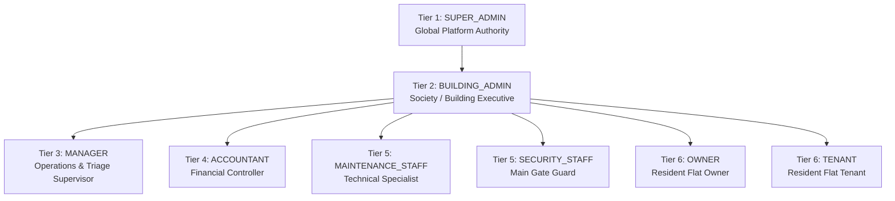

# Flat Maintenance Management System — Comprehensive System Documentation

> **Production Master Specification & Developer Reference Guide**  
> *Author:* Muhammad Umar &bull; *Version:* 1.0.0 &bull; *Architecture:* Multi-Tenant Society & Flat Management

---

## 1. Executive Summary & Architecture Overview

The **Flat Maintenance Management System** is an enterprise-grade residential society operating system built to streamline property administration, facility maintenance, financial auditing, visitor gate security, and resident communications across multiple building complexes in Pakistan.

### Technology Stack

| Layer | Technologies |
| :--- | :--- |
| **Frontend** | React 19, Vite, Material UI (MUI v9) with tailored HSL tokens, Framer Motion / CSS Transitions, React Hook Form + Zod, TanStack React Query v5, Axios |
| **Backend** | Node.js (v22+), Express 5, Mongoose 9 / MongoDB Atlas, Nodemailer (Gmail SMTP with STARTTLS pooling), Zod schema validation, Helmet, CORS, Rate Limiting |
| **Security & Auth** | Dual-token authentication (Access JWT 15m + Single-Use Refresh JWT 7d in `httpOnly` cookie with family theft detection), Bcrypt 12, SHA-256 token hashing at rest, RBAC + OBAC scope isolation |
| **Design Language** | Professional Dark Navy (`#0B132B`) Sidebar, Indigo Brand Palette (`#4F46E5`), full-width CSS Grid, responsive data tables, zero layout shift (CLS 0) |

---

## 2. Role-Based Access Control (RBAC) & Scoping Hierarchy

The system enforces a strict 6-tier organizational authority model with **anti-privilege escalation**:



### Role Authority & Directory Scoping Rules

1. **Super Admin (`SUPER_ADMIN`)**:
   - **Scope:** Cross-society, global.
   - **Directory View (`/users`):** By default, oversees **Building Administrators**. Can provision new Building Admins and assign them to specific residential projects.
   - **Authority:** Can create, update, and manage all buildings, audit logs, and global rate rules.
2. **Building Admin (`BUILDING_ADMIN`)**:
   - **Scope:** Strictly bound to assigned complex (e.g., *Al-Raziq Heights*).
   - **Directory View (`/users`):** Manages all users within their assigned complex: Managers, Accountants, Maintenance Technicians, Security Guards, Owners, and Tenants.
   - **Authority:** Can invite any subordinate tier (Levels 3 to 6). Cannot invite fellow Building Admins or Super Admins.
3. **Manager (`MANAGER`)**:
   - Manages maintenance request workflows, complaint triage, and vendor assignments.
4. **Accountant (`ACCOUNTANT`)**:
   - Generates monthly maintenance bills, issues invoices, registers receipts, and records operational expenses.
5. **Maintenance Staff (`MAINTENANCE_STAFF`)**:
   - Dedicated dashboard displaying assigned work orders, progress tracking, and resolution logs.
6. **Security Staff (`SECURITY_STAFF`)**:
   - Digital gate pass verification (`/visitors/verify`), real-time vehicle entry logging, and emergency broadcasts.
7. **Owner & Tenant (`OWNER` / `TENANT`)**:
   - Resident portal: digital bill payments, one-click complaint filing, visitor pass generation, and society notices.

---

## 3. Seed Accounts & One-Click Demo Credentials

All test accounts are pre-seeded in the database and selectable via the **"Select Pakistani Demo Account"** dropdown on the login page:

| Role | Display Name | Email | Password | Assigned Scope |
| :--- | :--- | :--- | :--- | :--- |
| **Super Admin** | Muhammad Umar | `muhammadumar.codes@gmail.com` | `umarkhan` | Global |
| **Building Admin** | Tariq Mahmood | `admin.alraziq@society.local` | `Password123!` | Al-Raziq Heights |
| **Manager** | Sarah Khan | `manager.sarah@society.local` | `Password123!` | Al-Raziq Heights |
| **Accountant** | Dawood Ahmed | `accountant.dawood@society.local` | `Password123!` | Al-Raziq Heights |
| **Maintenance Staff** | Kamran Akram | `tech.kamran@society.local` | `Password123!` | Al-Raziq Heights |
| **Security Staff** | Ahmed Raza | `guard.ahmed@society.local` | `Password123!` | Al-Raziq Heights |
| **Owner** | Fatima Zahra | `owner.fatima@society.local` | `Password123!` | Flat 101, Al-Raziq Heights |
| **Tenant** | Hamza Tariq | `tenant.hamza@society.local` | `Password123!` | Flat 101, Al-Raziq Heights |

---

## 4. Key Workflows & Functional Guides

### A. User Provisioning & Invitation Flow

1. **Initiation:**
   - Super Admin goes to `/users` &rarr; clicks **"Invite Building Admin"**.
   - Building Admin goes to `/users` &rarr; clicks **"Invite User"**.
2. **Form Submission:**
   - Enter First Name, Last Name, Email, E.164 Phone (`+92...`), target Role, and select the Building.
   - Submits to `POST /api/v1/users/invite`.
3. **Cryptographic Dispatch:**
   - Generates a 32-byte (64 hex character) random token: `rawToken`.
   - Stores `invitationTokenHash = sha256(rawToken)` in MongoDB with a 72-hour expiry window.
   - Dispatches a modern HTML email via Gmail SMTP containing the activation button:
     `${CLIENT_URL}/activate-account?token=${rawToken}`.
   - In development environments, the activation URL is also logged to the console and displayed in the UI dialog.
4. **Account Activation:**
   - The invited user clicks the link &rarr; enters their chosen password (must meet complexity requirements) &rarr; account transitions from `PENDING` to `ACTIVE`.

### B. Password Recovery Flow (`/forgot-password`)

1. User enters their email at `/forgot-password`.
2. Backend queries user, generates 32-byte crypto token, and saves SHA-256 hash with 15-minute expiry.
3. Branded HTML email delivered via Gmail SMTP.
4. User clicks link &rarr; opens `/reset-password?token=...` with token pre-filled.
5. User enters new password with live strength indicator &rarr; submits `{ token, newPassword }`.
6. Password updated using Bcrypt cost 12, reset token invalidated, all existing refresh token families revoked.

### C. Security Gate Verification Protocol (`/visitors/verify`)

1. Resident generates a visitor pass from their portal (e.g. Pass code `849201` for visitor *Tariq Bashir*).
2. Visitor arrives at society main gate.
3. Security guard types `849201` into `/visitors/verify`.
4. System validates visitor identity, host flat, and status (`EXPECTED`). Guard clicks **"Check In"** to record timestamp and allow gate access.

---

## 5. API Reference Catalog

### Authentication (`/api/v1/auth`)
- `POST /auth/login` — Dual-token issuance (access JWT + refresh cookie).
- `POST /auth/refresh` — Atomic single-use refresh token rotation with theft detection.
- `POST /auth/logout` — Revokes active refresh session family and clears cookie.
- `POST /auth/forgot-password` — Dispatches SHA-256 reset email.
- `POST /auth/reset-password` — Consumes reset token and updates password.
- `POST /auth/activate-account` — Consumes single-use invitation token and activates pending user.
- `GET /auth/me` — Returns sanitized current user profile.

### Users & Administration (`/api/v1/users`)
- `GET /users` — Paginated, OBAC-scoped directory with role and status filters.
- `POST /users/invite` (and `POST /users`) — Provisions pending user with invitation token.
- `GET /users/:id` — Detailed user profile.
- `PATCH /users/:id/status` — Toggles active / suspended / inactive status.
- `GET /users/profile` & `PATCH /users/profile` — Self-service profile updates.

### Property Management
- `GET/POST /buildings` — Society and building complexes.
- `GET/POST /flats` — Flat inventory, floor associations, dues, and occupancy status.
- `GET/POST /maintenance-requests` — Work order ticketing pipeline.
- `GET/POST /invoices` — Automated monthly maintenance billing.
- `GET/POST /payments` — Payment reconciliation and receipts.
- `GET/POST /expenses` — Building operational expenditures.
- `GET/POST /complaints` — Resident grievances and resolution workflows.
- `GET/POST /notices` — Broadcast announcements and emergency alerts.
- `GET/POST /visitors` & `POST /visitors/verify` — Gate passes and security logs.
- `GET /audit-logs` — Tamper-proof audit timeline with IP and user telemetry.

---

## 6. Development & Run Commands

```bash
# Backend (Port 5000)
cd flat-maintenance-backend
yarn install
yarn dev        # Starts nodemon with .env config
yarn test:auth  # Runs complete auth integration test suite

# Frontend (Port 5173)
cd flat-maintenance-fronted
yarn install
yarn dev        # Starts Vite development server on http://localhost:5173
yarn build      # Production bundle verification
```
