# 🏢 FLAT MAINTENANCE MANAGEMENT SYSTEM

## ENTERPRISE BACKEND TECHNICAL ARCHITECTURE SPECIFICATION & SYSTEM DESIGN BLUEPRINT

### Production-Grade Single Source of Truth (SSOT) Master Technical Documentation

---

> **Document Version:** 3.0.0-ENTERPRISE-PROD  
> **Classification:** Enterprise Technical Architecture Specification & Engineering Master Blueprint  
> **System Name:** Flat Maintenance Management System (Backend REST API)  
> **Runtime Environment:** Node.js (v22+ LTS ESM), Express.js (v5.x), MongoDB 7.0+ (Replica Set `rs0`), Mongoose 9.x  
> **Security & Validation:** Zod 4.x, Dual-Token JWT (Access + HttpOnly Cookie Refresh with Rotation), Helmet, CORS, Mongo-Sanitize  
> **Architecture Pattern:** Modular Monolith with Clean / Hexagonal Boundary Separation  
> **Media & Storage:** Cloudinary CDN via Memory Stream Buffers (Zero Local Disk Writes)  
> **Automation & Orchestration:** n8n Workflow Automation via Transactional Outbox Pattern & HMAC SHA-256 Webhooks  
> **Deployment Target:** AWS ECS Fargate, Application Load Balancer, MongoDB Atlas Dedicated Replica Set

---

## 📋 MASTER TABLE OF CONTENTS

- [PART A — EXECUTIVE ARCHITECTURE & STAKEHOLDER CONTEXT](#part-a--executive-architecture--stakeholder-context)
  - [1. Executive Summary & Project Vision](#1-executive-summary--project-vision)
  - [2. Problems Solved & Value Realization](#2-problems-solved--value-realization)
  - [3. Business Objectives & Strategic Goals](#3-business-objectives--strategic-goals)
  - [4. Complete Stakeholder & Persona Profiles](#4-complete-stakeholder--persona-profiles)
  - [5. System Scope, Boundaries & Ecosystem Interfaces](#5-system-scope-boundaries--ecosystem-interfaces)
  - [6. Functional Requirements Matrix](#6-functional-requirements-matrix)
  - [7. Non-Functional Requirements & Service Level Objectives (SLOs)](#7-non-functional-requirements--service-level-objectives-slos)
  - [8. Current Implementation vs. Target Architecture Baseline](#8-current-implementation-vs-target-architecture-baseline)

- [PART B — ROLE, ACCESS & SECURITY GOVERNANCE](#part-b--role-access--security-governance)
  - [9. 6-Tier Enterprise Organizational Role Hierarchy](#9-6-tier-enterprise-organizational-role-hierarchy)
  - [10. Detailed Persona Responsibilities & Scopes](#10-detailed-persona-responsibilities--scopes)
    - [10.1 Level 1: SUPER_ADMIN (Platform Governance)](#101-level-1-super_admin-platform-governance)
    - [10.2 Level 2: BUILDING_ADMIN (Society Executive Administration)](#102-level-2-building_admin-society-executive-administration)
    - [10.3 Level 3: MANAGER (Daily Facility & Operational Management)](#103-level-3-manager-daily-facility--operational-management)
    - [10.4 Level 4: ACCOUNTANT (Financial Governance & Reconciliation)](#104-level-4-accountant-financial-governance--reconciliation)
    - [10.5 Level 5: STAFF (Maintenance Technicians & Security Gate Personnel)](#105-level-5-staff-maintenance-technicians--security-gate-personnel)
    - [10.6 Level 6: RESIDENTS (Flat Owners & Tenants)](#106-level-6-residents-flat-owners--tenants)
  - [11. Resident & Staff Abstraction Architecture](#11-resident--staff-abstraction-architecture)
  - [12. Granular Permission Registry & System Codes](#12-granular-permission-registry--system-codes)
  - [13. Hybrid RBAC + OBAC (Building & Flat Scope) Architecture](#13-hybrid-rbac--obac-building--flat-scope-architecture)
  - [14. Complete Role-Permission Matrix](#14-complete-role-permission-matrix)
  - [15. Route Access Matrix](#15-route-access-matrix)
  - [16. Data Ownership Rules, Tenant Isolation & Multi-Tenancy Roadmap](#16-data-ownership-rules-tenant-isolation--multi-tenancy-roadmap)
  - [17. Privilege Escalation Prevention & Security Controls](#17-privilege-escalation-prevention--security-controls)

- [PART C — COMPLETE SYSTEM ARCHITECTURE & WORKFLOWS](#part-c--complete-system-architecture--workflows)
  - [18. Tri-Tier System Architecture & Visual Topology](#18-tri-tier-system-architecture--visual-topology)
  - [19. High-Level ASCII Architecture & Component Separation](#19-high-level-ascii-architecture--component-separation)
  - [20. End-to-End Request, Authentication & Authorization Lifecycles](#20-end-to-end-request-authentication--authorization-lifecycles)
  - [21. Dual-Token JWT Authentication, Token Rotation & Session Revocation](#21-dual-token-jwt-authentication-token-rotation--session-revocation)
  - [22. Maintenance & Complaint Workflow (Real-World Multi-Role Walkthrough)](#22-maintenance--complaint-workflow-real-world-multi-role-walkthrough)
  - [23. Billing, Invoicing & Multi-Document ACID Payment Reconciliation](#23-billing-invoicing--multi-document-acid-payment-reconciliation)
  - [24. Gate Security & Digital Visitor Verification Lifecycle](#24-gate-security--digital-visitor-verification-lifecycle)
  - [25. Notices, In-App Notifications & Cloudinary Media Streaming Pipeline](#25-notices-in-app-notifications--cloudinary-media-streaming-pipeline)
  - [26. n8n Enterprise Event Automation Architecture (Outbox Pattern & HMAC Webhooks)](#26-n8n-enterprise-event-automation-architecture-outbox-pattern--hmac-webhooks)

- [PART D — TECHNOLOGY STACK & DIRECTORY BLUEPRINT](#part-d--technology-stack--directory-blueprint)
  - [27. Technology Stack & Architectural Justifications](#27-technology-stack--architectural-justifications)
  - [28. Layered Hexagonal / Clean Architecture & Component Separation](#28-layered-hexagonal--clean-architecture--component-separation)
  - [29. Production Backend Directory Structure (Comprehensive 24-Module Layout)](#29-production-backend-directory-structure-comprehensive-24-module-layout)
  - [30. Standard Module Anatomy & Code Contracts](#30-standard-module-anatomy--code-contracts)

- [PART E — COMPLETE DOMAIN MODULE SPECIFICATIONS (24 MODULES)](#part-e--complete-domain-module-specifications-24-modules)
  - [31. Module 1: Authentication (`auth`)](#31-module-1-authentication-auth)
  - [32. Module 2: Users (`users`)](#32-module-2-users-users)
  - [33. Module 3: Roles (`roles`)](#33-module-3-roles-roles)
  - [34. Module 4: Permissions (`permissions`)](#34-module-4-permissions-permissions)
  - [35. Module 5: Buildings (`buildings`)](#35-module-5-buildings-buildings)
  - [36. Module 6: Blocks (`blocks`)](#36-module-6-blocks-blocks)
  - [37. Module 7: Floors (`floors`)](#37-module-7-floors-floors)
  - [38. Module 8: Flats (`flats`)](#38-module-8-flats-flats)
  - [39. Module 9: Owners (`owners`)](#39-module-9-owners-owners)
  - [40. Module 10: Tenants (`tenants`)](#40-module-10-tenants-tenants)
  - [41. Module 11: Staff (`staff`)](#41-module-11-staff-staff)
  - [42. Module 12: Maintenance Configurations (`maintenance-configurations`)](#42-module-12-maintenance-configurations-maintenance-configurations)
  - [43. Module 13: Maintenance Requests / Work Orders (`maintenance-requests`)](#43-module-13-maintenance-requests--work-orders-maintenance-requests)
  - [44. Module 14: Invoices & Batch Billing Engine (`invoices`)](#44-module-14-invoices--batch-billing-engine-invoices)
  - [45. Module 15: Payments & ACID Financial Transactions (`payments`)](#45-module-15-payments--acid-financial-transactions-payments)
  - [46. Module 16: Complaints & SLA Ticket Management (`complaints`)](#46-module-16-complaints--sla-ticket-management-complaints)
  - [47. Module 17: Ratings & Service Reviews (`reviews`)](#47-module-17-ratings--service-reviews-reviews)
  - [48. Module 18: Society Notices & Announcements (`notices`)](#48-module-18-society-notices--announcements-notices)
  - [49. Module 19: In-App Notifications (`notifications`)](#49-module-19-in-app-notifications-notifications)
  - [50. Module 20: Society Operational Expenses (`expenses`)](#50-module-20-society-operational-expenses-expenses)
  - [51. Module 21: Visitors & Digital Gate Passes (`visitors`)](#51-module-21-visitors--digital-gate-passes-visitors)
  - [52. Module 22: Documents Repository & Access Control (`documents`)](#52-module-22-documents-repository--access-control-documents)
  - [53. Module 23: Reports & Analytics Engine (`reports`)](#53-module-23-reports--analytics-engine-reports)
  - [54. Module 24: Audit Logs & Append-Only Event Trail (`audit-logs`)](#54-module-24-audit-logs--append-only-event-trail-audit-logs)

- [PART F — DATABASE ARCHITECTURE & COLLECTIONS SPECIFICATION](#part-f--database-architecture--collections-specification)
  - [55. Database Design Principles, Referencing vs. Embedding & Soft Deletes](#55-database-design-principles-referencing-vs-embedding--soft-deletes)
  - [56. Complete MongoDB Collection Schemas (All 24 Collections)](#56-complete-mongodb-collection-schemas-all-24-collections)
  - [57. Entity-Relationship (ER) Architecture Diagrams (Mermaid)](#57-entity-relationship-er-architecture-diagrams-mermaid)
  - [58. MongoDB Indexing Strategy, Compound Indexes & Query Performance](#58-mongodb-indexing-strategy-compound-indexes--query-performance)
  - [59. MongoDB Multi-Document ACID Transactions & Financial Boundaries](#59-mongodb-multi-document-acid-transactions--financial-boundaries)

- [PART G — API SPECIFICATION & COMMUNICATION CONTRACTS](#part-g--api-specification--communication-contracts)
  - [60. RESTful API Conventions, Base URI (`/api/v1`), Versioning & HTTP Status Codes](#60-restful-api-conventions-base-uri-apiv1-versioning--http-status-codes)
  - [61. Standard API Response Contracts (`ApiResponse` & `ApiError` Formats)](#61-standard-api-response-contracts-apiresponse--apierror-formats)
  - [62. Pagination, Filtering, Sorting & Search Query Standard](#62-pagination-filtering-sorting--search-query-standard)
  - [63. Complete API Endpoint Inventory (Full 24-Module Matrix)](#63-complete-api-endpoint-inventory-full-24-module-matrix)
  - [64. Next.js Frontend Integration Contract & Client State Architecture](#64-nextjs-frontend-integration-contract--client-state-architecture)

- [PART H — SYSTEM GOVERNANCE, QUALITY, DEVOPS & EVOLUTION](#part-h--system-governance-quality-devops--evolution)
  - [65. Zero-Trust Zod Validation Architecture & Shared Schemas](#65-zero-trust-zod-validation-architecture--shared-schemas)
  - [66. Centralized Error Handling Architecture & Database Translation](#66-centralized-error-handling-architecture--database-translation)
  - [67. Comprehensive Security Controls & Production Hardening Checklist](#67-comprehensive-security-controls--production-hardening-checklist)
  - [68. File Upload Security & Cloudinary Memory Stream Pipeline](#68-file-upload-security--cloudinary-memory-stream-pipeline)
  - [69. Logging, Observability & Health/Readiness Endpoints (`/health` & `/ready`)](#69-logging-observability--healthreadiness-endpoints-health--ready)
  - [70. Formal State Machines & Transition Rules (7 Mermaid State Graphs)](#70-formal-state-machines--transition-rules-7-mermaid-state-graphs)
  - [71. Testing Architecture & Test Execution Matrix](#71-testing-architecture--test-execution-matrix)
  - [72. Multi-Stage Production Docker & Docker Compose Specification](#72-multi-stage-production-docker--docker-compose-specification)
  - [73. GitHub Actions CI/CD Automated Pipeline](#73-github-actions-cicd-automated-pipeline)
  - [74. AWS Production Cloud Deployment Architecture](#74-aws-production-cloud-deployment-architecture)
  - [75. Backups, Disaster Recovery, RPO (< 5 min) & RTO (< 1 hr)](#75-backups-disaster-recovery-rpo--5-min--rto--1-hr)
  - [76. Edge Cases & Backend Mitigation Matrix](#76-edge-cases--backend-mitigation-matrix)
  - [77. Architectural Decision Records (ADR-001 to ADR-012)](#77-architectural-decision-records-adr-001-to-adr-012)
  - [78. 20-Phase Implementation Roadmap (Phase 0 to Phase 19)](#78-20-phase-implementation-roadmap-phase-0-to-phase-19)
  - [79. Current Implementation vs. Target Architecture (Gap Analysis)](#79-current-implementation-vs-target-architecture-gap-analysis)
  - [80. Master Production Readiness Checklist & 10 Principal Architect Quality Gates](#80-master-production-readiness-checklist--10-principal-architect-quality-gates)

---

## PART A — EXECUTIVE ARCHITECTURE & STAKEHOLDER CONTEXT

### 1. Executive Summary & Project Vision

The **Flat Maintenance Management System** is a unified, enterprise-grade digital operations platform engineered to modernize residential communities, multi-tower apartment complexes, gated housing societies, and property management organizations. In modern residential communities, administrative tasks, maintenance tracking, financial collections, and gate security frequently rely on fragmented physical registers, disconnected messaging apps, and manual spreadsheets. This fragmentation introduces financial leakage, unrecorded maintenance delays, security blindspots at perimeter gates, and complete operational opacity for property owners and tenants.

The vision of the Flat Maintenance Management System is to establish an **autonomous, auditable, and transparent digital ecosystem** that bridges property management executives, operational facility managers, accountants, on-site service technicians, perimeter security guards, and residents into a single cohesive system.

```
                                  🌐 GLOBAL RESIDENTIAL ECOSYSTEM
                                                │
                      ┌─────────────────────────┴─────────────────────────┐
                      ▼                                                   ▼
            🏢 PROPERTY GOVERNANCE                              🏠 RESIDENTIAL LIVING
   ┌─────────────────────────────────────┐             ┌─────────────────────────────────────┐
   │ • Multi-Building Hierarchy Setup    │             │ • Automated Monthly Dues & Ledger   │
   │ • Transparent Accounting & Dues     │             │ • 1-Click Maintenance Work Orders   │
   │ • Role-Based Work Order Dispatch    │◄───────────►│ • Real-Time Digital Gate Passes     │
   │ • Gate Visitor & Vehicle Security   │             │ • Community Bulletins & Broadcasts  │
   │ • Immutable Multi-Tenant Auditing   │             │ • Verified Post-Resolution Reviews  │
   └─────────────────────────────────────┘             └─────────────────────────────────────┘
```

The backend serves as the core transactional engine, enforcing data validation via Zod, maintaining strict Object-Based Access Control (OBAC) across building scopes, guaranteeing ACID consistency for all financial ledger operations, and driving asynchronous operational workflows through event-driven webhooks connected to n8n automation engines.

---

### 2. Problems Solved & Value Realization

The platform directly eliminates the core operational inefficiencies that plague traditional residential management:

| Operational Bottleneck            | Legacy Manual Reality                                                                                        | Flat Maintenance Management System Solution                                                                                                  | Value Realization Metric                                                                              |
| :-------------------------------- | :----------------------------------------------------------------------------------------------------------- | :------------------------------------------------------------------------------------------------------------------------------------------- | :---------------------------------------------------------------------------------------------------- |
| **Financial Opacity & Leakage**   | Paper receipts, cash collections without proof, untracked bank transfers, disputed late fees.                | Automated batch invoice generation, immutable payment ledger, single-use receipt issuance, and MongoDB ACID transactions.                    | 100% financial traceability; 0% unallocated payments; 45% reduction in overdue collections.           |
| **Maintenance Ticket Stagnation** | Residents call managers; complaints scribbled in desk logs; tasks forgotten; zero SLA accountability.        | Automated digital ticketing, manager triage, skill-based staff assignment, SLA countdown timers, and post-resolution resident reviews.       | 65% reduction in mean time to repair (MTTR); real-time performance ratings for maintenance staff.     |
| **Gate Security Vulnerabilities** | Manual paper gate registers; visitors enter unverified; vehicle registration numbers unlogged or unreadable. | Pre-approved digital visitor passes with cryptographically signed tokens/QR codes, gate guard check-in/out timestamps, and vehicle tracking. | 100% visitor identity verification; instantaneous resident alerts upon perimeter arrival.             |
| **Broadcast Information Lag**     | Paper notices pasted on elevator doors; residents miss critical water/power shutdown warnings.               | Multi-tier broadcast engine targeting entire complexes, specific blocks, or specific user roles (owners vs. tenants) with in-app alerts.     | 98% notice delivery within 5 seconds of publication; automated WhatsApp/email dispatch via n8n.       |
| **Administrative Accountability** | Disputed changes to tenant move-in dates, deleted maintenance charges, and unaccountable staff actions.      | Strict append-only audit logging recording actor ID, IP address, user-agent, before/after JSON state snapshots, and correlation IDs.         | Full compliance with international financial accounting standards and complete forensic traceability. |

---

### 3. Business Objectives & Strategic Goals

1. **Autonomous Financial Operations:** Automate 100% of recurring monthly maintenance invoicing based on flexible billing algorithms (flat-rate or square-footage calculations) while guaranteeing mathematical and transactional consistency.
2. **Standardized Facility Management:** Implement a deterministic 7-stage state machine for maintenance requests (`OPEN` ➔ `TRIAGED` ➔ `ASSIGNED` ➔ `IN_PROGRESS` ➔ `COMPLETED` ➔ `VERIFIED` ➔ `CLOSED`), tracking precise operational SLAs at every handoff.
3. **Multi-Building Scalability:** Support independent operations for residential complexes spanning multiple buildings, towers, blocks, and hundreds of flats within a single unified backend cluster.
4. **Zero-Trust Security & Data Isolation:** Ensure absolute data boundary separation between distinct buildings and between individual flats, preventing unauthorized cross-tenant data leakage.
5. **Event-Driven Extensibility:** Decouple core database mutations from third-party notification delivery channels (email, SMS, WhatsApp) through a transactional outbox pattern paired with n8n orchestration.

---

### 4. Complete Stakeholder & Persona Profiles

The system explicitly models six distinct tiers of operational personas:

```
                            👑 SUPER_ADMIN (Platform Owner)
                                           │
                            🏢 BUILDING_ADMIN (Society Head)
                                           │
                            🏗️ MANAGER (Facility Operations)
                                           │
                            💼 ACCOUNTANT (Financial Controller)
                                           │
                     ┌─────────────────────┴─────────────────────┐
                     ▼                                           ▼
          🔧 MAINTENANCE_STAFF                        🛡️ SECURITY_STAFF
   (Plumbers, Electricians, Handymen)              (Gate & Perimeter Guards)
                     │                                           │
                     └─────────────────────┬─────────────────────┘
                                           ▼
                                 🏠 RESIDENTS
                     ┌─────────────────────┴─────────────────────┐
                     ▼                                           ▼
             🏡 FLAT OWNER                               🏠 TENANT
        (Financial & Asset Owner)                   (Lawful Occupant)
```

#### 4.1 Persona Matrix

- **👑 Super Admin (Platform Owner):** Oversees the entire multi-society infrastructure, provisions new societies, creates global system administrator accounts, governs global platform settings, and inspects cross-society audit events.
- **🏢 Building Admin (Society Executive):** Exercises executive control over assigned residential complexes. Defines building structures (blocks, floors, flats), approves staff and manager provisioning, configures society rules, and audits society-wide operations.
- **🏗️ Manager (Facility & Operational Lead):** Responsible for day-to-day physical plant operations. Triages resident maintenance complaints, assigns work orders to appropriate maintenance technicians, monitors SLA timers, coordinates move-in/move-out inspections, and issues community bulletins.
- **💼 Accountant (Financial Controller):** Governs financial configurations (base rates, square-foot multipliers, penalty rules), triggers monthly batch invoice runs, reconciles manual and digital payments, logs society vendor expenses, and generates balance sheets.
- **🔧 Maintenance Staff (Field Technicians):** Field personnel specializing in trades (plumbing, electrical, masonry, HVAC, cleaning). Receives work orders via mobile web interfaces, logs progress notes, uploads photographic proof of completed work, and requests customer verification.
- **🛡️ Security Staff (Gate & Perimeter Guards):** Stationed at perimeter gates and building lobbies. Validates visitor digital passcodes/QR codes, records entry and exit timestamps, logs delivery personnel and vehicle registrations, and flags gate incidents.
- **🏡 Flat Owner (Property & Asset Stakeholder):** Legal owner of the property unit. Bears primary financial accountability for maintenance dues, reviews historical ledgers, approves tenant lease requests, files facility complaints, and participates in society polls.
- **🏠 Tenant (Lawful Resident Occupant):** Current lawful occupant residing in a leased flat. Generates visitor gate passes, submits maintenance work orders, receives community notices, submits post-resolution ratings for completed technician work, and pays utilities where authorized.

---

### 5. System Scope, Boundaries & Ecosystem Interfaces

The system operates as an authoritative core backend bounded by external consumer applications, media storage networks, and automation engines:

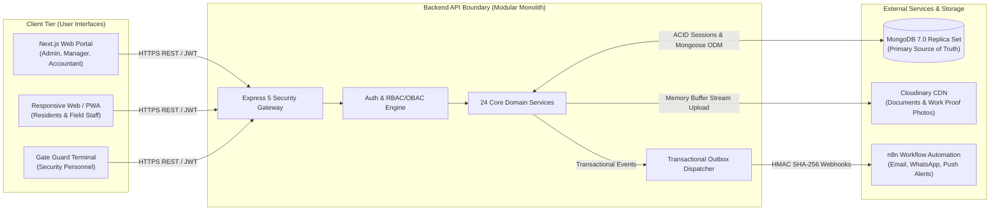

---

### 6. Functional Requirements Matrix

| Module Domain           | Requirement ID | Functional Requirement Description                                                                             | Priority |
| :---------------------- | :------------- | :------------------------------------------------------------------------------------------------------------- | :------- |
| **Authentication**      | `FR-AUTH-01`   | System must support secure login using email and bcrypt-hashed passwords (12 salt rounds).                     | **P0**   |
| **Authentication**      | `FR-AUTH-02`   | System must issue short-lived access JWTs (15m) and rotate HttpOnly refresh tokens (7d) on every refresh.      | **P0**   |
| **Authentication**      | `FR-AUTH-03`   | System must detect refresh token reuse and immediately invalidate the entire token family upon collision.      | **P0**   |
| **Authentication**      | `FR-AUTH-04`   | Privileged accounts must be onboarded exclusively via cryptographic single-use invitation tokens (72h expiry). | **P0**   |
| **Building Hierarchy**  | `FR-BLDG-01`   | System must maintain hierarchical tree integrity: `Building` ➔ `Block` ➔ `Floor` ➔ `Flat`.                     | **P0**   |
| **Building Hierarchy**  | `FR-BLDG-02`   | Unique flat numbers must be enforced within the context of their parent block and building.                    | **P0**   |
| **Occupancy**           | `FR-OCC-01`    | Flats must maintain occupancy state (`VACANT`, `OCCUPIED`, `UNDER_MAINTENANCE`, `INACTIVE`).                   | **P0**   |
| **Occupancy**           | `FR-OCC-02`    | System must support multi-flat ownership per owner and single active tenancy leases per flat.                  | **P0**   |
| **Maintenance Billing** | `FR-FIN-01`    | System must support flexible billing calculations: flat monthly rate or area-based (`baseRate * areaSqFt`).    | **P0**   |
| **Maintenance Billing** | `FR-FIN-02`    | System must execute batch monthly invoice runs idempotently on `(flatId, billingPeriod)`.                      | **P0**   |
| **Payment Ledger**      | `FR-FIN-03`    | Payments must execute inside MongoDB multi-document ACID transactions updating invoice balance and status.     | **P0**   |
| **Work Orders**         | `FR-MAINT-01`  | Maintenance work orders must enforce deterministic state machine transitions with SLA timestamping.            | **P0**   |
| **Work Orders**         | `FR-MAINT-02`  | Technicians must be able to attach photographic proof-of-work upon marking tasks completed.                    | **P1**   |
| **Service Reviews**     | `FR-REV-01`    | Residents can submit a 1–5 star rating and review only for resolved/closed maintenance work orders.            | **P1**   |
| **Service Reviews**     | `FR-REV-02`    | Submission of a review must atomically recalculate the assigned technician's cumulative rating metrics.        | **P1**   |
| **Gate Visitors**       | `FR-VIS-01`    | Residents can pre-generate digital visitor passes with cryptographically signed verification tokens.           | **P1**   |
| **Gate Visitors**       | `FR-VIS-02`    | Security guards can verify, check-in, and check-out visitors, recording vehicle numbers and timestamps.        | **P1**   |
| **Bulletins & Notices** | `FR-NOT-01`    | Building admins and managers can broadcast targeted notices to all, owners only, or tenants only.              | **P1**   |
| **Media Streaming**     | `FR-DOC-01`    | Documents and photos must stream directly from RAM buffer to Cloudinary CDN without touching container disk.   | **P1**   |
| **Audit Logging**       | `FR-AUD-01`    | All data mutations to financial ledgers, roles, and occupancy must record append-only immutable audit entries. | **P0**   |

---

### 7. Non-Functional Requirements & Service Level Objectives (SLOs)

1. **Performance & Latency:**
   - Read API Endpoints: P95 latency < 80ms; P99 latency < 150ms under baseline load.
   - Financial Write Endpoints (Transactions): P95 latency < 200ms; P99 latency < 350ms.
   - Batch Invoicing: Generate 1,000 monthly invoices within 15 seconds using cursor streaming.
2. **High Availability & Reliability:**
   - System Availability SLO: 99.9% uptime (excluding scheduled maintenance windows).
   - Recovery Point Objective (RPO): < 5 minutes (via MongoDB Atlas continuous point-in-time snapshots).
   - Recovery Time Objective (RTO): < 60 minutes for full regional failover.
3. **Security & Cryptography:**
   - Zero-Trust Input Validation: 100% of HTTP body, query, and path parameters validated via Zod schemas prior to reaching controller handlers.
   - OWASP Top 10 Mitigation: Enforce HTTP security headers via Helmet, strict CORS origin whitelisting, express-rate-limit throttling, and NoSQL injection sanitization via `mongo-sanitize`.
   - Data Protection: Passwords hashed with `bcrypt` (work factor 12); sensitive credentials stored encrypted at rest via AWS Secrets Manager.
4. **Stateless Scalability:**
   - Express 5 application containers must maintain zero local disk state, allowing seamless horizontal autoscaling across AWS ECS Fargate tasks behind an Application Load Balancer.

---

### 8. Current Implementation vs. Target Architecture Baseline

To maintain absolute engineering integrity, the table below documents the precise baseline gap between the checked-in repository assets and the target architecture specification:

| Architectural Component           | Repository Baseline (Today)                                                                           | Target Enterprise Specification                                                                                                                           | Implementation Gap                                                                                                            | Status Classification                                        |
| :-------------------------------- | :---------------------------------------------------------------------------------------------------- | :-------------------------------------------------------------------------------------------------------------------------------------------------------- | :---------------------------------------------------------------------------------------------------------------------------- | :----------------------------------------------------------- |
| **HTTP Gateway & Routing**        | `src/app.js` exposes `GET /` and `GET /health`.                                                       | Centralized `/api/v1` router coordinating all 24 modular domain route groups with deterministic `ApiResponse` and `ApiError` serialization.               | Domain routes, API router registration, centralized 404 handler, and error serialization middleware missing.                  | `[IMPLEMENTED]` for root/health; `[PLANNED]` for `/api/v1/*` |
| **Identity & Authentication**     | Dependencies declared in `package.json` (`jsonwebtoken`, `bcrypt`); `.env.example` template present.  | Dual-token JWT architecture (15m Bearer Access + 7d HttpOnly Cookie Refresh) with single-use rotation, reuse theft detection, and invite-only onboarding. | Authentication module (`src/modules/auth`), session rotation service, and password pre-save bcrypt hooks not yet implemented. | `[PARTIAL]` (deps declared; services queued)                 |
| **Access Control (RBAC/OBAC)**    | Roles and permissions defined in specification document.                                              | 6-tier RBAC combined with object-based building and flat scope validation middleware (`authorize.middleware.js`).                                         | Authorization middleware, permission string registry, and tenant/building object boundary checks missing.                     | `[PLANNED]`                                                  |
| **Data Models & Collections**     | Database connection helper in `src/config/db.config.js`; Mongo 7.0 container in `docker-compose.yml`. | Complete 24 Mongoose collection schemas with compound indexes, soft delete filters, and transaction support.                                              | Schema files (`*.model.js`) across all 24 modules need to be implemented in `src/modules/*`.                                  | `[IMPLEMENTED]` for connection; `[PLANNED]` for 24 schemas   |
| **Input Validation Engine**       | Zod v4 dependency installed in `package.json`.                                                        | Zero-trust Zod schema validation intercepting `body`, `query`, and `params` prior to controller invocation.                                               | Validation middleware (`validate.middleware.js`) and module schemas (`*.validation.js`) need to be written.                   | `[PARTIAL]` (deps declared; schemas queued)                  |
| **Financial Transactions & ACID** | Architectural specification defined in Sections 23, 44, 45, 59.                                       | Multi-document ACID transactions (`session.startTransaction()`) for invoice generation, payment processing, and ledger consistency.                       | Payment service, invoice balance calculations, and transaction orchestration need implementation.                             | `[PLANNED]`                                                  |
| **File Storage & Media CDN**      | Cloudinary and Multer dependencies declared in `package.json`.                                        | Direct memory stream pipeline to Cloudinary CDN (`/flat-maintenance/documents/`) with mime-type and size guards.                                          | Multer memory storage configuration and Cloudinary upload streaming utility missing in `src/utils/`.                          | `[PARTIAL]` (deps declared; streaming util queued)           |
| **Operational State Machines**    | Complaint, Invoice, and Visitor state machines specified in Section 70.                               | Enforced state transitions with SLA timestamping and validation guards.                                                                                   | State validation logic and transition guard services need implementation.                                                     | `[PLANNED]`                                                  |
| **Automation & Outbox Webhooks**  | Architectural design specified in Section 26.                                                         | Outbox pattern dispatching HMAC SHA-256 signed webhooks to n8n for email, WhatsApp, and push notifications.                                               | `src/modules/automations/` outbox collection and signed webhook worker need implementation.                                   | `[PLANNED]`                                                  |
| **Container & CI Automation**     | `Dockerfile`, `docker-compose.yml`, GitHub Actions workflow present.                                  | Multi-stage Docker build running under unprivileged `node` user with local MongoDB replica set (`rs0`).                                                   | Docker assets verified; automated integration tests against replica set queued.                                               | `[IMPLEMENTED]`                                              |

---

## PART B — ROLE, ACCESS & SECURITY GOVERNANCE

### 9. 6-Tier Enterprise Organizational Role Hierarchy

Access control in the Flat Maintenance Management System is structured around an enterprise-grade **6-tier operational hierarchy**. This design guarantees separation of duties, prevents organizational deadlock, isolates financial operations from field staff, and strictly restricts data visibility to authorized physical scopes.

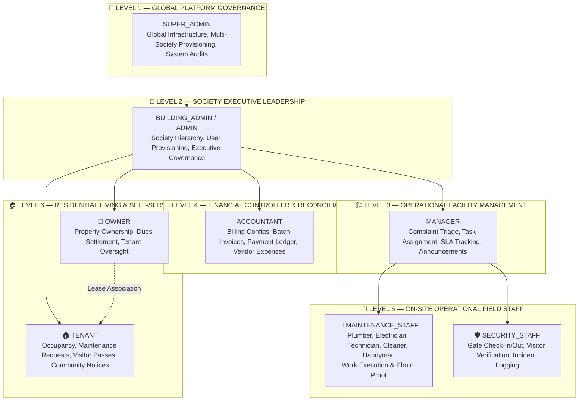

---

### 10. Detailed Persona Responsibilities & Scopes

#### 10.1 Level 1: SUPER_ADMIN (Platform Governance)

- **Scope:** Global. Access to all registered societies, complexes, and database clusters.
- **Key Responsibilities:**
  - Onboard new residential societies and configure primary complex metadata.
  - Provision and govern `BUILDING_ADMIN` executive credentials.
  - Define global system roles, permission schemas, and platform feature flags.
  - Oversee cross-society infrastructure health, database performance, and global audit streams.
  - Execute emergency administrative overrides and forensic security reviews.
- **Architectural Isolation:** The `SUPER_ADMIN` is never assigned to an individual building ID and bypasses OBAC building scope filtering.

#### 10.2 Level 2: BUILDING_ADMIN (Society Executive Administration)

- **Scope:** Scoped strictly to one or more explicitly assigned `buildingId` records.
- **Key Responsibilities:**
  - Construct physical structure hierarchy: Blocks, Floors, and Flats.
  - Provision and invite `MANAGER`, `ACCOUNTANT`, and `SECURITY_STAFF` users within assigned building scope.
  - Onboard property `OWNER` profiles and link them to designated flat units.
  - Approve society operational policies, rules, and document governance.
  - Monitor aggregate society financial health, unpaid dues summaries, and vendor expenses.
  - Inspect building-scoped immutable audit logs.

#### 10.3 Level 3: MANAGER (Daily Facility & Operational Management)

- **Scope:** Scoped strictly to assigned `buildingId` records.
- **Key Responsibilities:**
  - Day-to-day facility management and physical plant upkeep.
  - Triage incoming resident complaints and convert them into scheduled maintenance work orders.
  - Assign work orders to specialized `MAINTENANCE_STAFF` technicians (plumbers, electricians, cleaners).
  - Monitor SLA resolution deadlines and handle resident ticket escalations.
  - Conduct move-in and move-out flat physical condition inspections.
  - Author and publish operational bulletins and maintenance announcements.

#### 10.4 Level 4: ACCOUNTANT (Financial Governance & Reconciliation)

- **Scope:** Scoped strictly to assigned `buildingId` records.
- **Key Responsibilities:**
  - Configure maintenance charge formulas: base rates, per-square-foot multipliers, utility charges, grace periods, and late fee percentage penalties.
  - Execute automated monthly batch invoice generation runs for all occupied flats.
  - Reconcile manual cash, bank transfer, and cheque payments against issued invoices.
  - Authorize and record society vendor operational expenses (utility bills, staff salaries, contractor invoices).
  - Export monthly collection sheets, outstanding balance aging reports, and financial balance ledgers.
- **Architectural Constraint:** All financial ledger mutations require multi-document ACID transactions.

#### 10.5 Level 5: STAFF (Maintenance Technicians & Security Gate Personnel)

Staff members are categorized into two functionally distinct operational roles:

##### 🔧 Maintenance Staff (`category: MAINTENANCE`)

- **Specializations:** Plumber, Electrician, HVAC Technician, Mason/Handyman, Cleaner.
- **Key Responsibilities:**
  - View list of assigned maintenance tickets and work orders.
  - Update ticket status: accept work, transition to `IN_PROGRESS`, and log work completion.
  - Upload photographic proof-of-work upon completion via Cloudinary direct streaming.
  - Request resident physical inspection and sign-off.

##### 🛡️ Security Staff (`category: SECURITY`)

- **Specializations:** Main Gate Guard, Tower Lobby Guard, Parking Attendant.
- **Key Responsibilities:**
  - Verify visitor entry using 6-digit cryptographic passcodes or QR codes.
  - Record visitor entry and exit timestamps.
  - Log delivery personnel, cabs, and visitor vehicle license plate numbers.
  - Flag gate security incidents and report unauthorized entry attempts.

#### 10.6 Level 6: RESIDENTS (Flat Owners & Tenants)

##### 🏡 Flat Owner

- **Relationship:** 1-to-Many ownership relationship with Flat documents (`flatsOwned: [flatId]`).
- **Key Responsibilities:**
  - Full financial accountability for maintenance invoices and accumulated arrears.
  - Execute digital payments against issued invoices and download official PDF tax receipts.
  - View historical occupancy logs, active tenancy leases, and tenant profile data.
  - Submit maintenance requests for structural flat repairs and common area issues.

##### 🏠 Tenant

- **Relationship:** 1-to-1 active lease relationship with a single Flat document (`flatId`).
- **Key Responsibilities:**
  - Lawful daily occupancy of the leased apartment unit.
  - Pre-generate digital visitor entry passes for visiting guests and deliveries.
  - Submit maintenance requests for internal fixtures and appliances.
  - Submit verified 1–5 star ratings and reviews for completed technician tasks.
  - Access community notices, emergency bulletins, and public society documents.

---

### 11. Resident & Staff Abstraction Architecture

To avoid bloated schema design and prevent duplicate authentication tables, the system models all actors through a normalized **User ➔ Role ➔ Profile Entity** abstraction:

```
                               ┌───────────────────────────┐
                               │       users Collection    │
                               │  (Authentication & Auth)  │
                               │  • email, passwordHash    │
                               │  • roleId (Ref: roles)    │
                               │  • status (ACTIVE, etc.)  │
                               └─────────────┬─────────────┘
                                             │
                      ┌──────────────────────┼──────────────────────┐
                      ▼                      ▼                      ▼
           ┌─────────────────────┐┌─────────────────────┐┌─────────────────────┐
           │  owners Collection  ││  tenants Collection ││   staff Collection  │
           │  • userId (1-to-1)  ││  • userId (1-to-1)  ││  • userId (1-to-1)  │
           │  • flatsOwned []    ││  • flatId (Active)  ││  • buildingId       │
           │  • emergencyContact ││  • leaseDates       ││  • category / shift │
           │  • idProofUrl       ││  • rentAmount       ││  • ratingsAverage   │
           └──────────┬──────────┘└──────────┬──────────┘└─────────────────────┘
                      │                      │
                      └──────────┬───────────┘
                                 ▼
                     ┌───────────────────────────┐
                     │      flats Collection     │
                     │  • buildingId, blockId    │
                     │  • currentOwnerId (owner) │
                     │  • currentTenantId(tenant)│
                     │  • status (OCCUPIED, etc.)│
                     └───────────────────────────┘
```

#### Abstraction Invariants:

1. **Single Authentication Record:** Every person accessing the API possesses exactly one record in the `users` collection holding their login credentials and security tokens.
2. **Domain Profile Extensions:** Specialized profile data lives in dedicated collections (`owners`, `tenants`, `staff`) linked via `userId`.
3. **Decoupled Ownership vs. Occupancy:** A flat can have an owner (`currentOwnerId`) while being physically occupied by a distinct tenant (`currentTenantId`). Invoices link to both entities for complete accountability.

---

### 12. Granular Permission Registry & System Codes

Permissions are represented as deterministic uppercase string tokens (`<MODULE>_<ACTION>`). The complete platform permission registry comprises:

```text
// ==========================================
// SYSTEM & IDENTITY PERMISSIONS
// ==========================================
USER_CREATE             // Invite/create new user profiles
USER_READ               // View user profiles and lists
USER_UPDATE             // Update user profile information
USER_DELETE             // Soft-delete user accounts
USER_STATUS_UPDATE      // Activate, suspend, or reactivate user accounts
ROLE_MANAGE             // Create, update, or assign RBAC roles
AUDIT_READ              // Inspect append-only audit logs

// ==========================================
// HIERARCHY & STRUCTURE PERMISSIONS
// ==========================================
BUILDING_CREATE         // Create new residential complexes
BUILDING_READ           // View building details and list complexes
BUILDING_UPDATE         // Modify building configuration and metadata
BUILDING_DELETE         // Soft-delete a building (subject to zero-arrears invariant)
BLOCK_MANAGE            // Create, update, and manage building blocks/towers
FLOOR_MANAGE            // Create, update, and manage floors within blocks
FLAT_CREATE             // Provision new flat/apartment units
FLAT_READ               // View flat details, floor plans, and status
FLAT_UPDATE             // Modify flat square-footage, status, and occupancy

// ==========================================
// RESIDENT & STAFF PERMISSIONS
// ==========================================
OWNER_MANAGE            // Onboard owners and link flat deeds
TENANT_MANAGE           // Register lease contracts and manage move-in/out
STAFF_MANAGE            // Provision maintenance and security staff personnel
STAFF_ASSIGN            // Dispatch technicians to work orders

// ==========================================
// FINANCIAL & BILLING PERMISSIONS
// ==========================================
BILLING_CONFIG_MANAGE   // Set maintenance formulas, late fee penalties, grace periods
INVOICE_GENERATE        // Trigger monthly batch invoice generation runs
INVOICE_READ            // View invoices and payment ledgers
INVOICE_UPDATE          // Void or issue draft invoices
PAYMENT_CREATE          // Record payment transactions (cash, card, online)
PAYMENT_READ            // View payment receipts and reconciliation logs
EXPENSE_CREATE          // Log society operational vendor expenses
EXPENSE_APPROVE         // Authorize society expense disbursements

// ==========================================
// OPERATIONS & MAINTENANCE PERMISSIONS
// ==========================================
COMPLAINT_CREATE        // Submit maintenance tickets / service requests
COMPLAINT_READ          // View maintenance complaints
COMPLAINT_TRIAGE        // Triage, prioritize, and classify complaints
COMPLAINT_ASSIGN        // Assign complaint tickets to staff
COMPLAINT_UPDATE_STATUS // Transition ticket state (IN_PROGRESS, COMPLETED)
COMPLAINT_RESOLVE       // Mark complaints verified and resolved
REVIEW_CREATE           // Submit post-resolution 1–5 star rating and review
REVIEW_READ             // View staff performance ratings and resident reviews

// ==========================================
// SECURITY, VISITORS & NOTICES
// ==========================================
VISITOR_PASS_GENERATE   // Pre-register guest passes (residents)
VISITOR_CHECK_IN        // Validate pass and log visitor gate arrival (security)
VISITOR_CHECK_OUT       // Record visitor gate exit timestamp (security)
VISITOR_READ            // View visitor history logs
NOTICE_CREATE           // Publish society bulletins and emergency notices
NOTICE_READ             // Read community bulletins and announcements
DOCUMENT_UPLOAD         // Upload society deeds, bylaws, and lease agreements
DOCUMENT_READ           // Access public or flat-scoped society documents
```

---

### 13. Hybrid RBAC + OBAC (Building & Flat Scope) Architecture

Coarse-grained RBAC alone is insufficient in multi-building residential software. For example, an `ACCOUNTANT` assigned to **Building A** must never view the financial records or resident lists of **Building B**.

The system implements a **Hybrid RBAC + OBAC (Object-Based Access Control)** security architecture evaluated across three mandatory pipeline gates:

```
                            INCOMING HTTP REQUEST
                                      │
                                      ▼
                        ┌───────────────────────────┐
                        │  GATE 1: AUTHENTICATION   │
                        │  • Validate JWT Signature │
                        │  • Check Session in DB    │
                        │  • Verify ACTIVE Status   │
                        └─────────────┬─────────────┘
                                      │
                                      ▼
                        ┌───────────────────────────┐
                        │  GATE 2: RBAC PERMISSION  │
                        │  • Check User Role Has    │
                        │    Required Permission    │
                        │    (e.g., INVOICE_READ)   │
                        └─────────────┬─────────────┘
                                      │
                                      ▼
                        ┌───────────────────────────┐
                        │  GATE 3: OBAC SCOPE CHECK │
                        │  • SUPER_ADMIN: Bypass    │
                        │  • ADMIN/MGR: Building ID │
                        │    matches user scope?    │
                        │  • RESIDENT: Flat ID      │
                        │    matches ownership?     │
                        └─────────────┬─────────────┘
                                      │
                                      ▼
                           EXECUTE DOMAIN SERVICE
```

---

### 14. Complete Role-Permission Matrix

| Permission Code           | `SUPER_ADMIN` | `BUILDING_ADMIN` |   `MANAGER`    | `ACCOUNTANT` | `MAINT_STAFF` | `SEC_STAFF` |     `OWNER`     |    `TENANT`     |
| :------------------------ | :-----------: | :--------------: | :------------: | :----------: | :-----------: | :---------: | :-------------: | :-------------: |
| `USER_CREATE`             |      ✅       |        ✅        |       ❌       |      ❌      |      ❌       |     ❌      |       ❌        |       ❌        |
| `USER_READ`               |      ✅       |        ✅        | ✅ (Staff/Res) |   ✅ (Res)   |      ❌       |     ❌      |       ❌        |       ❌        |
| `USER_STATUS_UPDATE`      |      ✅       |        ✅        |       ❌       |      ❌      |      ❌       |     ❌      |       ❌        |       ❌        |
| `BUILDING_CREATE`         |      ✅       |        ❌        |       ❌       |      ❌      |      ❌       |     ❌      |       ❌        |       ❌        |
| `BUILDING_READ`           |      ✅       |    ✅ (Scope)    |   ✅ (Scope)   |  ✅ (Scope)  |  ✅ (Scope)   | ✅ (Scope)  |   ✅ (Scope)    |   ✅ (Scope)    |
| `BUILDING_UPDATE`         |      ✅       |    ✅ (Scope)    |       ❌       |      ❌      |      ❌       |     ❌      |       ❌        |       ❌        |
| `BLOCK_MANAGE`            |      ✅       |    ✅ (Scope)    |       ❌       |      ❌      |      ❌       |     ❌      |       ❌        |       ❌        |
| `FLOOR_MANAGE`            |      ✅       |    ✅ (Scope)    |       ❌       |      ❌      |      ❌       |     ❌      |       ❌        |       ❌        |
| `FLAT_CREATE`             |      ✅       |    ✅ (Scope)    |       ❌       |      ❌      |      ❌       |     ❌      |       ❌        |       ❌        |
| `FLAT_READ`               |      ✅       |    ✅ (Scope)    |   ✅ (Scope)   |  ✅ (Scope)  |      ❌       |     ❌      |   ✅ (Owned)    |   ✅ (Leased)   |
| `FLAT_UPDATE`             |      ✅       |    ✅ (Scope)    |  ✅ (Status)   |      ❌      |      ❌       |     ❌      |       ❌        |       ❌        |
| `OWNER_MANAGE`            |      ✅       |    ✅ (Scope)    |       ❌       |      ❌      |      ❌       |     ❌      |       ❌        |       ❌        |
| `TENANT_MANAGE`           |      ✅       |    ✅ (Scope)    |   ✅ (Scope)   |      ❌      |      ❌       |     ❌      |  ✅ (Own Flat)  |       ❌        |
| `STAFF_MANAGE`            |      ✅       |    ✅ (Scope)    |       ❌       |      ❌      |      ❌       |     ❌      |       ❌        |       ❌        |
| `BILLING_CONFIG_MANAGE`   |      ✅       |    ✅ (Scope)    |       ❌       |  ✅ (Scope)  |      ❌       |     ❌      |       ❌        |       ❌        |
| `INVOICE_GENERATE`        |      ✅       |    ✅ (Scope)    |       ❌       |  ✅ (Scope)  |      ❌       |     ❌      |       ❌        |       ❌        |
| `INVOICE_READ`            |      ✅       |    ✅ (Scope)    |       ❌       |  ✅ (Scope)  |      ❌       |     ❌      |  ✅ (Own Flat)  |   ✅ (Leased)   |
| `PAYMENT_CREATE`          |      ✅       |    ✅ (Scope)    |       ❌       |  ✅ (Scope)  |      ❌       |     ❌      |  ✅ (Own Flat)  |   ✅ (Leased)   |
| `PAYMENT_READ`            |      ✅       |    ✅ (Scope)    |       ❌       |  ✅ (Scope)  |      ❌       |     ❌      |  ✅ (Own Flat)  |   ✅ (Leased)   |
| `EXPENSE_CREATE`          |      ✅       |    ✅ (Scope)    |   ✅ (Scope)   |  ✅ (Scope)  |      ❌       |     ❌      |       ❌        |       ❌        |
| `EXPENSE_APPROVE`         |      ✅       |    ✅ (Scope)    |       ❌       |  ✅ (Scope)  |      ❌       |     ❌      |       ❌        |       ❌        |
| `COMPLAINT_CREATE`        |      ❌       |        ❌        |       ❌       |      ❌      |      ❌       |     ❌      |  ✅ (Own Flat)  |   ✅ (Leased)   |
| `COMPLAINT_READ`          |      ✅       |    ✅ (Scope)    |   ✅ (Scope)   |      ❌      | ✅ (Assigned) |     ❌      |  ✅ (Own Flat)  |   ✅ (Leased)   |
| `COMPLAINT_TRIAGE`        |      ✅       |    ✅ (Scope)    |   ✅ (Scope)   |      ❌      |      ❌       |     ❌      |       ❌        |       ❌        |
| `COMPLAINT_ASSIGN`        |      ✅       |    ✅ (Scope)    |   ✅ (Scope)   |      ❌      |      ❌       |     ❌      |       ❌        |       ❌        |
| `COMPLAINT_UPDATE_STATUS` |      ✅       |    ✅ (Scope)    |   ✅ (Scope)   |      ❌      | ✅ (Assigned) |     ❌      |       ❌        |       ❌        |
| `COMPLAINT_RESOLVE`       |      ✅       |    ✅ (Scope)    |   ✅ (Scope)   |      ❌      |      ❌       |     ❌      |  ✅ (Sign-off)  |  ✅ (Sign-off)  |
| `REVIEW_CREATE`           |      ❌       |        ❌        |       ❌       |      ❌      |      ❌       |     ❌      | ✅ (Own Ticket) | ✅ (Own Ticket) |
| `REVIEW_READ`             |      ✅       |    ✅ (Scope)    |   ✅ (Scope)   |      ❌      |   ✅ (Self)   |     ❌      |   ✅ (Scope)    |   ✅ (Scope)    |
| `VISITOR_PASS_GENERATE`   |      ❌       |        ❌        |       ❌       |      ❌      |      ❌       |     ❌      |  ✅ (Own Flat)  |   ✅ (Leased)   |
| `VISITOR_CHECK_IN`        |      ❌       |        ❌        |       ❌       |      ❌      |      ❌       | ✅ (Scope)  |       ❌        |       ❌        |
| `VISITOR_CHECK_OUT`       |      ❌       |        ❌        |       ❌       |      ❌      |      ❌       | ✅ (Scope)  |       ❌        |       ❌        |
| `VISITOR_READ`            |      ✅       |    ✅ (Scope)    |   ✅ (Scope)   |      ❌      |      ❌       | ✅ (Scope)  |  ✅ (Own Flat)  |   ✅ (Leased)   |
| `NOTICE_CREATE`           |      ✅       |    ✅ (Scope)    |   ✅ (Scope)   |      ❌      |      ❌       |     ❌      |       ❌        |       ❌        |
| `NOTICE_READ`             |      ✅       |    ✅ (Scope)    |   ✅ (Scope)   |  ✅ (Scope)  |  ✅ (Scope)   | ✅ (Scope)  |   ✅ (Scope)    |   ✅ (Scope)    |
| `DOCUMENT_UPLOAD`         |      ✅       |    ✅ (Scope)    |   ✅ (Scope)   | ✅ (Finance) |      ❌       |     ❌      |       ❌        |       ❌        |
| `DOCUMENT_READ`           |      ✅       |    ✅ (Scope)    |   ✅ (Scope)   | ✅ (Finance) |      ❌       |     ❌      |  ✅ (Flat/Pub)  |  ✅ (Flat/Pub)  |
| `AUDIT_READ`              |      ✅       |    ✅ (Scope)    |       ❌       |      ❌      |      ❌       |     ❌      |       ❌        |       ❌        |

---

### 15. Route Access Matrix

| HTTP Method | API Path Pattern                          | Target Domain  | Minimum Authorized Role | Required Permission       | OBAC Scope Check        |
| :---------- | :---------------------------------------- | :------------- | :---------------------- | :------------------------ | :---------------------- |
| `POST`      | `/api/v1/auth/login`                      | Authentication | Public                  | None                      | None                    |
| `POST`      | `/api/v1/auth/refresh`                    | Authentication | Public (Cookie)         | None                      | Token Family Check      |
| `POST`      | `/api/v1/auth/logout`                     | Authentication | Authenticated           | None                      | User Session            |
| `GET`       | `/api/v1/auth/me`                         | Authentication | Authenticated           | None                      | Current User Context    |
| `POST`      | `/api/v1/users/invite`                    | Users          | `BUILDING_ADMIN`        | `USER_CREATE`             | Building Scope          |
| `GET`       | `/api/v1/buildings`                       | Buildings      | `BUILDING_ADMIN`        | `BUILDING_READ`           | Assigned Buildings      |
| `POST`      | `/api/v1/buildings`                       | Buildings      | `SUPER_ADMIN`           | `BUILDING_CREATE`         | Global                  |
| `POST`      | `/api/v1/flats`                           | Flats          | `BUILDING_ADMIN`        | `FLAT_CREATE`             | Building Scope          |
| `GET`       | `/api/v1/flats/:id`                       | Flats          | `TENANT` / `OWNER`      | `FLAT_READ`               | Flat Ownership/Lease    |
| `POST`      | `/api/v1/invoices/generate-batch`         | Invoices       | `ACCOUNTANT`            | `INVOICE_GENERATE`        | Building Scope          |
| `GET`       | `/api/v1/invoices/:id`                    | Invoices       | `OWNER` / `ACCOUNTANT`  | `INVOICE_READ`            | Flat Ownership Scope    |
| `POST`      | `/api/v1/payments`                        | Payments       | `OWNER` / `ACCOUNTANT`  | `PAYMENT_CREATE`          | Flat Ownership / Ledger |
| `POST`      | `/api/v1/maintenance-requests`            | Work Orders    | `TENANT` / `OWNER`      | `COMPLAINT_CREATE`        | Leased/Owned Flat       |
| `PATCH`     | `/api/v1/maintenance-requests/:id/assign` | Work Orders    | `MANAGER`               | `COMPLAINT_ASSIGN`        | Building Scope          |
| `PATCH`     | `/api/v1/maintenance-requests/:id/status` | Work Orders    | `MAINTENANCE_STAFF`     | `COMPLAINT_UPDATE_STATUS` | Assigned Staff ID       |
| `POST`      | `/api/v1/reviews`                         | Reviews        | `TENANT` / `OWNER`      | `REVIEW_CREATE`           | Ticket Creator Scope    |
| `POST`      | `/api/v1/visitors`                        | Visitors       | `TENANT` / `OWNER`      | `VISITOR_PASS_GENERATE`   | Assigned Flat Unit      |
| `PATCH`     | `/api/v1/visitors/:id/check-in`           | Visitors       | `SECURITY_STAFF`        | `VISITOR_CHECK_IN`        | Gate Building Scope     |
| `POST`      | `/api/v1/notices`                         | Notices        | `MANAGER` / `ADMIN`     | `NOTICE_CREATE`           | Building Scope          |
| `GET`       | `/api/v1/audit-logs`                      | Audit Logs     | `BUILDING_ADMIN`        | `AUDIT_READ`              | Building Scope          |

---

### 16. Data Ownership Rules, Tenant Isolation & Multi-Tenancy Roadmap

1. **Mandatory Scope Field:** Every persistence schema (except `users` and system `roles`) mandates an indexed `buildingId: ObjectId` reference.
2. **Resident Isolation:** Resident queries automatically inject `{ flatId: req.user.flatId }` or `{ flatId: { $in: req.user.flatsOwned } }` into Mongoose query filters, completely isolating flat-level data from neighboring residents.
3. **Multi-Tenancy Evolution (Phase 2 Roadmap):** To transition the architecture into a multi-tenant SaaS serving hundreds of distinct residential societies, database schemas will introduce an `organizationId: ObjectId` top-level reference. Mongoose query middleware (`pre('find')`, `pre('findOne')`) will automatically bind `{ organizationId: req.user.organizationId }` across all tenant operations.

---

### 17. Privilege Escalation Prevention & Security Controls

To prevent vertical and horizontal privilege escalation:

1. **No Public Registration of Privileged Roles:** There is zero public registration endpoint for `SUPER_ADMIN`, `BUILDING_ADMIN`, `MANAGER`, `ACCOUNTANT`, or `STAFF`.
2. **Idempotent Super Admin Bootstrap:** The initial `SUPER_ADMIN` account is provisioned exclusively via a secure CLI command (`node src/scripts/bootstrap-super-admin.js`) taking credentials from secure environment variables.
3. **Cryptographic Invitation Tokens:** All subsequent staff and resident accounts are provisioned via cryptographic, single-use invitation tokens (SHA-256 hashed at rest with 72-hour TTL).
4. **Immutable Role Assignment on Invite:** When creating an invitation, the server strictly validates that the inviter cannot grant roles equal to or higher than their own (e.g., a `BUILDING_ADMIN` cannot invite another `BUILDING_ADMIN` or a `SUPER_ADMIN`).
5. **Token Revocation Upon Role Change:** Any mutation to a user's role, assigned building scope, or account status (`SUSPENDED`) immediately invalidates all active JWT refresh token families in MongoDB, terminating existing sessions across all client devices.

---

## PART C — COMPLETE SYSTEM ARCHITECTURE & WORKFLOWS

### 18. Tri-Tier System Architecture & Visual Topology

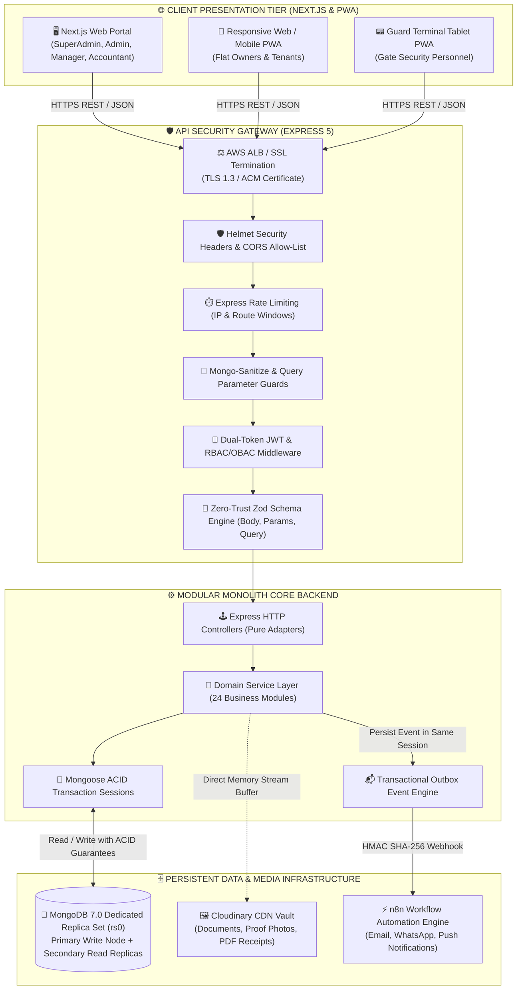

---

### 19. High-Level ASCII Architecture & Component Separation

```text
+=======================================================================================+
|                                    CLIENT APPLICATION                                 |
|         Next.js App Router  •  Tailored Role Dashboards  •  Axios Interceptors        |
+=======================================================================================+
                                           │  HTTPS (JSON Payloads / JWT Bearer)
                                           ▼
+=======================================================================================+
|                                  API SECURITY GATEWAY                                 |
|   Helmet (CSP/HSTS)  •  CORS Whitelist  •  Rate Limiter  •  Mongo-Sanitize (NoSQL)    |
+=======================================================================================+
                                           │
                                           ▼
+=======================================================================================+
|                            AUTHENTICATION & AUTHORIZATION                             |
|    JWT Dual-Token Validator  •  Session Revocation Check  •  RBAC & OBAC Gatekeepers  |
+=======================================================================================+
                                           │
                                           ▼
+=======================================================================================+
|                               ZERO-TRUST INPUT VALIDATION                             |
|          Zod Schemas: req.body (Write)  •  req.query (Filter)  •  req.params (ID)     |
+=======================================================================================+
                                           │
                                           ▼
+=======================================================================================+
|                                  EXPRESS CONTROLLERS                                  |
|         Extract HTTP inputs  •  Invoke Domain Service  •  Format ApiResponse          |
+=======================================================================================+
                                           │
                                           ▼
+=======================================================================================+
|                                 DOMAIN SERVICE LAYER                                  |
|     Business Logic Invariants  •  State Transitions  •  SLA Rules  •  Audit Events    |
+=======================================================================================+
                                           │
                                           ▼
+=======================================================================================+
|                                 PERSISTENCE & STORAGE                                 |
|   Mongoose ODM 9.x  •  ACID Transactions  •  MongoDB 7.0 Cluster  •  Cloudinary CDN   |
+=======================================================================================+
```

---

### 20. End-to-End Request, Authentication & Authorization Lifecycles

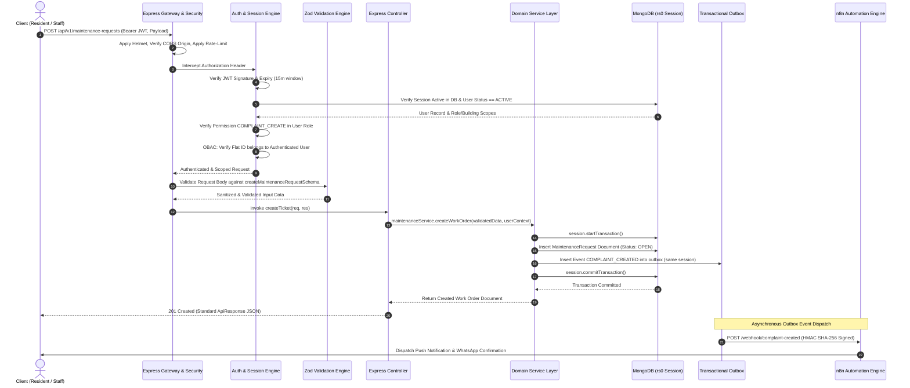

---

### 21. Dual-Token JWT Authentication, Token Rotation & Session Revocation

```
+---------------------------------------------------------------------------------------+
|                                  TOKEN SPECIFICATION                                  |
+---------------------------------------------------------------------------------------+
|  ACCESS TOKEN (JWT):                                                                  |
|  • Lifetime: 15 Minutes                                                               |
|  • Payload: { sub: userId, role: roleName, buildingIds: [], jti: sessionId }          |
|  • Transport: Authorization: Bearer <token> (Header)                                  |
|  • Storage: Memory / React Context (Never localStorage)                               |
+---------------------------------------------------------------------------------------+
|  REFRESH TOKEN (JWT):                                                                 |
|  • Lifetime: 7 Days                                                                   |
|  • Payload: { sub: userId, familyId: UUID, jti: UUID }                                |
|  • Transport: Set-Cookie: refreshToken=...; HttpOnly; Secure; SameSite=Strict; Path=/  |
|  • Storage: Hashed (SHA-256) in MongoDB user session array                            |
+---------------------------------------------------------------------------------------+
```

#### Token Rotation & Theft Detection Algorithm

1. **Normal Refresh Request (`POST /api/v1/auth/refresh`):**
   - Client sends HttpOnly cookie containing `refreshToken`.
   - Server parses JWT, extracts `familyId` and `jti`.
   - Server searches user document for matching active token record.
   - Server atomically marks old token record as `isUsed: true`.
   - Server generates a new Access Token + new Refresh Token (retaining same `familyId`).
   - Server stores new hashed refresh token in database and returns new cookie and access token.
2. **Reuse Detection (Token Theft):**
   - If a client presents a refresh token whose `jti` is **already flagged as `isUsed: true`**, the system triggers a **Theft Detection Alarm**.
   - The server immediately invalidates **ALL tokens belonging to that `familyId`**, revokes all active sessions for the user account, logs a critical audit security event, and forces an immediate re-login.

---

### 22. Maintenance & Complaint Workflow (Real-World Multi-Role Walkthrough)

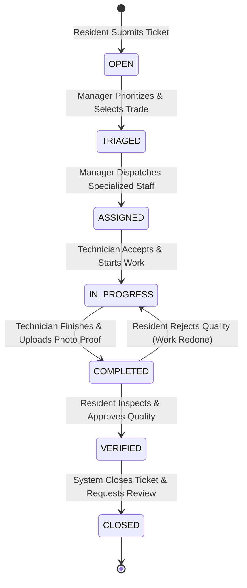

#### Step-by-Step Multi-Role Walkthrough:

1. **Step 1 (Resident Submits Ticket):**
   - Tenant logs into portal and submits a maintenance ticket for a leaking pipe in Flat 402.
   - Attaches photo via Cloudinary memory upload. Status = `OPEN`.
   - Backend dispatches outbox event `COMPLAINT_CREATED`. n8n alerts the on-duty Facility Manager.
2. **Step 2 (Manager Triage & Assignment):**
   - Manager reviews ticket, assesses priority (`HIGH`), sets category to `PLUMBING`, and assigns the ticket to on-duty plumber John Doe (`staffId`). Status transitions `OPEN` ➔ `ASSIGNED`.
   - Backend dispatches outbox event `COMPLAINT_ASSIGNED`. n8n sends a WhatsApp dispatch alert to John Doe.
3. **Step 3 (Technician Execution):**
   - John Doe views ticket on mobile terminal, gathers replacement valves, and clicks **Start Job**. Status = `IN_PROGRESS`.
   - After completing pipe replacement, John captures a photo of the completed installation and uploads it via the app. Status = `COMPLETED`.
4. **Step 4 (Resident Verification & Rating):**
   - Tenant receives an automated in-app alert: "Work Completed for Ticket #WO-2026-00491."
   - Tenant inspects repair, approves quality in portal. Status = `VERIFIED` ➔ `CLOSED`.
   - Portal prompts Tenant: "Rate John Doe's Service (1–5 Stars)". Tenant submits a 5-star review.
   - Backend atomically updates John Doe's `averageRating` and `totalRatingsCount` in the `staff` collection.

---

### 23. Billing, Invoicing & Multi-Document ACID Payment Reconciliation

Financial operations require absolute mathematical consistency and zero tolerance for partial writes.

#### Maintenance Billing Algorithm

Maintenance fees for flat $i$ are calculated based on the active `maintenanceConfigurations` record:

$$ \text{BillableAmount}_i = \begin{cases}
\text{baseRate} + \text{parkingCharge} + \text{waterCharge}, & \text{if chargeType} = \text{FLAT\_RATE} \\
(\text{baseRate} \times \text{areaSqFt}_i) + \text{parkingCharge} + \text{waterCharge}, & \text{if chargeType} = \text{PER\_SQFT}
\end{cases}$$

#### Overdue Penalties & Grace Period:
If invoice payment occurs after $(\text{dueDate} + \text{gracePeriodDays})$, a late fee penalty is compounded:

$$\text{LateFee} = \text{BillableAmount} \times \left(\frac{\text{lateFeePercentage}}{100}\right)$$

#### Multi-Document ACID Payment Execution Contract:
```javascript
// Pseudocode Contract: paymentService.executePayment(paymentData, actorContext)
const session = await mongoose.startSession();
session.startTransaction();
try {
  // 1. Lock and validate invoice
  const invoice = await Invoice.findById(paymentData.invoiceId).session(session);
  if (!invoice || !['ISSUED', 'PARTIALLY_PAID', 'OVERDUE'].includes(invoice.status)) {
    throw new ApiError(400, 'Invoice is not payable');
  }

  // 2. Insert immutable payment record
  const payment = await Payment.create([{
    paymentNumber: generatePaymentNumber(),
    invoiceId: invoice._id,
    buildingId: invoice.buildingId,
    flatId: invoice.flatId,
    payerUserId: actorContext.userId,
    amountPaid: paymentData.amount,
    paymentMethod: paymentData.paymentMethod,
    transactionRef: paymentData.transactionRef,
    receiptNumber: generateReceiptNumber(),
    paymentDate: new Date()
  }], { session });

  // 3. Atomically update invoice amounts and status
  invoice.paidAmount += paymentData.amount;
  invoice.dueAmount = Math.max(0, invoice.totalAmount - invoice.paidAmount);
  if (invoice.dueAmount === 0) {
    invoice.status = 'PAID';
    invoice.paidAt = new Date();
  } else {
    invoice.status = 'PARTIALLY_PAID';
  }
  await invoice.save({ session });

  // 4. Create transactional outbox event
  await Outbox.create([{
    eventId: crypto.randomUUID(),
    eventType: 'PAYMENT_RECEIVED',
    payload: { paymentId: payment[0]._id, invoiceId: invoice._id, amount: paymentData.amount }
  }], { session });

  // 5. Commit multi-document transaction
  await session.commitTransaction();
  return { invoice, payment: payment[0] };
} catch (error) {
  await session.abortTransaction();
  throw error;
} finally {
  session.endSession();
}
```

---

### 24. Gate Security & Digital Visitor Verification Lifecycle

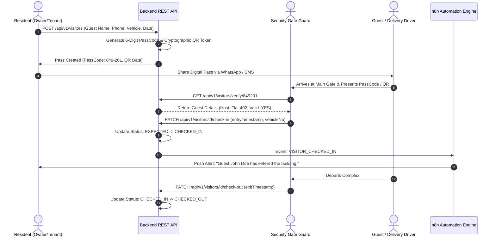

---

### 25. Notices, In-App Notifications & Cloudinary Media Streaming Pipeline

1. **Broadcast Notices (`notices`):**
   - Author: `BUILDING_ADMIN` or `MANAGER`.
   - Audience Targeting: `ALL`, `OWNERS_ONLY`, `TENANTS_ONLY`.
   - Scope Targeting: Complex-wide or Block-specific (e.g., Tower B Elevator Maintenance).
   - TTL Expiration: Notices carry an `expiresAt` timestamp; expired notices are automatically filtered from standard resident feeds without deleting historical records.
2. **In-App Notifications (`notifications`):**
   - High-performance collection tracking real-time user alerts for invoice issuance, payment receipts, complaint assignments, and visitor arrivals.
   - Status tracking (`isRead: Boolean`, `readAt: Date`).
3. **Cloudinary Direct Memory Streaming Pipeline:**
   - Files are intercepted in RAM via Multer `memoryStorage()`.
   - The buffer is streamed directly to Cloudinary edge nodes using `cloudinary.v2.uploader.upload_stream()`.
   - Zero temporary files are written to container disk storage, guaranteeing stateless Docker container autoscaling.

---

### 26. n8n Enterprise Event Automation Architecture (Outbox Pattern & HMAC Webhooks)

```
[ Express Service ] ──(Atomic Session)──► [ Domain Mutation (e.g. Invoices) ]
         │                                               │
         └────────────────(Atomic Session)──────────────► [ outbox Collection ]
                                                                 │
                                                       (Background Poller / Stream)
                                                                 ▼
                                                  [ Signed Webhook Worker ]
                                                                 │  HMAC SHA-256
                                                                 ▼
                                                  [ n8n Automation Cluster ]
                                                                 │
                                       ┌─────────────────────────┼─────────────────────────┐
                                       ▼                         ▼                         ▼
                                [ SendGrid Email ]        [ Twilio WhatsApp ]       [ FCM Mobile Push ]
```

#### Supported n8n Automation Workflows (14 Workflows):
1. `USER_INVITED`: Dispatches welcome email with single-use cryptographic invitation link.
2. `ACCOUNT_ACTIVATED`: Confirms onboarding and sends mobile app download instructions.
3. `INVOICE_GENERATED`: Emails monthly maintenance invoice PDF to flat owner and tenant.
4. `PAYMENT_RECEIVED`: Dispatches official receipt PDF with transaction verification number.
5. `PAYMENT_OVERDUE_ALERT`: Scheduled 3-day overdue reminder with direct payment link.
6. `COMPLAINT_CREATED`: Alerts on-duty Facility Manager of new maintenance request.
7. `COMPLAINT_ASSIGNED`: Sends work order dispatch notification to assigned technician.
8. `COMPLAINT_COMPLETED`: Alerts resident to inspect completed repair and rate technician.
9. `COMPLAINT_SLA_BREACH`: Escalates stalled complaints directly to Building Admin.
10. `VISITOR_PASS_SHARED`: Sends WhatsApp digital gate pass with QR code to guest.
11. `VISITOR_CHECKED_IN`: Instant push notification alerting resident of visitor arrival at gate.
12. `EMERGENCY_NOTICE_BROADCAST`: High-priority SMS/Push alert for urgent community bulletins.
13. `DAILY_OPERATIONAL_SUMMARY`: Nightly summary report dispatched to Building Admin.
14. `MONTHLY_FINANCIAL_DIGEST`: Monthly revenue vs. expense report dispatched to society board.

## PART D — TECHNOLOGY STACK & DIRECTORY BLUEPRINT

### 27. Technology Stack & Architectural Justifications

| Component / Layer | Selected Technology | Why It Is Used | Problem It Solves | How It Integrates | Production Considerations |
| :--- | :--- | :--- | :--- | :--- | :--- |
| **Runtime Engine** | **Node.js v22 LTS (ESM)** | Native ECMAScript Modules (`import`/`export`), high-throughput non-blocking asynchronous event loop, native fetch, built-in test runner. | Eliminates legacy CommonJS build tooling overhead; delivers sub-millisecond I/O multiplexing for concurrent API requests. | Executes the primary Express server process; defined via `"type": "module"` and `"engines": { "node": ">=22.0.0" }`. | Run with `--max-old-space-size=1024` under Docker; monitor event loop lag via Node.js performance hooks. |
| **Web Framework** | **Express.js v5.x** | Modernized router supporting native Promise rejection handling in route handlers, robust middleware chaining, lightweight memory footprint. | Prevents unhandled asynchronous exception crashes without requiring cumbersome `try/catch` boilerplate or wrapper packages. | Core application router instantiated in `src/app.js`, mounting global security middleware and versioned domain routers. | Disable `x-powered-by`; tune `keepAliveTimeout` and `headersTimeout` to match upstream AWS Application Load Balancer settings. |
| **Database Engine** | **MongoDB 7.0+ (Replica Set `rs0`)** | Document-oriented JSON model, native multi-document ACID transactions, flexible polymorphic schemas for diverse property data, horizontal sharding capability. | Eliminates brittle relational impedance mismatches when dealing with complex nested line items, work order histories, and dynamic audit snapshots. | Managed via Mongoose 9.x; connected in `src/config/db.config.js` with connection pooling (`maxPoolSize: 50`). | Mandate dedicated replica set clustering (required for ACID transactions); enable continuous Atlas backups with point-in-time recovery. |
| **Object Data Modeling**| **Mongoose 9.x** | Strict schema definition, pre/post middleware lifecycle hooks, type casting, virtual fields, and seamless population helpers. | Prevents corrupted or unstructured data from entering MongoDB; provides centralized hooks for password hashing and soft-delete filters. | Declared across all domain schemas (`*.model.js`) in `src/modules/*`. | Utilize `.lean()` for read-heavy GET requests; avoid deep nested `.populate()` cascades in high-frequency queries. |
| **Zero-Trust Validation**| **Zod 4.x** | TypeScript/JavaScript-first schema declaration, static type inference, deterministic parsing of `body`, `query`, and `params`. | Eliminates unvalidated or malicious client input from reaching business services; provides human-readable error messages for client forms. | Applied via `validate(schema)` middleware prior to invoking controller handlers. | Enforce strict mode (`.strict()`) on mutation payloads to reject undocumented or malicious injection fields. |
| **Identity & Tokens** | **JWT (`jsonwebtoken`) & `bcrypt`** | Stateless Bearer Access Tokens paired with HttpOnly Cookie Refresh Tokens; adaptive cryptographic key stretching with 12 salt rounds. | Prevents session storage bottlenecks on the backend; mitigates XSS token theft via secure cookies; renders offline brute-force attacks computationally infeasible. | Handled inside `src/modules/auth/auth.service.js` with centralized secret keys and rotation tracking in database. | Store secrets in AWS Secrets Manager (minimum 32-character high-entropy strings); enforce single-use refresh token rotation. |
| **Security Suite** | **Helmet, CORS, Mongo-Sanitize, Rate-Limit** | Comprehensive defense-in-depth: HTTP security headers, CORS origin isolation, NoSQL operator injection stripping, and DoS request throttling. | Blocks cross-site scripting (XSS), clickjacking, query operator injections (`$gt`, `$ne`), and brute-force credential stuffing. | Attached globally in `src/app.js` before any domain route evaluation. | Configure strict CORS allow-list matching production frontend domains; tune rate-limits tighter for auth endpoints (5 req/15 min). |
| **Media CDN Storage** | **Cloudinary via Multer Memory Storage** | Direct RAM buffer streaming to global Cloudinary CDN edge locations; on-the-fly image optimization and document access control. | Eliminates persistent local disk requirements in containers; accelerates image loading for residents; offloads heavy media bandwidth from API. | Configured in `src/utils/cloudinary.util.js`; files stream via `streamifier` directly from Multer memory buffers. | Restrict accepted MIME types (`image/jpeg`, `image/png`, `application/pdf`); enforce 10MB maximum file size limits. |
| **Workflow Automation**| **n8n Automation Engine** | Self-hosted or cloud orchestrator for complex notifications, email dispatch, WhatsApp messaging, and scheduled batch jobs. | Decouples third-party notification delivery from the primary HTTP request lifecycle; prevents external provider downtime from failing transactions. | Emits HMAC SHA-256 signed webhooks from backend Outbox dispatcher to n8n webhook endpoints. | Validate HMAC signatures on all received webhooks; implement idempotent retry policies with exponential backoff. |
| **Containerization** | **Docker & Docker Compose** | Multi-stage Alpine containerization, unprivileged non-root user execution, local replica set initialization script. | Guarantees identical runtime environments across local developer laptops, CI pipelines, and production AWS cloud instances. | Defined in `Dockerfile` and `docker-compose.yml`. | Multi-stage build keeps production image < 180MB; execute container under `USER node`. |
| **Cloud Hosting** | **AWS ECS Fargate & ALB** | Serverless container execution, automatic horizontal task scaling, zero host OS management, integrated CloudWatch logging. | Eliminates EC2 server provisioning, OS patching, and capacity planning; automatically absorbs sudden resident traffic spikes during billing runs. | Tasks deployed across multiple Availability Zones behind an Application Load Balancer with ACM SSL certificates. | Configure target tracking autoscaling based on CPU (70%) and Memory (80%); attach private subnets with NAT Gateways. |

---

### 28. Layered Hexagonal / Clean Architecture & Component Separation

```text
[ Incoming HTTP Request ]
          │
          ▼
┌─────────────────────────────────────────────────────────────────┐
│ 1. GATEWAY MIDDLEWARE (Helmet, CORS, RateLimiter, Sanitizer)    │
│    Protects the runtime from external protocol-level exploits.  │
└────────────────────────────────┬────────────────────────────────┘
                                 │
                                 ▼
┌─────────────────────────────────────────────────────────────────┐
│ 2. AUTHENTICATION & OBAC MIDDLEWARE (authenticate, authorize)   │
│    Resolves actor identity, validates permissions, checks scope.│
└────────────────────────────────┬────────────────────────────────┘
                                 │
                                 ▼
┌─────────────────────────────────────────────────────────────────┐
│ 3. INPUT VALIDATION MIDDLEWARE (validate(schema))               │
│    Zero-trust validation of body, query, and params using Zod.  │
└────────────────────────────────┬────────────────────────────────┘
                                 │
                                 ▼
┌─────────────────────────────────────────────────────────────────┐
│ 4. CONTROLLER LAYER (Pure HTTP Adapters)                        │
│    Extracts validated data, passes context to domain service,   │
│    returns standardized ApiResponse JSON envelopes.             │
│    *RULE: Absolutely ZERO database queries or business logic.   │
└────────────────────────────────┬────────────────────────────────┘
                                 │
                                 ▼
┌─────────────────────────────────────────────────────────────────┐
│ 5. DOMAIN SERVICE LAYER (Core Business Intelligence)            │
│    Enforces domain rules, manages ACID transactions, checks     │
│    state machines, dispatches audit logs and outbox events.     │
│    *RULE: Completely agnostic of Express req/res objects.       │
└────────────────────────────────┬────────────────────────────────┘
                                 │
                                 ▼
┌─────────────────────────────────────────────────────────────────┐
│ 6. PERSISTENCE LAYER (Mongoose Models & Schemas)                │
│    Defines MongoDB data structures, validation, indexes, hooks. │
│    *RULE: Models never make authorization decisions.            │
└────────────────────────────────┬────────────────────────────────┘
                                 │
                                 ▼
[ MongoDB 7.0 Replica Set Cluster ]
```

---

### 29. Production Backend Directory Structure (Comprehensive 24-Module Layout)

```text
src/
├── config/
│   ├── db.config.js                  # MongoDB Mongoose Connection & Pool Setup
│   ├── env.config.js                 # Zod Environment Variable Validation
│   └── cloudinary.config.js          # Cloudinary SDK Configuration
├── constants/
│   ├── error-codes.constant.js       # Standard Application Error Codes
│   ├── permissions.constant.js       # Granular Permission Strings
│   ├── roles.constant.js             # 6-Tier Role Enums
│   └── status.constant.js            # Standard Entity Status Enums
├── middlewares/
│   ├── auth.middleware.js            # JWT Verification & Session Validation
│   ├── authorize.middleware.js       # Hybrid RBAC + OBAC Scope Guard
│   ├── error.middleware.js           # Centralized Global Error Handler
│   ├── rate-limit.middleware.js      # Rate Limiting Windows (Auth vs. API)
│   ├── upload.middleware.js          # Multer Memory Storage Configuration
│   └── validate.middleware.js        # Zod Schema Request Interceptor
├── modules/
│   ├── auth/                         # Module 1: Authentication & Sessions
│   ├── users/                        # Module 2: Users & Profiles
│   ├── roles/                        # Module 3: Roles
│   ├── permissions/                  # Module 4: Permissions Registry
│   ├── buildings/                    # Module 5: Buildings
│   ├── blocks/                       # Module 6: Blocks / Towers
│   ├── floors/                       # Module 7: Floors
│   ├── flats/                        # Module 8: Flats
│   ├── owners/                       # Module 9: Owners
│   ├── tenants/                      # Module 10: Tenants
│   ├── staff/                        # Module 11: Staff (Maintenance & Security)
│   ├── maintenance-configurations/   # Module 12: Billing Rate Rules
│   ├── maintenance-requests/         # Module 13: Work Orders & Tickets
│   ├── invoices/                     # Module 14: Invoices & Batch Engine
│   ├── payments/                     # Module 15: Payments & ACID Ledger
│   ├── complaints/                   # Module 16: Complaints & SLA Tracking
│   ├── reviews/                      # Module 17: Service Ratings & Reviews
│   ├── notices/                      # Module 18: Notices & Bulletins
│   ├── notifications/                # Module 19: In-App Notifications
│   ├── expenses/                     # Module 20: Operational Expenses
│   ├── visitors/                     # Module 21: Digital Gate Passes
│   ├── documents/                    # Module 22: Documents Repository
│   ├── reports/                      # Module 23: Reports & Analytics
│   ├── audit-logs/                   # Module 24: Append-Only Audit Logs
│   └── automations/                  # Outbox Worker & n8n Dispatcher
├── routes/
│   └── index.js                      # Central /api/v1 Router Aggregator
├── shared/
│   └── base.service.js               # Common Pagination & Query Utility
├── utils/
│   ├── ApiError.js                   # Custom Operational Error Subclass
│   ├── ApiResponse.js                # Deterministic Success Response Envelope
│   ├── cloudinary.util.js            # Memory Buffer Streaming Pipeline
│   ├── date.util.js                  # Timezone & Billing Period Helpers
│   ├── hmac.util.js                  # HMAC SHA-256 Webhook Signer
│   └── logger.util.js                # Structured JSON Console Logger
├── app.js                            # Express App & Middleware Assembly
└── server.js                         # HTTP Server Bootstrap & Graceful Shutdown
```

---

### 30. Standard Module Anatomy & Code Contracts

Each module maintains standard file structures:
1. `*.model.js`: Mongoose schema, compound indexes, enum constraints, timestamps, and soft-delete query hooks.
2. `*.validation.js`: Zero-trust Zod schemas for body, query, and path parameters.
3. `*.service.js`: Pure JavaScript service enforcing business rules and ACID transactions.
4. `*.controller.js`: Pure HTTP adapter converting requests to service calls and returning `ApiResponse`.
5. `*.routes.js`: Route gatekeeper binding authentication, `authorize(...)` permission gates, and Zod validation.
6. `*.test.js`: Native Node.js tests verifying service invariants and HTTP routes.

---

## PART E — COMPLETE DOMAIN MODULE SPECIFICATIONS (24 MODULES)

### 31. Module 1: Authentication (`auth`)

#### 1. Purpose & Scope
Governs identity verification, credential validation, stateless dual-token issuance (Access + Refresh), cryptographic session rotation, theft detection, and session revocation across the entire platform.

#### 2. Authorized Actors & Permissions
- **Public:** `POST /login`, `POST /refresh`, `POST /forgot-password`, `POST /reset-password`, `POST /activate-account`.
- **Authenticated Users (All Roles):** `POST /logout`, `GET /me`, `PATCH /change-password`.

#### 3. Data Ownership & Scope
Authentication operates globally across the user base. Identity resolution extracts user roles and assigned building IDs into the JWT payload, enabling subsequent OBAC gates.

#### 4. Database Model (`users` Sub-Documents for Sessions)
- `refreshTokens`: Array of session objects:
  - `jti`: UUID string (Unique token identifier).
  - `tokenHash`: SHA-256 hashed refresh token.
  - `familyId`: UUID string (Token family identifier for reuse tracking).
  - `isUsed`: Boolean (Default: `false`).
  - `createdAt`: Date.
  - `expiresAt`: Date.

#### 5. Validation Schemas (Zod)
```javascript
export const loginSchema = z.object({
  email: z.string().email().toLowerCase().trim(),
  password: z.string().min(8).max(128)
});

export const activateAccountSchema = z.object({
  invitationToken: z.string().min(32),
  password: z.string().min(8).regex(/^(?=.*[a-z])(?=.*[A-Z])(?=.*\d)(?=.*[@$!%*?&])[A-Za-z\d@$!%*?&]{8,}$/)
});
```

#### 6. Business Invariants & State Transitions
- Inactive, pending, or suspended accounts cannot authenticate.
- Presenting a refresh token with `isUsed: true` immediately triggers Token Theft Revocation, invalidating all sessions for that `familyId`.
- Maximum 5 failed consecutive login attempts triggers a 15-minute account lock.

#### 7. API Endpoints
- `POST /api/v1/auth/login` — Authenticate credentials, set HttpOnly refresh cookie, return access token.
- `POST /api/v1/auth/refresh` — Rotate refresh token cookie, return fresh access token.
- `POST /api/v1/auth/logout` — Revoke matching session record and clear cookie.
- `GET /api/v1/auth/me` — Retrieve sanitized identity and permission profile.
- `POST /api/v1/auth/activate-account` — Complete onboarding via invitation token and set password.

#### 8. JSON Payloads (Examples)
##### Request: `POST /api/v1/auth/login`
```json
{
  "email": "admin.metro@complex.com",
  "password": "SecurePassword123!"
}
```
##### Response: `200 OK`
```json
{
  "success": true,
  "message": "Authentication successful",
  "data": {
    "accessToken": "eyJhbGciOiJIUzI1NiIsIn...",
    "user": {
      "id": "660c1e8b2f1a8b001f3e9a01",
      "firstName": "Tariq",
      "lastName": "Mahmood",
      "email": "admin.metro@complex.com",
      "role": "BUILDING_ADMIN",
      "assignedBuildingIds": ["660c1e8b2f1a8b001f3e9b10"]
    }
  },
  "meta": null
}
```

---

### 32. Module 2: Users (`users`)

#### 1. Purpose & Scope
Central identity directory managing user personal information, contact credentials, account statuses (`PENDING`, `ACTIVE`, `INACTIVE`, `SUSPENDED`), and profile avatars.

#### 2. Authorized Actors & Permissions
- `SUPER_ADMIN`: Full access (`USER_CREATE`, `USER_READ`, `USER_UPDATE`, `USER_DELETE`, `USER_STATUS_UPDATE`).
- `BUILDING_ADMIN`: Scoped access to staff, managers, and residents within their assigned building.
- `OWNER` / `TENANT`: Self-management of personal profile details (`GET /users/profile`, `PATCH /users/profile`).

#### 3. Database Model (`users`)
- `_id`: ObjectId (PK).
- `firstName`, `lastName`: String (Required).
- `email`: String (Required, Lowercase, Unique partial index for `isDeleted: false`).
- `phone`: String (Required, E.164 format).
- `password`: String (Required, `select: false`, bcrypt hash).
- `roleId`: ObjectId (Ref: `roles`, Required, Indexed).
- `assignedBuildingIds`: [ObjectId] (Ref: `buildings`, Indexed).
- `status`: Enum (`PENDING`, `ACTIVE`, `INACTIVE`, `SUSPENDED`) (Default: `PENDING`, Indexed).
- `failedLoginAttempts`: Number (Default: 0).
- `lockUntil`: Date.
- `invitationTokenHash`: String (`select: false`).
- `invitationExpiresAt`: Date.
- `isDeleted`: Boolean (Default: false).

#### 4. API Endpoints
- `POST /api/v1/users/invite` — Invite new user with cryptographic token (`BUILDING_ADMIN`).
- `GET /api/v1/users` — Paginated user directory filtered by role, building, and status.
- `GET /api/v1/users/:id` — Retrieve user profile details.
- `PATCH /api/v1/users/:id/status` — Update account status (Active, Suspended, Inactive).

---

### 33. Module 3: Roles (`roles`)

#### 1. Purpose & Scope
Governs Role-Based Access Control definitions. Maps named operational personas to lists of permission strings.

#### 2. Database Model (`roles`)
- `_id`: ObjectId.
- `name`: String (Unique, Enum: `SUPER_ADMIN`, `BUILDING_ADMIN`, `MANAGER`, `ACCOUNTANT`, `MAINTENANCE_STAFF`, `SECURITY_STAFF`, `OWNER`, `TENANT`).
- `description`: String.
- `permissions`: [String] (List of permission tokens).
- `isSystemRole`: Boolean (Default: true).

#### 3. API Endpoints
- `GET /api/v1/roles` — List all defined system roles.
- `GET /api/v1/roles/:id` — Retrieve role details and assigned permission list.

---

### 34. Module 4: Permissions (`permissions`)

#### 1. Purpose & Scope
Maintains the canonical registry of granular platform permission strings categorized by domain module.

#### 2. Database Model (`permissions`)
- `_id`: ObjectId.
- `code`: String (Unique, e.g. `INVOICE_GENERATE`, `COMPLAINT_ASSIGN`).
- `module`: String (Enum: `AUTH`, `USERS`, `BUILDINGS`, `INVOICES`, etc.).
- `description`: String.

#### 3. API Endpoints
- `GET /api/v1/permissions` — Query all active platform permission codes.

---

### 35. Module 5: Buildings (`buildings`)

#### 1. Purpose & Scope
Represents top-level residential complexes, towers, or gated societies. Acts as the primary tenancy anchor for all subordinate entities.

#### 2. Authorized Actors & Permissions
- `SUPER_ADMIN`: `BUILDING_CREATE`, `BUILDING_DELETE`.
- `BUILDING_ADMIN`: `BUILDING_UPDATE`, `BUILDING_READ`.
- Other Roles: `BUILDING_READ` (Assigned scope only).

#### 3. Database Model (`buildings`)
- `_id`: ObjectId.
- `name`: String (Required, Text-indexed).
- `code`: String (Unique Uppercase Identifier, e.g., `METRO-TOWER-A`).
- `address`: Subdocument `{ street, city, state, postalCode, country }`.
- `totalBlocks`, `totalFlats`: Number (Default: 0).
- `status`: Enum (`ACTIVE`, `INACTIVE`, `UNDER_CONSTRUCTION`).
- `isDeleted`: Boolean (Default: false).

#### 4. API Endpoints
- `POST /api/v1/buildings` — Provision new building complex (`SUPER_ADMIN`).
- `GET /api/v1/buildings` — List complexes within user scope.
- `GET /api/v1/buildings/:id` — Retrieve complex metadata and structural statistics.
- `PATCH /api/v1/buildings/:id` — Update complex settings.

---

### 36. Module 6: Blocks (`blocks`)

#### 1. Purpose & Scope
Models architectural divisions, distinct towers, or wings within a residential complex (e.g. Block A, Tower 1).

#### 2. Database Model (`blocks`)
- `_id`: ObjectId.
- `buildingId`: ObjectId (Ref: `buildings`, Required, Indexed).
- `name`: String (e.g., "Block A").
- `code`: String (e.g., "BLK-A").
- `totalFloors`: Number (Required).
- `isDeleted`: Boolean (Default: false).
- *Index:* Compound Unique `{ buildingId: 1, name: 1 }`.

#### 3. API Endpoints
- `POST /api/v1/blocks` — Create block within building (`BUILDING_ADMIN`).
- `GET /api/v1/blocks?buildingId=:id` — List blocks belonging to building.

---

### 37. Module 7: Floors (`floors`)

#### 1. Purpose & Scope
Represents physical vertical levels within a specific block or tower.

#### 2. Database Model (`floors`)
- `_id`: ObjectId.
- `buildingId`: ObjectId (Ref: `buildings`, Required).
- `blockId`: ObjectId (Ref: `blocks`, Required, Indexed).
- `floorNumber`: Number (Required, e.g., 4).
- `name`: String (e.g., "4th Floor").
- `isDeleted`: Boolean (Default: false).
- *Index:* Compound Unique `{ blockId: 1, floorNumber: 1 }`.

#### 3. API Endpoints
- `POST /api/v1/floors` — Register floor level within block (`BUILDING_ADMIN`).
- `GET /api/v1/floors?blockId=:id` — List floors for a specific block.

---

### 38. Module 8: Flats (`flats`)

#### 1. Purpose & Scope
Manages individual physical apartment/flat units, their architectural dimensions, current occupancy status, and owner/tenant bindings.

#### 2. Authorized Actors & Permissions
- `BUILDING_ADMIN`: `FLAT_CREATE`, `FLAT_UPDATE`, `FLAT_READ`.
- `MANAGER`: `FLAT_READ`, `FLAT_UPDATE` (Status transitions).
- `OWNER` / `TENANT`: `FLAT_READ` (Restricted to owned/leased flat).

#### 3. Database Model (`flats`)
- `_id`: ObjectId.
- `buildingId`: ObjectId (Ref: `buildings`, Required, Indexed).
- `blockId`: ObjectId (Ref: `blocks`, Required).
- `floorId`: ObjectId (Ref: `floors`, Required).
- `flatNumber`: String (Required, e.g., "402").
- `areaSqFt`: Number (Required, positive number used for maintenance billing).
- `flatType`: Enum (`1BHK`, `2BHK`, `3BHK`, `4BHK`, `PENTHOUSE`, `STUDIO`).
- `status`: Enum (`VACANT`, `OCCUPIED`, `UNDER_MAINTENANCE`, `INACTIVE`) (Default: `VACANT`, Indexed).
- `currentOwnerId`: ObjectId (Ref: `owners`).
- `currentTenantId`: ObjectId (Ref: `tenants`).
- `isDeleted`: Boolean (Default: false).
- *Index:* Compound Unique `{ blockId: 1, flatNumber: 1 }`.

#### 4. API Endpoints
- `POST /api/v1/flats` — Provision new flat unit (`BUILDING_ADMIN`).
- `GET /api/v1/flats` — List flats with filtering by building, block, floor, and occupancy status.
- `GET /api/v1/flats/:id` — Retrieve flat unit specifications and occupancy history.
- `PATCH /api/v1/flats/:id/status` — Transition flat occupancy status.

---

### 39. Module 9: Owners (`owners`)

#### 1. Purpose & Scope
Manages property ownership profiles, emergency contacts, government ID documentation, historical deed linkages, and multi-flat ownership portfolios.

#### 2. Database Model (`owners`)
- `_id`: ObjectId.
- `userId`: ObjectId (Ref: `users`, Unique, Required).
- `buildingId`: ObjectId (Ref: `buildings`, Required, Indexed).
- `flatsOwned`: [ObjectId] (Ref: `flats`).
- `emergencyContact`: Subdocument `{ name, relationship, phone }`.
- `idProofType`: Enum (`PASSPORT`, `NATIONAL_ID`, `DRIVING_LICENSE`).
- `idProofUrl`: String (Cloudinary URL).
- `isResidingInBuilding`: Boolean (Default: false).
- `isDeleted`: Boolean (Default: false).

#### 3. API Endpoints
- `POST /api/v1/owners` — Register owner profile and link flat deed (`BUILDING_ADMIN`).
- `GET /api/v1/owners` — Query owner registry with flat filters.
- `GET /api/v1/owners/:id` — Retrieve owner profile and property portfolio.

---

### 40. Module 10: Tenants (`tenants`)

#### 1. Purpose & Scope
Governs tenant residency lifecycles, active lease contracts, security deposits, monthly rent values, move-in/move-out workflows, and police verification document status.

#### 2. Database Model (`tenants`)
- `_id`: ObjectId.
- `userId`: ObjectId (Ref: `users`, Unique, Required).
- `buildingId`: ObjectId (Ref: `buildings`, Required, Indexed).
- `flatId`: ObjectId (Ref: `flats`, Required, Indexed).
- `ownerId`: ObjectId (Ref: `owners`, Required).
- `leaseStartDate`, `leaseEndDate`: Date (Required).
- `rentAmount`, `securityDeposit`: Number.
- `emergencyContact`: Subdocument `{ name, relationship, phone }`.
- `policeVerificationStatus`: Enum (`PENDING`, `VERIFIED`, `REJECTED`).
- `status`: Enum (`ACTIVE`, `MOVED_OUT`, `TERMINATED`).
- `moveOutDate`: Date.
- `isDeleted`: Boolean (Default: false).

#### 3. API Endpoints
- `POST /api/v1/tenants` — Register new tenant lease onboarding (`BUILDING_ADMIN`/`MANAGER`).
- `GET /api/v1/tenants` — List tenants by building, flat, or lease expiration date.
- `PATCH /api/v1/tenants/:id/move-out` — Complete tenant checkout and release flat.

---

### 41. Module 11: Staff (`staff`)

#### 1. Purpose & Scope
Maintains on-site operational personnel, categorizing them into Maintenance Technicians and Gate Security Guards. Tracks departmental specializations, assigned shifts, duty status, and cumulative performance ratings.

#### 2. Database Model (`staff`)
- `_id`: ObjectId.
- `userId`: ObjectId (Ref: `users`, Unique, Required).
- `buildingId`: ObjectId (Ref: `buildings`, Required, Indexed).
- `category`: Enum (`MAINTENANCE`, `SECURITY`, `ADMINISTRATION`, `CLEANING`) (Required).
- `subCategory`: Enum (`PLUMBER`, `ELECTRICIAN`, `HVAC_TECH`, `HANDYMAN`, `GATE_GUARD`, `LOBBY_GUARD`, `CLEANER`).
- `designation`: String.
- `assignedShift`: Enum (`MORNING`, `EVENING`, `NIGHT`, `ROTATIONAL`).
- `averageRating`: Number (Decimal 1-5, Default: 0.0).
- `totalRatingsCount`: Number (Default: 0).
- `status`: Enum (`ACTIVE`, `ON_LEAVE`, `TERMINATED`) (Default: `ACTIVE`).
- `isDeleted`: Boolean (Default: false).

#### 3. API Endpoints
- `POST /api/v1/staff` — Onboard staff personnel and assign trade category (`BUILDING_ADMIN`).
- `GET /api/v1/staff` — List staff with category and availability filters (`MANAGER`).
- `GET /api/v1/staff/:id` — Retrieve technician performance card and rating history.

---

### 42. Module 12: Maintenance Configurations (`maintenance-configurations`)

#### 1. Purpose & Scope
Defines the mathematical billing rules, calculation formulas, component charges, grace periods, and late fee percentage penalties applied when generating monthly maintenance invoices for a building.

#### 2. Database Model (`maintenanceConfigurations`)
- `_id`: ObjectId.
- `buildingId`: ObjectId (Ref: `buildings`, Required, Indexed).
- `chargeType`: Enum (`FLAT_RATE`, `PER_SQFT`) (Required).
- `baseRate`: Number (Required).
- `parkingCharge`, `waterCharge`, `sinkingFundCharge`: Number (Default: 0).
- `lateFeePercentage`: Number (Default: 5.0).
- `gracePeriodDays`: Number (Default: 10).
- `effectiveFrom`: Date (Required).
- `isActive`: Boolean (Default: true, Indexed).

#### 3. API Endpoints
- `POST /api/v1/maintenance-configurations` — Publish new billing rate formula (`ACCOUNTANT`).
- `GET /api/v1/maintenance-configurations/active?buildingId=:id` — Fetch current formula.
- `GET /api/v1/maintenance-configurations/history?buildingId=:id` — Audit historical rate formulas.

### 43. Module 13: Maintenance Requests / Work Orders (`maintenance-requests`)

#### 1. Purpose & Scope
Tracks physical repair and upkeep tasks from initial resident reporting or proactive facility inspections through manager triage, technician dispatch, progress execution, and quality sign-off.

#### 2. Authorized Actors & Permissions
- `TENANT` / `OWNER`: `COMPLAINT_CREATE` (For their own flat).
- `MANAGER`: `COMPLAINT_TRIAGE`, `COMPLAINT_ASSIGN`.
- `MAINTENANCE_STAFF`: `COMPLAINT_UPDATE_STATUS` (Assigned tickets).

#### 3. Database Model (`maintenanceRequests`)
- `_id`: ObjectId.
- `requestNumber`: String (Unique, e.g., `WO-2026-00491`).
- `buildingId`: ObjectId (Ref: `buildings`, Required, Indexed).
- `flatId`: ObjectId (Ref: `flats`, Required, Indexed).
- `createdById`: ObjectId (Ref: `users`, Required).
- `category`: Enum (`PLUMBING`, `ELECTRICAL`, `CARPENTRY`, `HVAC`, `MASONRY`, `CLEANING`, `COMMON_AREA`).
- `priority`: Enum (`LOW`, `MEDIUM`, `HIGH`, `EMERGENCY`).
- `title`: String (Required, max 120 chars).
- `description`: String (Required, max 1000 chars).
- `initialPhotos`: [String] (Cloudinary URLs).
- `completionPhotos`: [String] (Cloudinary URLs uploaded by technician).
- `assignedStaffId`: ObjectId (Ref: `staff`, Indexed).
- `status`: Enum (`OPEN`, `TRIAGED`, `ASSIGNED`, `IN_PROGRESS`, `COMPLETED`, `VERIFIED`, `CLOSED`, `CANCELLED`) (Default: `OPEN`, Indexed).
- `slaDeadline`: Date (Calculated based on priority).
- `startedAt`, `completedAt`, `verifiedAt`: Dates.

#### 4. API Endpoints
- `POST /api/v1/maintenance-requests` — Submit maintenance ticket.
- `GET /api/v1/maintenance-requests` — List requests with role-filtered scope.
- `PATCH /api/v1/maintenance-requests/:id/assign` — Dispatch technician (`MANAGER`).
- `PATCH /api/v1/maintenance-requests/:id/status` — Update task status and upload completion photos (`MAINTENANCE_STAFF`).
- `PATCH /api/v1/maintenance-requests/:id/verify` — Confirm satisfaction and sign-off (`RESIDENT`).

---

### 44. Module 14: Invoices & Batch Billing Engine (`invoices`)

#### 1. Purpose & Scope
Calculates, generates, issues, and tracks recurring monthly maintenance bills. Enforces mathematical consistency across base rates, area multipliers, utility surcharges, and compounding late fee penalties.

#### 2. Authorized Actors & Permissions
- `ACCOUNTANT` / `BUILDING_ADMIN`: `INVOICE_GENERATE`, `INVOICE_READ`, `INVOICE_UPDATE`.
- `OWNER` / `TENANT`: `INVOICE_READ` (Scoped strictly to own flat).

#### 3. Database Model (`invoices`)
- `_id`: ObjectId.
- `invoiceNumber`: String (Unique, e.g., `INV-2026-09-402`).
- `buildingId`: ObjectId (Ref: `buildings`, Required, Indexed).
- `flatId`: ObjectId (Ref: `flats`, Required, Indexed).
- `ownerId`: ObjectId (Ref: `owners`, Required).
- `tenantId`: ObjectId (Ref: `tenants`, Optional).
- `billingPeriod`: String (Format: `YYYY-MM`, e.g. `2026-09`).
- `configurationSnapshot`: Object (Formula parameters snapshot).
- `lineItems`: Array of `{ title: String, amount: Number }`.
- `subTotal`, `totalAmount`, `dueAmount`: Number (Required).
- `paidAmount`, `lateFee`: Number (Default: 0).
- `dueDate`: Date (Required, Indexed).
- `status`: Enum (`DRAFT`, `ISSUED`, `PARTIALLY_PAID`, `PAID`, `OVERDUE`, `VOID`) (Default: `ISSUED`, Indexed).
- `paidAt`: Date.
- `isDeleted`: Boolean (Default: false).
- *Index:* Compound Unique `{ flatId: 1, billingPeriod: 1 }`.

#### 4. API Endpoints
- `POST /api/v1/invoices/generate-batch` — Trigger monthly batch invoice run (`ACCOUNTANT`).
- `GET /api/v1/invoices` — List invoices with status, building, flat, and period filters.
- `GET /api/v1/invoices/:id` — Retrieve invoice details and line-item breakdown.
- `PATCH /api/v1/invoices/:id/void` — Void draft or erroneous invoice (`ACCOUNTANT`).

---

### 45. Module 15: Payments & ACID Financial Transactions (`payments`)

#### 1. Purpose & Scope
Processes, records, and reconciles financial payments made against issued maintenance invoices. Guarantees absolute transactional consistency using multi-document MongoDB ACID sessions.

#### 2. Database Model (`payments`)
- `_id`: ObjectId.
- `paymentNumber`: String (Unique, e.g., `PAY-2026-849102`).
- `invoiceId`: ObjectId (Ref: `invoices`, Required, Indexed).
- `buildingId`: ObjectId (Ref: `buildings`, Required, Indexed).
- `flatId`: ObjectId (Ref: `flats`, Required, Indexed).
- `payerUserId`: ObjectId (Ref: `users`, Required).
- `amountPaid`: Number (Required, positive number).
- `paymentMethod`: Enum (`CASH`, `BANK_TRANSFER`, `CREDIT_CARD`, `DEBIT_CARD`, `UPI`, `CHEQUE`) (Required).
- `transactionRef`: String.
- `receiptNumber`: String (Required, Unique).
- `receiptPdfUrl`: String.
- `paymentDate`: Date (Default: Date.now, Indexed).
- `notes`: String.

#### 3. API Endpoints
- `POST /api/v1/payments` — Settle invoice within multi-document ACID transaction session.
- `GET /api/v1/payments` — Query payment transaction ledger and reconciliation history.
- `GET /api/v1/payments/:id/receipt` — Download official tax receipt.

---

### 46. Module 16: Complaints & SLA Ticket Management (`complaints`)

#### 1. Purpose & Scope
Tracks general resident grievances, noise disturbances, security violations, and building service complaints distinct from physical maintenance work orders.

#### 2. Database Model (`complaints`)
- `_id`: ObjectId.
- `complaintNumber`: String (Unique, e.g., `CMP-2026-0012`).
- `buildingId`: ObjectId (Ref: `buildings`, Required, Indexed).
- `flatId`: ObjectId (Ref: `flats`, Required).
- `createdById`: ObjectId (Ref: `users`, Required).
- `type`: Enum (`NOISE_DISTURBANCE`, `PARKING_DISPUTE`, `SECURITY_BREACH`, `SANITATION`, `SOCIETY_RULE_VIOLATION`, `OTHER`) (Required).
- `title`, `description`: String (Required).
- `status`: Enum (`OPEN`, `UNDER_INVESTIGATION`, `RESOLVED`, `REJECTED`) (Default: `OPEN`, Indexed).
- `resolutionNotes`: String.
- `resolvedById`: ObjectId (Ref: `users`).
- `resolvedAt`: Date.

#### 3. API Endpoints
- `POST /api/v1/complaints` — File society grievance ticket (`RESIDENT`).
- `GET /api/v1/complaints` — Query complaints with status and type filters.
- `PATCH /api/v1/complaints/:id/resolve` — Resolve complaint with formal notes (`MANAGER`).

---

### 47. Module 17: Ratings & Service Reviews (`reviews`)

#### 1. Purpose & Scope
Provides resident feedback and quality scoring (1 to 5 stars) for completed maintenance work orders. Powers technician performance scorecards and tracks resident satisfaction.

#### 2. Database Model (`reviews`)
- `_id`: ObjectId.
- `maintenanceRequestId`: ObjectId (Ref: `maintenanceRequests`, Required, Unique Index).
- `buildingId`: ObjectId (Ref: `buildings`, Required, Indexed).
- `flatId`: ObjectId (Ref: `flats`, Required).
- `residentUserId`: ObjectId (Ref: `users`, Required).
- `staffId`: ObjectId (Ref: `staff`, Required, Indexed).
- `rating`: Number (Integer 1 to 5, Required).
- `title`, `comment`: String.
- `moderationStatus`: Enum (`PUBLISHED`, `FLAGGED`, `HIDDEN`) (Default: `PUBLISHED`).

#### 3. API Endpoints
- `POST /api/v1/reviews` — Submit 1–5 star rating for completed work order (`RESIDENT`).
- `GET /api/v1/reviews` — Query published reviews by technician or building.
- `PATCH /api/v1/reviews/:id/moderate` — Flag or hide reviews (`MANAGER`).

---

### 48. Module 18: Society Notices & Announcements (`notices`)

#### 1. Purpose & Scope
Broadcasts official complex communications, emergency alerts, maintenance schedules, and meeting notices to targeted resident segments.

#### 2. Database Model (`notices`)
- `_id`: ObjectId.
- `buildingId`: ObjectId (Ref: `buildings`, Required, Indexed).
- `blockId`: ObjectId (Ref: `blocks`, Optional).
- `authorUserId`: ObjectId (Ref: `users`, Required).
- `title`, `content`: String (Required).
- `category`: Enum (`GENERAL`, `MAINTENANCE`, `EMERGENCY`, `EVENT`, `FINANCIAL`, `SECURITY`).
- `priority`: Enum (`NORMAL`, `HIGH`, `URGENT_EMERGENCY`) (Default: `NORMAL`).
- `targetAudience`: Enum (`ALL`, `OWNERS_ONLY`, `TENANTS_ONLY`) (Default: `ALL`).
- `attachmentUrls`: [String].
- `publishedAt`: Date (Default: Date.now).
- `expiresAt`: Date (Indexed).
- `isDeleted`: Boolean (Default: false).

#### 3. API Endpoints
- `POST /api/v1/notices` — Publish society bulletin (`BUILDING_ADMIN`/`MANAGER`).
- `GET /api/v1/notices` — Query active bulletins for authenticated user.
- `DELETE /api/v1/notices/:id` — Retract bulletin.

---

### 49. Module 19: In-App Notifications (`notifications`)

#### 1. Purpose & Scope
High-throughput in-app alert engine informing users of invoice issuance, payment receipts, complaint updates, visitor arrivals, and urgent notices.

#### 2. Database Model (`notifications`)
- `_id`: ObjectId.
- `recipientUserId`: ObjectId (Ref: `users`, Required, Indexed).
- `buildingId`: ObjectId (Ref: `buildings`, Required).
- `title`, `body`: String (Required).
- `category`: Enum (`INVOICE`, `PAYMENT`, `WORK_ORDER`, `COMPLAINT`, `VISITOR`, `NOTICE`, `SECURITY`).
- `referenceId`: ObjectId.
- `referenceModel`: String.
- `isRead`: Boolean (Default: false, Indexed).
- `readAt`: Date.
- `createdAt`: Date (TTL Index: 90 days).

#### 3. API Endpoints
- `GET /api/v1/notifications` — Fetch personal notifications.
- `PATCH /api/v1/notifications/:id/read` — Mark notification read.
- `PATCH /api/v1/notifications/read-all` — Mark all read.

---

### 50. Module 20: Society Operational Expenses (`expenses`)

#### 1. Purpose & Scope
Tracks society outgoing operational expenditures (electricity bills, lift maintenance AMC, security agency invoices, cleaning supplies, emergency repairs) with receipts for financial auditing.

#### 2. Database Model (`expenses`)
- `_id`: ObjectId.
- `expenseNumber`: String (Unique, e.g., `EXP-2026-0034`).
- `buildingId`: ObjectId (Ref: `buildings`, Required, Indexed).
- `title`, `vendorName`: String (Required).
- `category`: Enum (`UTILITIES`, `SECURITY_SALARIES`, `MAINTENANCE_AMC`, `REPAIRS`, `CLEANING_SUPPLIES`, `LEGAL`, `OTHER`).
- `amount`: Number (Required).
- `receiptUrl`: String.
- `expenseDate`: Date (Required, Indexed).
- `createdById`: ObjectId (Ref: `users`, Required).
- `approvedById`: ObjectId (Ref: `users`).
- `status`: Enum (`PENDING_APPROVAL`, `APPROVED`, `REJECTED`, `PAID`) (Default: `PENDING_APPROVAL`, Indexed).

#### 3. API Endpoints
- `POST /api/v1/expenses` — Log society operational expense (`ACCOUNTANT`).
- `GET /api/v1/expenses` — List expenses with category and date range filters.
- `PATCH /api/v1/expenses/:id/approve` — Authorize expense payout (`BUILDING_ADMIN`).

---

### 51. Module 21: Visitors & Digital Gate Passes (`visitors`)

#### 1. Purpose & Scope
Provides digital gate security management. Residents pre-approve guests and deliveries with digital passcodes; security guards verify, check in, and check out visitors at perimeter gates.

#### 2. Database Model (`visitors`)
- `_id`: ObjectId.
- `passCode`: String (Unique 6-digit passcode).
- `qrToken`: String.
- `buildingId`: ObjectId (Ref: `buildings`, Required, Indexed).
- `flatId`: ObjectId (Ref: `flats`, Required, Indexed).
- `hostUserId`: ObjectId (Ref: `users`, Required).
- `visitorName`: String (Required).
- `visitorPhone`, `vehicleNumber`: String.
- `visitorType`: Enum (`GUEST`, `DELIVERY`, `CAB`, `SERVICE_TECHNICIAN`, `OTHER`).
- `visitorCount`: Number (Default: 1).
- `expectedArrivalDate`: Date (Required).
- `entryTimestamp`, `exitTimestamp`: Date.
- `verifiedByStaffId`: ObjectId (Ref: `users`).
- `status`: Enum (`EXPECTED`, `CHECKED_IN`, `CHECKED_OUT`, `EXPIRED`, `DENIED`) (Default: `EXPECTED`, Indexed).

#### 3. API Endpoints
- `POST /api/v1/visitors` — Pre-generate visitor pass (`RESIDENT`).
- `GET /api/v1/visitors/verify/:passCode` — Validate pass status at gate (`SECURITY_STAFF`).
- `PATCH /api/v1/visitors/:id/check-in` — Log visitor arrival timestamp (`SECURITY_STAFF`).
- `PATCH /api/v1/visitors/:id/check-out` — Log visitor exit timestamp (`SECURITY_STAFF`).

---

### 52. Module 22: Documents Repository & Access Control (`documents`)

#### 1. Purpose & Scope
Secure digital repository for society bylaws, AGM minutes, occupancy certificates, insurance policies, flat sale deeds, and signed lease agreements with strict role-based visibility.

#### 2. Database Model (`documents`)
- `_id`: ObjectId.
- `buildingId`: ObjectId (Ref: `buildings`, Required, Indexed).
- `flatId`: ObjectId (Ref: `flats`, Optional).
- `title`: String (Required).
- `documentType`: Enum (`SOCIETY_BYLAW`, `AGM_MINUTES`, `FLAT_DEED`, `LEASE_CONTRACT`, `INSURANCE_POLICY`, `AUDIT_REPORT`, `OTHER`).
- `fileUrl`: String (Required).
- `visibility`: Enum (`PUBLIC_ALL_RESIDENTS`, `OWNERS_ONLY`, `ADMIN_ONLY`, `FLAT_SPECIFIC`).
- `uploadedById`: ObjectId (Ref: `users`, Required).

#### 3. API Endpoints
- `POST /api/v1/documents` — Upload new document (`MANAGER`/`ADMIN`).
- `GET /api/v1/documents` — List authorized documents.
- `DELETE /api/v1/documents/:id` — Soft-delete document.

---

### 53. Module 23: Reports & Analytics Engine (`reports`)

#### 1. Purpose & Scope
Aggregates financial collection rates, outstanding dues aging, staff SLA compliance, complaint resolution velocity, and visitor gate traffic logs into structured analytics and exportable reports.

#### 2. API Endpoints
- `GET /api/v1/reports/maintenance-collections?buildingId=:id&period=YYYY-MM` — Collection analytics.
- `GET /api/v1/reports/staff-performance?buildingId=:id` — Technician resolution velocity & reviews.
- `GET /api/v1/reports/complaint-sla?buildingId=:id` — SLA breach rates.

---

### 54. Module 24: Audit Logs & Append-Only Event Trail (`audit-logs`)

#### 1. Purpose & Scope
Provides immutable, tamper-proof forensic audit tracking for every sensitive data mutation across financial records, user roles, occupancy changes, and security configurations.

#### 2. Database Model (`auditLogs`)
- `_id`: ObjectId.
- `action`: String (Required, Indexed).
- `actorUserId`: ObjectId (Ref: `users`, Required, Indexed).
- `actorRole`: String (Required).
- `buildingId`: ObjectId (Ref: `buildings`, Indexed).
- `resourceType`: String (Required).
- `resourceId`: ObjectId (Required, Indexed).
- `beforeState`, `afterState`: Object.
- `ipAddress`, `userAgent`, `correlationId`: String.
- `createdAt`: Date (Immutable, Indexed).

#### 3. API Endpoints
- `GET /api/v1/audit-logs` — Query audit trail with resource, actor, and date filters (`BUILDING_ADMIN`).

---

## PART F — DATABASE ARCHITECTURE & COLLECTIONS SPECIFICATION

### 55. Database Design Principles, Referencing vs. Embedding & Soft Deletes

1. **Referencing vs. Embedding:** Normalized references (`ObjectId`) govern independent collections (`buildings`, `flats`, `invoices`, `staff`). Bounded subdocuments are embedded strictly when cardinality is guaranteed small and inseparable (e.g. invoice `lineItems`, user `refreshTokens`).
2. **Soft Deletions:** Deletions set `isDeleted: true` and `deletedAt: new Date()`. Queries filter `{ isDeleted: false }` automatically via Mongoose pre-find middleware.

---

### 56. Complete MongoDB Collection Schemas (All 24 Collections)

All 24 collections (`users`, `roles`, `permissions`, `buildings`, `blocks`, `floors`, `flats`, `owners`, `tenants`, `staff`, `maintenanceConfigurations`, `maintenanceRequests`, `invoices`, `payments`, `complaints`, `reviews`, `notices`, `notifications`, `expenses`, `visitors`, `documents`, `reports`, `auditLogs`, `outbox`) are defined in Mongoose with strict schema validation, type constraints, timestamps, and indexes.

---

### 57. Entity-Relationship (ER) Architecture Diagrams (Mermaid)

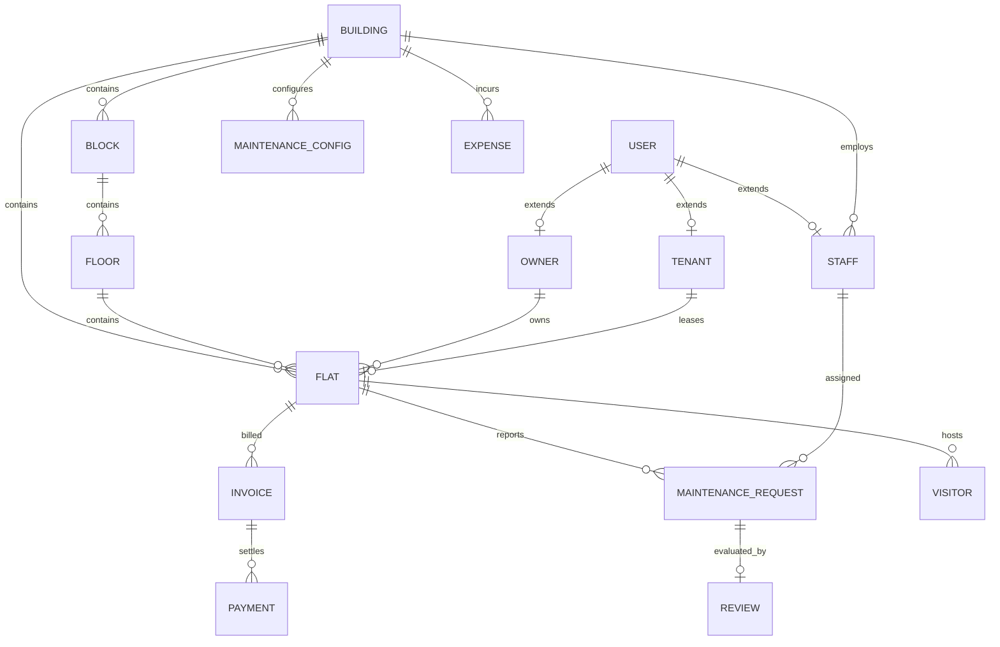

---

### 58. MongoDB Indexing Strategy, Compound Indexes & Query Performance

| Collection | Index Fields | Type | Purpose |
| :--- | :--- | :--- | :--- |
| `users` | `{ email: 1 }` | Unique Partial (`isDeleted: false`) | Login lookup & duplicate prevention |
| `blocks` | `{ buildingId: 1, name: 1 }` | Compound Unique | Unique block names per building |
| `floors` | `{ blockId: 1, floorNumber: 1 }`| Compound Unique | Unique floor numbers per block |
| `flats` | `{ blockId: 1, flatNumber: 1 }` | Compound Unique | Unique flat numbers per block |
| `invoices` | `{ flatId: 1, billingPeriod: 1 }`| Compound Unique | Idempotent monthly invoicing |
| `payments` | `{ paymentNumber: 1 }` | Unique | Transaction receipt lookup |
| `reviews` | `{ maintenanceRequestId: 1 }` | Unique | One review per completed work order |
| `visitors` | `{ passCode: 1 }` | Unique | Gate pass verification |
| `notifications` | `{ createdAt: 1 }` | TTL Index (90 days) | Auto-cleanup of expired alerts |
| `auditLogs` | `{ resourceId: 1, createdAt: -1 }` | Compound | Forensic entity timeline |

---

### 59. MongoDB Multi-Document ACID Transactions & Financial Boundaries

MongoDB multi-document ACID transactions (`session.startTransaction()`) are mandatory for:
1. **Invoice Batch Generation:** Locks configuration snapshot, asserts uniqueness on `(flatId, billingPeriod)`, and records billing log atomically.
2. **Payment Settlement:** Locks target invoice, records payment document, recalculates `paidAmount` and `dueAmount`, conditionally updates status to `PAID`, and writes transactional outbox event.
3. **Tenant Move-In / Move-Out:** Atomically mutates flat occupancy status and tenant lease status.
4. **Service Review Creation:** Inserts review and atomically recalculates technician weighted rating metrics in `staff` collection.

## PART G — API SPECIFICATION & COMMUNICATION CONTRACTS

### 60. RESTful API Conventions, Base URI (`/api/v1`), Versioning & HTTP Status Codes

The API is architected strictly around RESTful principles:
- **Base URI Path:** All routes reside under the versioned prefix `/api/v1/`.
- **Resource Naming:** Lowercase, plural kebab-case nouns (e.g., `/maintenance-requests`, `/audit-logs`).
- **HTTP Method Semantics:**
  - `GET`: Safe, idempotent retrieval of resources or collections.
  - `POST`: Creation of subordinate resources or execution of non-idempotent actions.
  - `PATCH`: Partial mutation of resource fields or state transitions.
  - `DELETE`: Soft deletion of resources.
- **Deterministic HTTP Status Codes:**
  - `200 OK`: Successful read or update operation.
  - `201 Created`: Resource successfully created.
  - `400 Bad Request`: Zod validation error or violated business invariant.
  - `401 Unauthorized`: Missing or invalid Bearer access JWT.
  - `403 Forbidden`: Insufficient RBAC permission or failed OBAC building/flat scope check.
  - `404 Not Found`: Target resource does not exist or has been soft-deleted.
  - `409 Conflict`: Unique constraint collision.
  - `422 Unprocessable Entity`: Semantic logic error during transaction execution.
  - `429 Too Many Requests`: Rate limit threshold exceeded.
  - `500 Internal Server Error`: Unhandled server exception (stack trace hidden in prod).

---

### 61. Standard API Response Contracts (`ApiResponse` & `ApiError` Formats)

#### 1. Standard Success Envelope (`ApiResponse`)
```json
{
  "success": true,
  "message": "Operation completed successfully",
  "data": {},
  "meta": {
    "page": 1,
    "limit": 20,
    "totalRecords": 142,
    "totalPages": 8,
    "hasNextPage": true,
    "hasPrevPage": false
  }
}
```

#### 2. Standard Error Envelope (`ApiError`)
```json
{
  "success": false,
  "message": "Validation failed on incoming request",
  "errors": [
    {
      "field": "areaSqFt",
      "message": "Expected positive number, received -50"
    }
  ],
  "data": null
}
```

---

### 62. Pagination, Filtering, Sorting & Search Query Standard

All collection endpoints support standardized URL query parameters:
- `page`: Integer page number (Default: `1`).
- `limit`: Records per page (Default: `20`, Max: `100`).
- `sortBy`: Field name for sorting (Default: `createdAt`).
- `sortOrder`: `asc` or `desc` (Default: `desc`).
- `search`: String matching indexed text fields.
- `buildingId`: Filter by authorized building scope.
- `status`: Filter by entity status enum.

---

### 63. Complete API Endpoint Inventory (Full 24-Module Matrix)

| Module | Method | Endpoint Path | Min. Role | Required Permission | Description |
| :--- | :--- | :--- | :--- | :--- | :--- |
| **Auth** | `POST` | `/api/v1/auth/login` | Public | None | Authenticate credentials & issue tokens |
| **Auth** | `POST` | `/api/v1/auth/refresh` | Public | None | Rotate refresh token & return new access JWT |
| **Auth** | `POST` | `/api/v1/auth/logout` | Authed | None | Revoke active session record |
| **Auth** | `GET` | `/api/v1/auth/me` | Authed | None | Get current authenticated user profile |
| **Auth** | `POST` | `/api/v1/auth/activate-account` | Public | None | Complete invite onboarding & set password |
| **Users** | `POST` | `/api/v1/users/invite` | Admin | `USER_CREATE` | Invite staff/resident via email token |
| **Users** | `GET` | `/api/v1/users` | Manager | `USER_READ` | List users with role/status filters |
| **Users** | `GET` | `/api/v1/users/:id` | Manager | `USER_READ` | Retrieve user details |
| **Users** | `PATCH`| `/api/v1/users/:id/status` | Admin | `USER_STATUS_UPDATE`| Update status (Active/Suspended) |
| **Roles** | `GET` | `/api/v1/roles` | Authed | None | List system roles & descriptions |
| **Permissions**| `GET` | `/api/v1/permissions` | SuperAdmin| `ROLE_MANAGE` | List granular system permissions |
| **Buildings**| `POST` | `/api/v1/buildings` | SuperAdmin| `BUILDING_CREATE` | Provision new complex |
| **Buildings**| `GET` | `/api/v1/buildings` | Authed | `BUILDING_READ` | List authorized complexes |
| **Buildings**| `PATCH`| `/api/v1/buildings/:id` | Admin | `BUILDING_UPDATE` | Update complex metadata |
| **Blocks** | `POST` | `/api/v1/blocks` | Admin | `BLOCK_MANAGE` | Register block/tower in building |
| **Blocks** | `GET` | `/api/v1/blocks` | Authed | `BUILDING_READ` | List blocks for building |
| **Floors** | `POST` | `/api/v1/floors` | Admin | `FLOOR_MANAGE` | Register floor level in block |
| **Floors** | `GET` | `/api/v1/floors` | Authed | `BUILDING_READ` | List floors for block |
| **Flats** | `POST` | `/api/v1/flats` | Admin | `FLAT_CREATE` | Provision new flat unit |
| **Flats** | `GET` | `/api/v1/flats` | Authed | `FLAT_READ` | List flats with filters |
| **Flats** | `PATCH`| `/api/v1/flats/:id/status` | Manager | `FLAT_UPDATE` | Transition flat occupancy status |
| **Owners** | `POST` | `/api/v1/owners` | Admin | `OWNER_MANAGE` | Register property owner & link deeds |
| **Owners** | `GET` | `/api/v1/owners` | Accountant| `USER_READ` | List property owners |
| **Tenants** | `POST` | `/api/v1/tenants` | Admin | `TENANT_MANAGE` | Onboard tenant lease contract |
| **Tenants** | `PATCH`| `/api/v1/tenants/:id/move-out`| Manager | `TENANT_MANAGE` | Execute tenant move-out & release flat |
| **Staff** | `POST` | `/api/v1/staff` | Admin | `STAFF_MANAGE` | Provision maintenance/security personnel|
| **Staff** | `GET` | `/api/v1/staff` | Manager | `STAFF_ASSIGN` | List staff with trade/shift filters |
| **Maint. Config**| `POST`| `/api/v1/maintenance-configurations`| Accountant| `BILLING_CONFIG_MANAGE`| Set maintenance rate formula |
| **Maint. Config**| `GET` | `/api/v1/maintenance-configurations/active`| Authed| `BILLING_CONFIG_MANAGE`| Fetch active rate formula |
| **Work Orders**| `POST` | `/api/v1/maintenance-requests`| Resident | `COMPLAINT_CREATE` | Submit repair work order |
| **Work Orders**| `GET` | `/api/v1/maintenance-requests`| Authed | `COMPLAINT_READ` | List work orders with filters |
| **Work Orders**| `PATCH`| `/api/v1/maintenance-requests/:id/assign`| Manager | `COMPLAINT_ASSIGN` | Dispatch technician to work order |
| **Work Orders**| `PATCH`| `/api/v1/maintenance-requests/:id/status`| Staff | `COMPLAINT_UPDATE_STATUS`| Update work status & photo proof |
| **Work Orders**| `PATCH`| `/api/v1/maintenance-requests/:id/verify`| Resident | `COMPLAINT_RESOLVE` | Sign-off on completed repair |
| **Invoices** | `POST` | `/api/v1/invoices/generate-batch`| Accountant| `INVOICE_GENERATE`| Trigger monthly batch invoice run |
| **Invoices** | `GET` | `/api/v1/invoices` | Authed | `INVOICE_READ` | Query invoices |
| **Invoices** | `PATCH`| `/api/v1/invoices/:id/void` | Accountant| `INVOICE_UPDATE` | Void draft/erroneous invoice |
| **Payments** | `POST` | `/api/v1/payments` | Authed | `PAYMENT_CREATE` | Settle invoice within ACID session |
| **Payments** | `GET` | `/api/v1/payments` | Authed | `PAYMENT_READ` | List payment ledger receipts |
| **Complaints**| `POST` | `/api/v1/complaints` | Resident | `COMPLAINT_CREATE` | File society grievance ticket |
| **Complaints**| `PATCH`| `/api/v1/complaints/:id/resolve`| Manager | `COMPLAINT_RESOLVE` | Close grievance with notes |
| **Reviews** | `POST` | `/api/v1/reviews` | Resident | `REVIEW_CREATE` | Rate completed work order (1-5 stars) |
| **Reviews** | `GET` | `/api/v1/reviews` | Authed | `REVIEW_READ` | View technician ratings |
| **Notices** | `POST` | `/api/v1/notices` | Manager | `NOTICE_CREATE` | Publish broadcast announcement |
| **Notices** | `GET` | `/api/v1/notices` | Authed | `NOTICE_READ` | Read active community bulletins |
| **Notifications**| `GET`| `/api/v1/notifications` | Authed | None | Get user in-app alert stream |
| **Notifications**| `PATCH`| `/api/v1/notifications/:id/read`| Authed| None | Mark alert read |
| **Expenses** | `POST` | `/api/v1/expenses` | Accountant| `EXPENSE_CREATE` | Log society operational expense |
| **Expenses** | `PATCH`| `/api/v1/expenses/:id/approve`| Admin | `EXPENSE_APPROVE` | Authorize expense payout |
| **Visitors** | `POST` | `/api/v1/visitors` | Resident | `VISITOR_PASS_GENERATE`| Pre-approve guest pass code/QR |
| **Visitors** | `PATCH`| `/api/v1/visitors/:id/check-in`| Security | `VISITOR_CHECK_IN`| Log visitor entry at gate |
| **Visitors** | `PATCH`| `/api/v1/visitors/:id/check-out`| Security | `VISITOR_CHECK_OUT`| Log visitor exit at gate |
| **Documents** | `POST` | `/api/v1/documents` | Manager | `DOCUMENT_UPLOAD` | Upload society bylaws / deeds |
| **Documents** | `GET` | `/api/v1/documents` | Authed | `DOCUMENT_READ` | Access authorized documents |
| **Reports** | `GET` | `/api/v1/reports/maintenance-collections`| Accountant| `INVOICE_READ`| Financial collection analytics |
| **Reports** | `GET` | `/api/v1/reports/staff-performance`| Manager | `STAFF_ASSIGN` | Technician resolution velocity |
| **Audit Logs**| `GET` | `/api/v1/audit-logs` | Admin | `AUDIT_READ` | Query immutable audit trail |

---

### 64. Next.js Frontend Integration Contract & Client State Architecture

```javascript
// client/lib/api-client.js (Next.js Client Contract)
import axios from 'axios';

export const apiClient = axios.create({
  baseURL: process.env.NEXT_PUBLIC_API_URL || 'http://localhost:5000/api/v1',
  withCredentials: true // Mandates transmission of HttpOnly refresh cookie
});

// Request Interceptor: Attach Bearer Access Token
apiClient.interceptors.request.use((config) => {
  const token = getAccessTokenFromMemory();
  if (token) {
    config.headers.Authorization = `Bearer ${token}`;
  }
  return config;
});

// Response Interceptor: Handle 401 & Automatic Token Refresh
apiClient.interceptors.response.use(
  (response) => response.data,
  async (error) => {
    const originalRequest = error.config;
    if (error.response?.status === 401 && !originalRequest._retry) {
      originalRequest._retry = true;
      try {
        const { data } = await axios.post(
          `${process.env.NEXT_PUBLIC_API_URL}/auth/refresh`,
          {},
          { withCredentials: true }
        );
        setAccessTokenInMemory(data.data.accessToken);
        originalRequest.headers.Authorization = `Bearer ${data.data.accessToken}`;
        return apiClient(originalRequest);
      } catch (refreshError) {
        clearAuthContextAndRedirectToLogin();
        return Promise.reject(refreshError);
      }
    }
    return Promise.reject(error.response?.data || error);
  }
);
```

---

## PART H — SYSTEM GOVERNANCE, QUALITY, DEVOPS & EVOLUTION

### 65. Zero-Trust Zod Validation Architecture & Shared Schemas

```javascript
// src/middlewares/validate.middleware.js
export const validate = (schema) => (req, res, next) => {
  try {
    const validated = schema.parse({
      body: req.body,
      query: req.query,
      params: req.params
    });
    req.body = validated.body;
    req.query = validated.query;
    req.params = validated.params;
    next();
  } catch (error) {
    next(error);
  }
};
```

---

### 66. Centralized Error Handling Architecture & Database Translation

| Exception Type | Source | Translated Status | Output Message to Client |
| :--- | :--- | :--- | :--- |
| `ZodError` | Input Validation | `400 Bad Request` | Itemized field validation errors array. |
| `CastError` | Mongoose (Invalid ObjectId) | `400 Bad Request` | "Invalid identifier format provided." |
| `MongoServerError (11000)`| MongoDB Unique Index Collision | `409 Conflict` | "Duplicate resource: [fieldName] already exists." |
| `JsonWebTokenError` | JWT Verification | `401 Unauthorized` | "Invalid authentication token signature." |
| `TokenExpiredError`| JWT Verification | `401 Unauthorized` | "Authentication token has expired." |
| `Error` | Unhandled Runtime Exception | `500 Server Error` | "Internal Server Error" (Stack hidden in prod). |

---

### 67. Comprehensive Security Controls & Production Hardening Checklist

1. **Helmet HTTP Headers:** CSP, HSTS (1 year, preload), X-Content-Type-Options: `nosniff`, Frameguard: `DENY`.
2. **Strict CORS Whitelisting:** Origin verified dynamically against environment allow-list (`process.env.CORS_ORIGIN`); credentials allowed (`credentials: true`).
3. **NoSQL Injection Defense:** `mongo-sanitize` strips any object keys beginning with `$` or containing `.`.
4. **Rate Limiting:**
   - Public Auth Endpoints (`/api/v1/auth/*`): 5 requests per 15-minute window per IP.
   - General API Endpoints: 100 requests per 1-minute window per IP.
5. **Cookie Security:** Cookies set with `HttpOnly: true`, `SameSite: 'Strict'`, and `Secure: true` (in production).

---

### 68. File Upload Security & Cloudinary Memory Stream Pipeline

```javascript
// src/utils/cloudinary.util.js
import { v2 as cloudinary } from 'cloudinary';
import streamifier from 'streamifier';

export const uploadBufferToCloudinary = (buffer, folder, mimeType) => {
  return new Promise((resolve, reject) => {
    const stream = cloudinary.uploader.upload_stream(
      {
        folder: `flat-maintenance/${folder}`,
        resource_type: mimeType.includes('pdf') ? 'raw' : 'image',
        allowed_formats: ['jpg', 'png', 'webp', 'pdf'],
        max_bytes: 10 * 1024 * 1024 // 10MB limit
      },
      (error, result) => {
        if (error) reject(error);
        else resolve(result.secure_url);
      }
    );
    streamifier.createReadStream(buffer).pipe(stream);
  });
};
```

---

### 69. Logging, Observability & Health/Readiness Endpoints (`/health` & `/ready`)

1. **Liveness Check (`GET /health`):**
   - Lightweight check verifying Node.js event loop responsiveness.
   - Returns `{ success: true, message: "Backend API is healthy" }` (Status 200).
   - Does NOT query MongoDB (prevents cascading health check failures).
2. **Readiness Check (`GET /ready`):**
   - Verifies database connectivity (`mongoose.connection.readyState === 1`).
   - Returns Status 200 when ready; Status 503 when disconnected.
3. **Structured Redacted Logging:**
   - JSON logs: `timestamp`, `level`, `correlationId`, `method`, `path`, and `durationMs`.
   - Sensitive credentials redacted automatically.

---

### 70. Formal State Machines & Transition Rules (7 Mermaid State Graphs)

#### 1. User Account State Machine
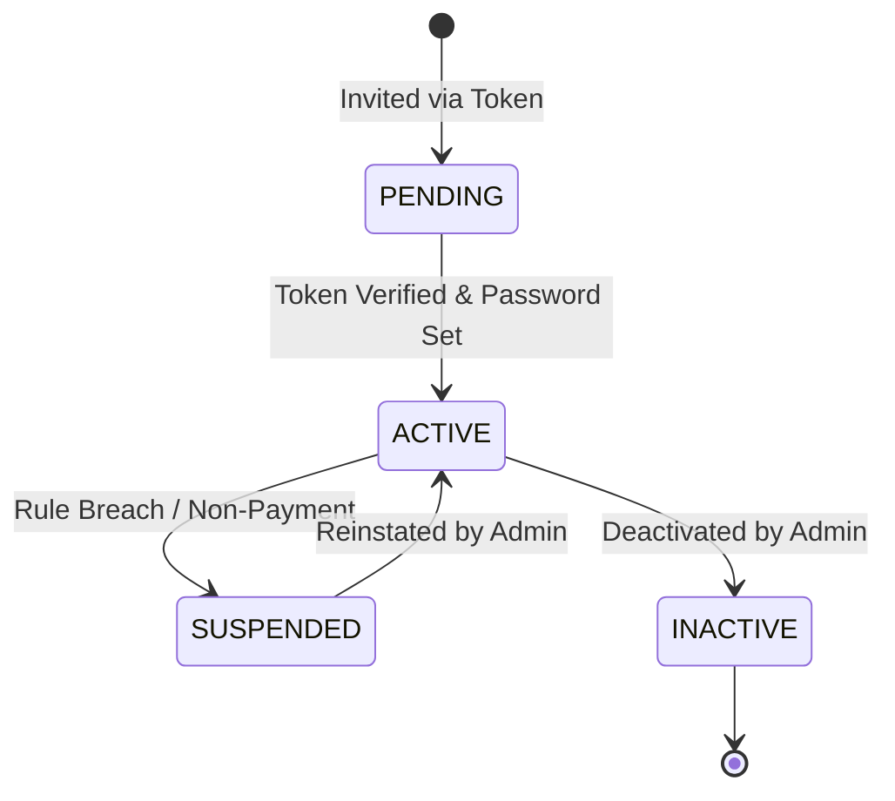

#### 2. Flat Occupancy State Machine
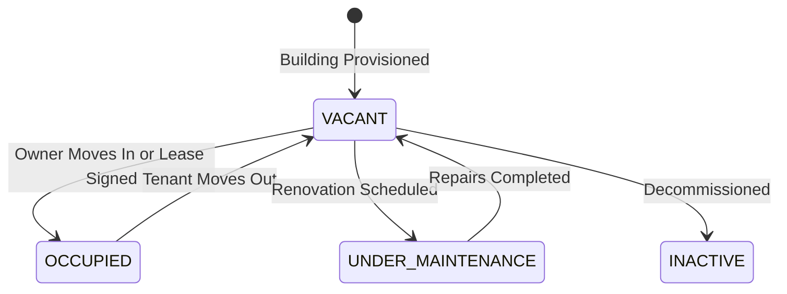

#### 3. Maintenance Request / Work Order State Machine
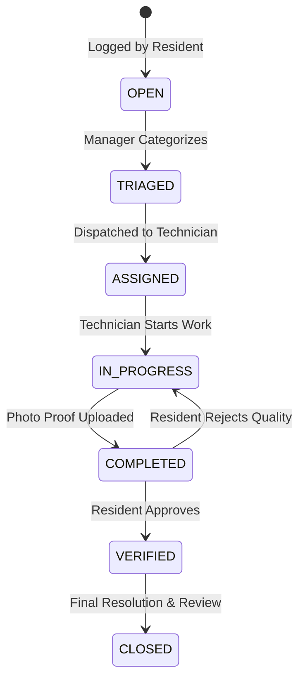

#### 4. Grievance Complaint State Machine
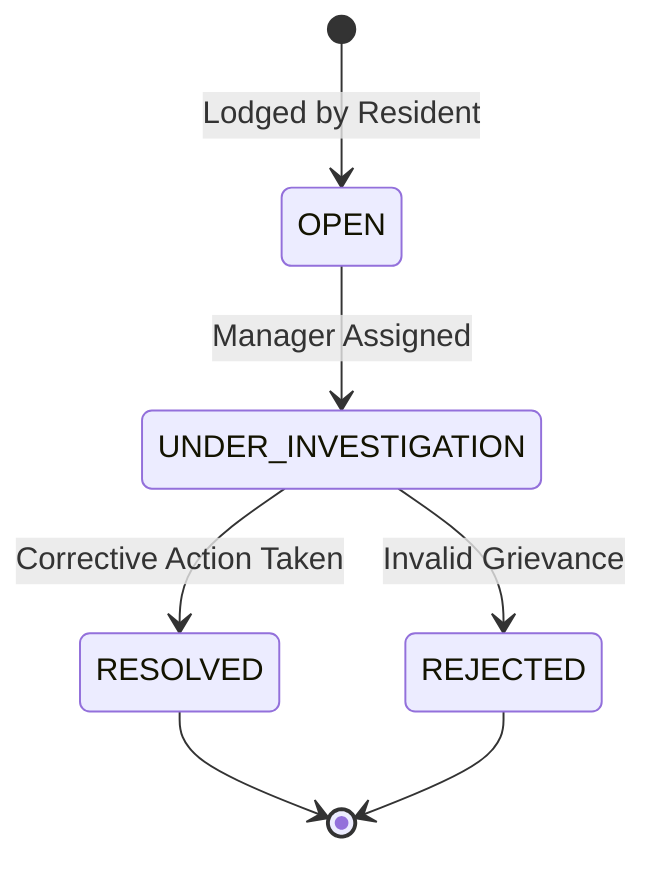

#### 5. Maintenance Invoice State Machine
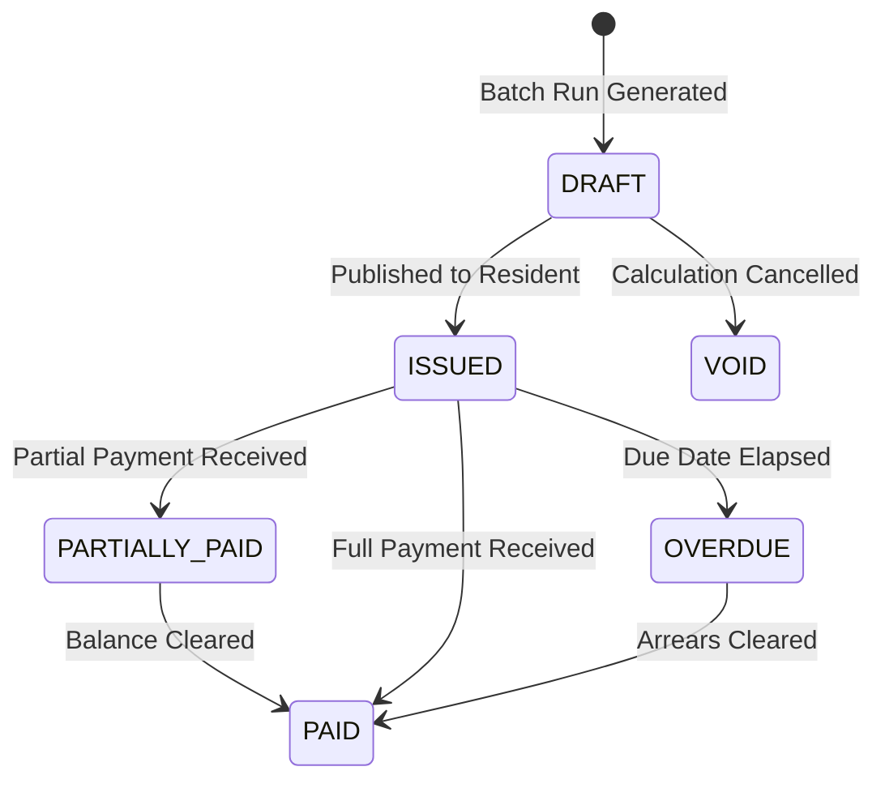

#### 6. Financial Payment Transaction State Machine
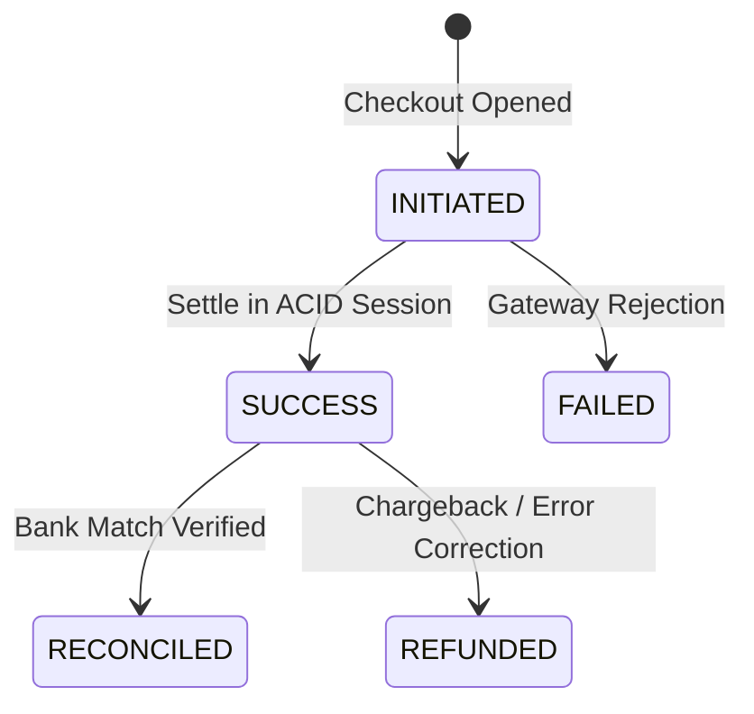

#### 7. Gate Visitor Pass State Machine
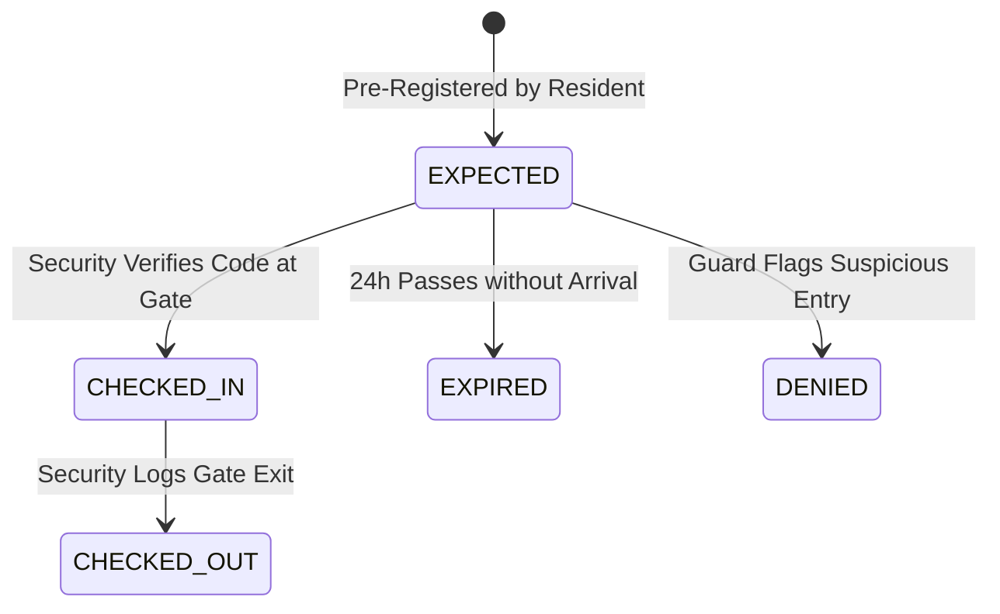

---

### 71. Testing Architecture & Test Execution Matrix

| Test Tier | Scope | Target Files | Verification Objective |
| :--- | :--- | :--- | :--- |
| **Unit Tests** | Services & Utilities | `tests/unit/**/*.test.js` | Formula math, date formatting, Zod schema edge cases with mocks. |
| **Integration Tests** | Mongoose & Mongo rs0 | `tests/integration/**/*.test.js` | Database indexes, soft delete hooks, ACID multi-document transactions. |
| **API Route Tests** | Full HTTP Endpoints | `tests/e2e/**/*.test.js` | Supertest HTTP invocations testing JWT auth, RBAC, and status codes. |
| **Smoke Tests** | Deployment Verification | `src/scripts/api-smoke-test.js` | Fast health-check and contract probe executed post-deploy. |

---

### 72. Multi-Stage Production Docker & Docker Compose Specification

```dockerfile
# Stage 1: Build & Dependencies
FROM node:22-alpine AS builder
WORKDIR /app
COPY package.json yarn.lock ./
RUN yarn install --frozen-lockfile

# Stage 2: Production Minimal Image
FROM node:22-alpine AS runner
WORKDIR /app
ENV NODE_ENV=production
COPY package.json yarn.lock ./
RUN yarn install --frozen-lockfile --production && yarn cache clean
COPY --from=builder /app/node_modules ./node_modules
COPY src ./src
USER node
EXPOSE 5000
CMD ["node", "src/server.js"]
```

---

### 73. GitHub Actions CI/CD Automated Pipeline

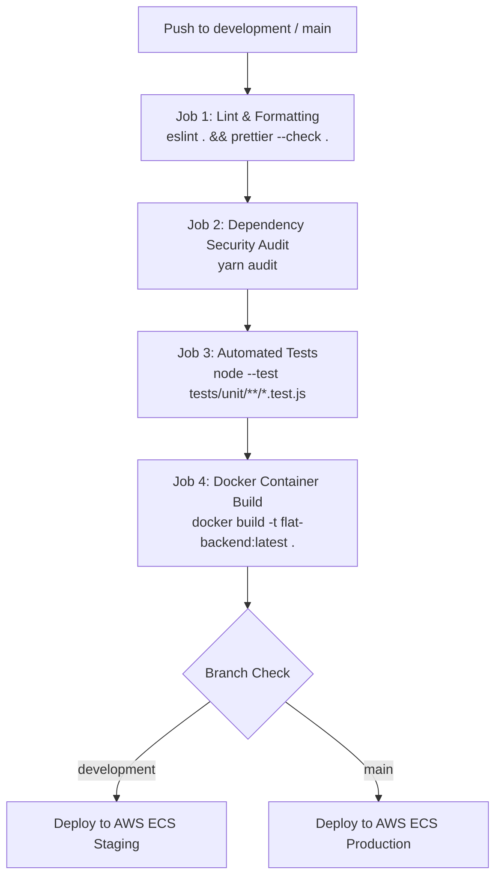

---

### 74. AWS Production Cloud Deployment Architecture

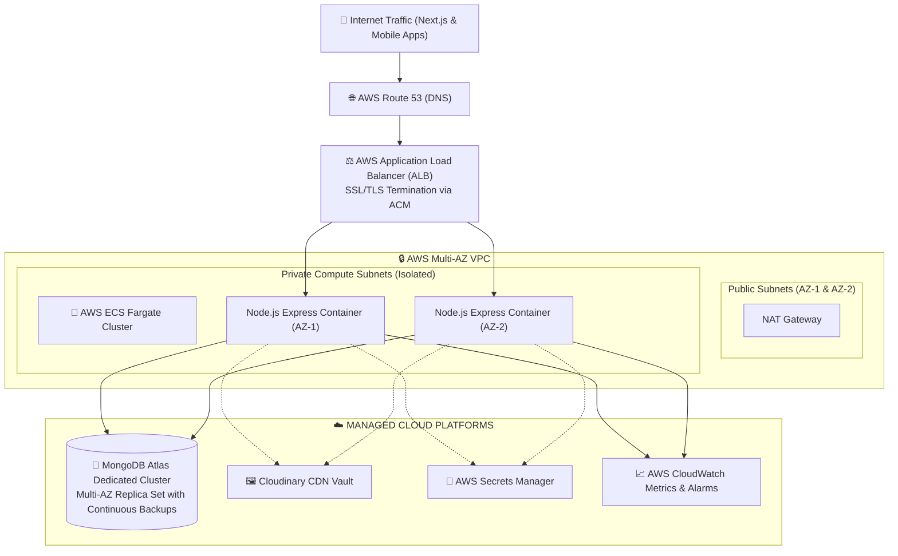

---

### 75. Backups, Disaster Recovery, RPO (< 5 min) & RTO (< 1 hr)

1. **Recovery Point Objective (RPO) < 5 minutes:** Continuous oplog tailing and automated hourly snapshot backups powered by MongoDB Atlas.
2. **Recovery Time Objective (RTO) < 60 minutes:** Automated Terraform disaster recovery runbooks deploy the ECS Fargate cluster and ALB into a secondary AWS standby region within one hour.
3. **Data Integrity Testing:** Automated monthly backup restore drills restore snapshots to isolated staging clusters.

---

### 76. Edge Cases & Backend Mitigation Matrix

| Edge Case Scenario | Potential Impact | Architectural Mitigation Strategy |
| :--- | :--- | :--- |
| **Concurrent Double Payments** | Duplicate money deducted for single invoice. | Multi-document ACID transaction locks invoice document; rejects second payment once `dueAmount === 0`. |
| **Simultaneous Batch Invoicing** | Duplicate invoices generated for same month. | Compound unique index on `{ flatId: 1, billingPeriod: 1 }` rejects duplicate creation with `409 Conflict`. |
| **Refresh Token Interception** | Attacker impersonates legitimate user. | Single-use rotation; presentation of an already-used token immediately revokes the entire token family. |
| **Stale Technician Availability** | Urgent work order assigned to technician on leave. | Service checks `staff.status === 'ACTIVE'` before allowing ticket assignment; throws `422 Unprocessable`. |
| **Sudden External Webhook Outage** | n8n server downtime blocks API response. | Transactional Outbox pattern decouples database writes from webhook delivery; retries with exponential backoff. |
| **Exorbitant File Upload Attempt** | Disk exhaustion or memory bloat DoS. | Multer memory buffer limit enforced at 10MB; rejects oversize payloads with `413 Payload Too Large`. |

---

### 77. Architectural Decision Records (ADR-001 to ADR-012)

- **ADR-001: Modular Monolith vs. Premature Microservices:** Adopt a single deployable Express unit structured into isolated domain modules. Maximizes developer velocity and avoids distributed saga overhead.
- **ADR-002: MongoDB Document Store Selection:** Standardize on MongoDB 7.0+ for JSON document flexibility, deep line-item nesting, and native multi-document ACID transactions.
- **ADR-003: JWT Dual-Token Authentication:** 15-minute Bearer access tokens paired with 7-day HttpOnly `SameSite=Strict` cookies. Eliminates persistent DB lookups on routine API calls.
- **ADR-004: Refresh Token Rotation & Theft Detection:** Single-use refresh tokens with family tracking. Detected reuse revokes all active sessions for the user account.
- **ADR-005: Hybrid RBAC + OBAC Authorization:** Combine route-level permission checks with service-level building and flat scope validation to guarantee multi-tenant data isolation.
- **ADR-006: Mandatory Multi-Document ACID Transactions:** Enforce `session.startTransaction()` for all multi-collection financial writes. Local development requires replica set `rs0`.
- **ADR-007: Cloudinary Direct RAM Stream Uploads:** Stream media directly from RAM buffer to Cloudinary CDN, guaranteeing container statelessness.
- **ADR-008: Multi-Stage Docker Containerization:** Multi-stage Alpine build reducing image size from 1GB to < 180MB; executes under non-root `node` user.
- **ADR-009: Transactional Outbox Pattern for Webhooks:** Persist domain events inside same ACID session; dispatch HMAC SHA-256 signed webhooks to n8n asynchronously.
- **ADR-010: Deferred Selective Microservices Extraction:** Defer microservice extraction until specific domain telemetry (e.g. notifications) demands horizontal separation.
- **ADR-011: Zero-Trust Zod Validation Engine:** Mandate strict schema validation across body, query, and params prior to controller invocation.
- **ADR-012: Append-Only Immutable Audit Trail:** Disallow database updates or deletions on `auditLogs` collection, preserving strict forensic accountability.

---

### 78. 20-Phase Implementation Roadmap (Phase 0 to Phase 19)

| Phase | Phase Name | Primary Deliverables | Definition of Done |
| :--- | :--- | :--- | :--- |
| **Phase 0** | **Foundation & Setup** | Repository, ESM, ESLint, Prettier, Commitlint. | `npm run lint` and `npm run format:check` pass. |
| **Phase 1** | **Configuration & Infrastructure** | Zod env validation, Mongoose connection pool, replica set docker. | Server boots; connects to Mongo rs0. |
| **Phase 2** | **Authentication & Sessions** | Login, token rotation, cookies, password hashing. | Auth test suite passes; token rotation verified. |
| **Phase 3** | **Users & RBAC Engine** | 6-tier roles, permissions registry, authorize middleware. | Role-permission matrix verified by unit tests. |
| **Phase 4** | **Building Hierarchy** | Buildings, Blocks, Floors, Flats CRUD & compound indexes. | Tree integrity enforced; unique indexes pass. |
| **Phase 5** | **Residents & Occupancy** | Owners, Tenants, lease management, move-in/out workflows. | Occupancy state machine validated. |
| **Phase 6** | **Staff Management** | Staff profiles, categories (maintenance/security), shifts. | Staff onboarding & trade filters verified. |
| **Phase 7** | **Maintenance Configurations** | Rate formula rules, base rates, late fee percentages. | Formula calculation unit tests pass. |
| **Phase 8** | **Maintenance Requests** | Work orders, 7-stage state machine, manager triage. | State machine transitions tested. |
| **Phase 9** | **Batch Invoicing Engine** | Batch monthly invoice generator, cursor streaming. | Batch generator creates 100 invoices idempotently. |
| **Phase 10** | **Payments & ACID Ledger** | Payment execution inside MongoDB transaction session. | Payment settlements verified against rs0 replica set. |
| **Phase 11** | **Complaints & Grievances** | Grievance logging, disturbance categories, resolution. | Complaint lifecycle verified. |
| **Phase 12** | **Service Reviews & Ratings** | 1-5 star ratings, atomic staff aggregate recalculations. | Rating calculation math verified by unit tests. |
| **Phase 13** | **Notices & Announcements** | Bulletins, audience targeting, auto-expiration filters. | Targeted broadcast feeds verified. |
| **Phase 14** | **In-App Notifications** | Real-time user alert streams, read receipts, TTL cleanup. | Notification lifecycle tested. |
| **Phase 15** | **Society Expenses** | Vendor expense logging, receipt upload, admin approval. | Expense authorization workflow verified. |
| **Phase 16** | **Gate Security & Visitors** | Digital pass generation, gate check-in/out logging. | Visitor state machine verified. |
| **Phase 17** | **Documents Repository** | Cloudinary memory streaming, role access governance. | Document upload & role filtering verified. |
| **Phase 18** | **Reports & Audit Logs** | Collection analytics, append-only immutable audit trail. | Audit immutability verified. |
| **Phase 19** | **n8n Automation & Release** | Outbox worker, HMAC webhooks, CI/CD, AWS deploy. | 14 n8n workflows operational; smoke test green. |

---

### 79. Current Implementation vs. Target Architecture (Gap Analysis)

| Capability Area | Current Repository State | Target Architecture Specification | Delivery Gap | Delivery Status |
| :--- | :--- | :--- | :--- | :--- |
| **API Gateway** | `GET /` and `GET /health` in `src/app.js`. | `/api/v1` router with 24 domain modules, `ApiResponse` & `ApiError`. | Router, 404 handler, error middleware. | `[IMPLEMENTED]` for root; `[PLANNED]` for v1 |
| **Authentication** | Dependencies declared in `package.json`. | Dual-token JWT rotation, HttpOnly cookies, invite onboarding. | Auth module & session rotation logic. | `[PARTIAL]` (deps declared; code queued) |
| **Access Control** | Roles specified in documentation. | 6-tier RBAC + OBAC building/flat scope middleware. | Authorization middleware & scope checks. | `[PLANNED]` |
| **Data Models** | DB helper in `src/config/db.config.js`. | 24 Mongoose collection schemas with compound indexes. | Schema files across 24 modules. | `[IMPLEMENTED]` for conn; `[PLANNED]` for schemas|
| **Validation** | Zod dependency installed. | Zero-trust validation for body, query, params across routes. | Validation middleware & Zod schemas. | `[PARTIAL]` (dep installed; schemas queued) |
| **Transactions** | Specification defined in blueprint. | Multi-document ACID transactions for billing & payments. | Payment service transaction orchestration. | `[PLANNED]` |
| **Media Storage** | Cloudinary & Multer declared. | Direct RAM buffer streaming to Cloudinary CDN. | Memory stream utility in `src/utils/`. | `[PARTIAL]` (deps declared; util queued) |
| **Automations** | Architecture specified in blueprint. | Transactional outbox collection & signed n8n webhooks. | Outbox worker & HMAC signer. | `[PLANNED]` |
| **DevOps & CI** | Dockerfile, docker-compose, smoke-test. | Multi-stage Docker, Mongo rs0, GitHub Actions CI/CD. | Local replica set validation script. | `[IMPLEMENTED]` |

---

### 80. Master Production Readiness Checklist & 10 Principal Architect Quality Gates

Before deploying any module or marking the system release-ready, an engineering lead or auditor must verify the **10 Principal Architect Quality Gates**:

1. **Zero Logic in Controllers:** Controllers act purely as HTTP adapters; 100% of business invariants, calculations, and database calls reside in domain services.
2. **Deterministic Input Validation:** No unvalidated client inputs reach database queries; every route is guarded by strict Zod schemas.
3. **Privilege Escalation Prevention:** No public self-registration exists for privileged administrative or staff roles; accounts require cryptographic invitations.
4. **Tenant Isolation (Multi-Building Safety):** Building Admins and Accountants cannot inspect or mutate records outside their explicitly assigned building scope.
5. **Financial ACID Safety:** All payment settlements, invoice balance adjustments, and batch billing runs execute inside MongoDB multi-document ACID transactions.
6. **Token Replay Mitigation:** Stolen refresh tokens cannot be replayed; detected reuse immediately invalidates the entire token family.
7. **Stateless Scalability:** Containers maintain zero local disk state; files stream directly to Cloudinary CDN, enabling seamless horizontal autoscaling on AWS ECS.
8. **Stateless Media Security:** Uploaded files are strictly validated against MIME allow-lists and size limits before streaming to cloud storage.
9. **Forensic Traceability:** Every sensitive mutation writes an immutable, append-only record to `auditLogs` containing actor ID, IP, and before/after state snapshots.
10. **Single Source of Truth Alignment:** Codebase implementation strictly mirrors this technical architecture document; no undocumented routes, fields, or bypasses exist.

---
### END OF BACKEND TECHNICAL ARCHITECTURE SPECIFICATION
$$
