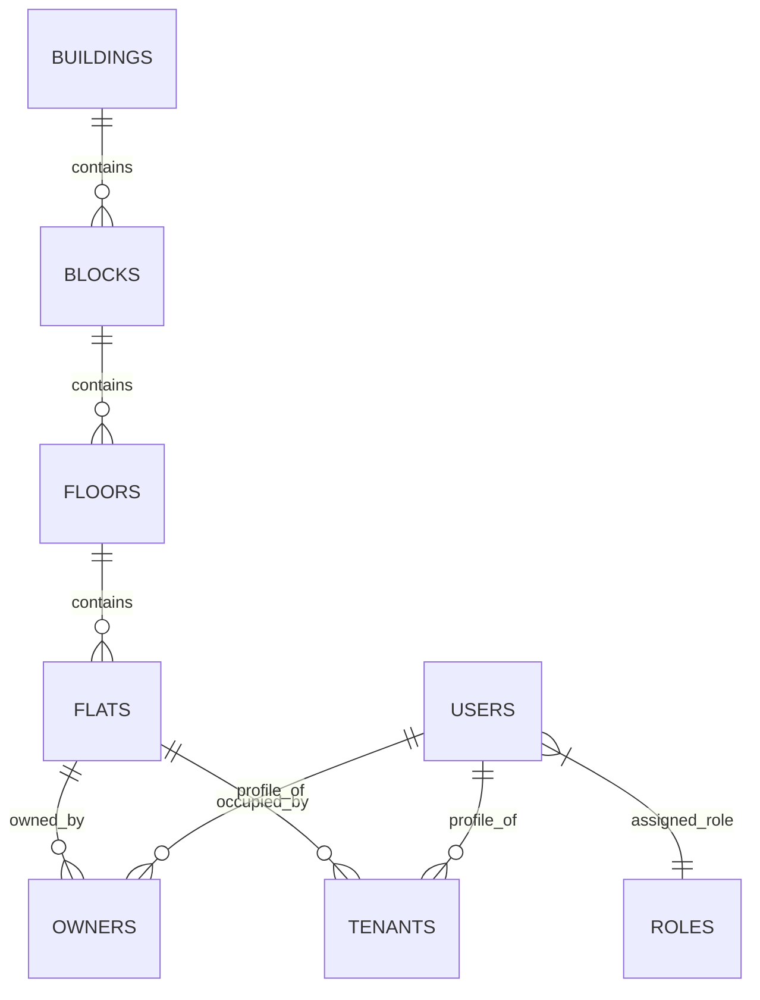
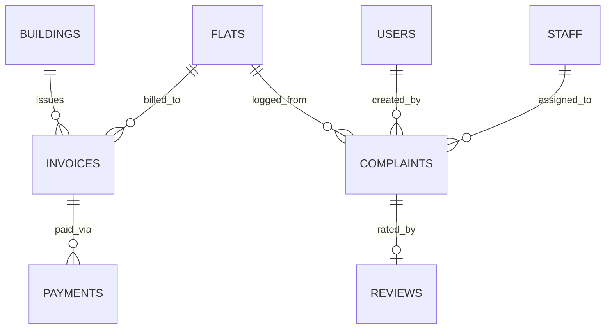
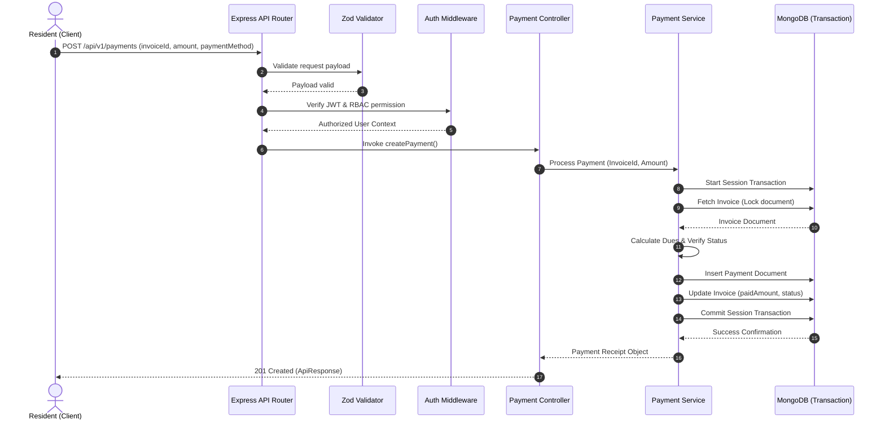

# FLAT MAINTENANCE MANAGEMENT SYSTEM

## BACKEND TECHNICAL ARCHITECTURE SPECIFICATION & SYSTEM DESIGN BLUEPRINT

---

> **Document Version:** 2.0.0
> **Status:** Target architecture / implementation blueprint (SSOT)
> **Target System:** Flat Maintenance Management System (Backend REST API)  
> **Primary Stack:** Node.js (v22+ ESM), Express.js (v5.x), MongoDB, Mongoose ODM, Zod, JWT, Docker  
> **Architecture Pattern:** Modular Monolith with Layered Hexagonal/Clean Principles

---

## TABLE OF CONTENTS

1. [Executive Summary & Project Overview](#1-executive-summary--project-overview)
2. [Technology Stack & Library Justifications](#2-technology-stack--library-justifications)
3. [Backend Architecture & Layered Design](#3-backend-architecture--layered-design)
4. [Project Directory Structure](#4-project-directory-structure)
5. [Engineering & Development Principles](#5-engineering--development-principles)
6. [API Design Standard & Conventions](#6-api-design-standard--conventions)
7. [Standard API Response Specification](#7-standard-api-response-specification)
8. [HTTP Status Code Standard](#8-http-status-code-standard)
9. [Environment Configuration & Management](#9-environment-configuration--management)
10. [Database Architecture & Data Modeling Principles](#10-database-architecture--data-modeling-principles)
11. [Database Collections Specification (Complete 22 Schemas)](#11-database-collections-specification)
12. [Module 1 — Authentication](#12-module-1--authentication)
13. [Module 2 — Users](#13-module-2--users)
14. [Module 3 — Roles & Permissions (RBAC)](#14-module-3--roles--permissions-rbac)
15. [Module 4 — Buildings](#15-module-4--buildings)
16. [Module 5 — Blocks](#16-module-5--blocks)
17. [Module 6 — Floors](#17-module-6--floors)
18. [Module 7 — Flats](#18-module-7--flats)
19. [Module 8 — Owners](#19-module-8--owners)
20. [Module 9 — Tenants](#20-module-9--tenants)
21. [Module 10 — Staff](#21-module-10--staff)
22. [Module 11 — Maintenance Configurations](#22-module-11--maintenance-configurations)
23. [Module 12 — Invoices](#23-module-12--invoices)
24. [Module 13 — Payments & Transactions](#24-module-13--payments--transactions)
25. [Module 14 — Complaints](#25-module-14--complaints)
26. [Module 15 — Ratings & Reviews](#26-module-15--ratings--reviews)
27. [Module 16 — Notices](#27-module-16--notices)
28. [Module 17 — Notifications](#28-module-17--notifications)
29. [Module 18 — Expenses](#29-module-18--expenses)
30. [Module 19 — Visitors](#30-module-19--visitors)
31. [Module 20 — Documents](#31-module-20--documents)
32. [Module 21 — Reports & Analytics](#32-module-21--reports--analytics)
33. [Module 22 — Audit Logs](#33-module-22--audit-logs)
34. [Global Error Handling Architecture](#34-global-error-handling-architecture)
35. [Validation Architecture (Zod Engine)](#35-validation-architecture-zod-engine)
36. [Authorization Architecture (RBAC + OBAC)](#36-authorization-architecture-rbac--obac)
37. [Pagination Standard](#37-pagination-standard)
38. [Search, Filtering & Sorting Conventions](#38-search-filtering--sorting-conventions)
39. [MongoDB Indexing Strategy](#39-mongodb-indexing-strategy)
40. [Database Transactions (ACID Boundaries)](#40-database-transactions-acid-boundaries)
41. [Security Architecture & Security Checklist](#41-security-architecture--security-checklist)
42. [File Upload Security & Cloud Storage](#42-file-upload-security--cloud-storage)
43. [Logging, Observability & Monitoring](#43-logging-observability--monitoring)
44. [Health Check & Readiness Architecture](#44-health-check--readiness-architecture)
45. [Testing Architecture & Workflow](#45-testing-architecture--workflow)
46. [API Endpoint Inventory (Comprehensive Endpoint Matrix)](#46-api-endpoint-inventory)
47. [Core Business Rules & Constraints](#47-core-business-rules--constraints)
48. [State Machines & Transition Rules](#48-state-machines--transition-rules)
49. [Data Ownership & Multi-Tenancy Evolution](#49-data-ownership--multi-tenancy-evolution)
50. [Backend Performance Optimization](#50-backend-performance-optimization)
51. [Scalability Architecture & Future Microservices Path](#51-scalability-architecture--future-microservices-path)
52. [Background Jobs & Queue Architecture](#52-background-jobs--queue-architecture)
53. [Docker & Containerization Specification](#53-docker--containerization-specification)
54. [CI/CD Automation Pipeline (GitHub Actions)](#54-cicd-automation-pipeline-github-actions)
55. [AWS Cloud Deployment Architecture](#55-aws-cloud-deployment-architecture)
56. [Backups, Disaster Recovery & RPO/RTO](#56-backups-disaster-recovery--rporto)
57. [Frontend Integration Contract (Next.js Client)](#57-frontend-integration-contract-nextjs-client)
58. [Development Workflow & Phase Breakdown](#58-development-workflow--phase-breakdown)
59. [Module Completion Checklist](#59-module-completion-checklist)
60. [Edge Cases & Backend Mitigation Matrix](#60-edge-cases--backend-mitigation-matrix)
61. [Production Readiness Checklist](#61-production-readiness-checklist)
62. [Entity Relationship (ER) Diagrams](#62-entity-relationship-er-diagrams)
63. [Request Flow Sequence Diagrams](#63-request-flow-sequence-diagrams)
64. [Engineering Rules & Quality Controls](#64-engineering-rules--quality-controls)
65. [Implementation Status & Source-of-Truth Rules](#65-implementation-status--source-of-truth-rules)
66. [Provisioning, Authentication & Session Contracts](#66-provisioning-authentication--session-contracts)
67. [Authorization, Building Scope & Permission Contract](#67-authorization-building-scope--permission-contract)
68. [Domain Delivery Contracts](#68-domain-delivery-contracts)
69. [n8n Automation & Event Contract](#69-n8n-automation--event-contract)
70. [Operational Delivery Contract](#70-operational-delivery-contract)

---

## 1. EXECUTIVE SUMMARY & PROJECT OVERVIEW

### 1.1 Purpose of the Backend System

The **Flat Maintenance Management System Backend** serves as the central administrative, financial, operational, and security intelligence engine for modern residential complexes, gated communities, and housing societies. It provides a hardened, highly available RESTful API layer that coordinates complex multi-entity relationships across building hierarchies, resident records, financial billing workflows, maintenance operations, visitor logging, notice publishing, and automated staff audit tracking.

### 1.2 Problems Solved by the System

1. **Financial Opacity & Billing Errors:** Replaces informal cash collections and manual spreadsheet tracking with immutable, auditable invoice calculation engines and payment transaction logs.
2. **Maintenance & Complaint Delay:** Replaces physical logbooks and un-tracked calls with automated complaint lifecycle routing, staff assignment, SLA tracking, and post-resolution resident rating analytics.
3. **Security & Visitor Unawareness:** Eliminates unauthorized building access by mandating real-time visitor pre-approval, resident verification, and entry/exit logging by gate security staff.
4. **Communication Gaps:** Centralizes broadcasts, emergency bulletins, maintenance schedules, and digital document distribution to specific buildings, blocks, or roles.
5. **Lack of Governance & Accountability:** Enforces strict Role-Based Access Control (RBAC) and immutable Audit Logging to track every modification to financial records, occupancy assignments, and security roles.

### 1.3 Target Persona & User Base

- **Super Admin:** System maintainers overseeing society settings, module activation, system-wide audits, and high-level role management.
- **Building Admin:** Operational managers handling building hierarchy (Blocks, Floors, Flats), resident onboarding, staff allocation, notice publishing, and expense management.
- **Accountant:** Financial administrators responsible for maintenance charge configurations, batch invoice generation, payment reconciliations, and financial reporting.
- **Security Staff:** Gate guards responsible for verifying visitor entry/exit codes, logging visitor vehicles, and alerting residents.
- **Maintenance Staff:** Technicians (plumbers, electricians, cleaners) assigned to resolve maintenance complaints and log work completion.
- **Flat Owner:** Property owners tracking flat occupancy, receiving financial statements, paying maintenance bills, and monitoring tenant activities.
- **Tenant:** Legal occupants of flats accessing building notices, logging maintenance complaints, rating completed staff work, and managing guest access.

### 1.4 Primary Responsibilities of the Backend

- Enforce domain business logic, data validation, and state machine transitions.
- Secure endpoints using JWT authentication, HTTP-Only cookies, and granular permissions.
- Execute ACID-compliant MongoDB database transactions for financial calculations.
- Orchestrate file uploads to Cloudinary CDN and generate secure asset URLs.
- Maintain structured application logging, centralized exception handling, and audit trails.
- Expose deterministic RESTful endpoints for web (Next.js) and mobile clients.

### 1.5 Architecture Model: Modular Monolith

The application is intentionally designed as a **Modular Monolith**. Rather than introducing premature microservices complexity (network latency, distributed tracing overhead, saga orchestrations), the backend isolates each domain within self-contained modules (`src/modules/<module-name>`). Each module owns its schema definitions, services, controllers, and validation rules while remaining in a single deployable Express.js unit. This guarantees high cohesion, low coupling, simple local developer workflows, and a direct path to domain extraction into microservices when traffic scale demands it.

---

## 2. TECHNOLOGY STACK & LIBRARY JUSTIFICATIONS

| Category             | Selected Technology                   | Version      | Architectural Justification                                                                                                                                                   |
| :------------------- | :------------------------------------ | :----------- | :---------------------------------------------------------------------------------------------------------------------------------------------------------------------------- |
| **Runtime**          | Node.js                               | v22 LTS      | Provides top-tier I/O performance, native V8 execution speed, native ES Modules support, built-in test runner, and long-term security support.                                |
| **Language**         | Modern JavaScript                     | ES2024 (ESM) | Native `import`/`export` syntax eliminates transpilation overhead while keeping code clean, modern, and compatible with Node 22+.                                             |
| **Framework**        | Express.js                            | v5.x         | Industry-standard Web framework. Express 5 natively handles rejected promises in async middleware, preventing uncaught promise rejections without custom wrapper boilerplate. |
| **Database**         | MongoDB                               | 7.0+         | Schema-flexible document store naturally suited for nested domain entities (line items, visitor logs, audit values) with high horizontal read/write throughput.               |
| **ODM**              | Mongoose                              | 8.x / 9.x    | Enforces schema validation, pre/post middleware hooks, custom virtuals, typed population, and native MongoDB transaction session orchestration.                               |
| **Validation**       | Zod                                   | 3.x          | Selected over Joi. Provides zero-dependency schema validation, declarative object composition, strict parameter parsing, and TypeScript/JS schema sharing.                    |
| **Authentication**   | `jsonwebtoken` & `bcrypt`             | 9.x / 5.x    | Industry standard JWT token signing (RS256/HS256) combined with `bcrypt` salted hashing (12 rounds) to ensure non-reversible password storage.                                |
| **Security Headers** | Helmet                                | 7.x          | Automatically sets 15+ HTTP security headers (CSP, HSTS, Frameguard, Hide-Powered-By, XSS-Filter) to harden Express against common web vulnerabilities.                       |
| **Sanitization**     | `express-mongo-sanitize`              | 2.x          | Strips MongoDB query injection operators (`$`, `.`) from request query params, body, and path params.                                                                         |
| **Rate Limiting**    | `express-rate-limit`                  | 7.x          | Protects public endpoints (Auth, Password Reset) from brute-force attempts and DoS attacks by enforcing window-based IP quotas.                                               |
| **File Storage**     | Cloudinary & Multer                   | Latest       | Direct stream handling from Express via `multer` memory storage directly into Cloudinary CDN, eliminating local temporary file persistence.                                   |
| **Testing**          | Node Native Test Runner & `supertest` | Native / 7.x | Zero-dependency unit testing with `node --test` alongside HTTP API endpoint integration testing via `supertest`.                                                              |
| **DevOps**           | Docker & Docker Compose               | Multi-Stage  | Guarantees container parity between local development and cloud production environments.                                                                                      |

---

## 3. BACKEND ARCHITECTURE & LAYERED DESIGN

The system follows a strict **Layered Modular Architecture**:

```text
                                Client Request (Next.js / Mobile)
                                                │
                                                ▼
                         ┌─────────────────────────────────────────────┐
                         │           Express 5 Middleware Stack        │
                         │ (Helmet, CORS, Rate Limit, Mongo Sanitize) │
                         └──────────────────────┬──────────────────────┘
                                                │
                                                ▼
                         ┌─────────────────────────────────────────────┐
                         │               Routing Layer                 │
                         │           (/api/v1/<module-name>)           │
                         └──────────────────────┬──────────────────────┘
                                                │
                                                ▼
                         ┌─────────────────────────────────────────────┐
                         │            Validation Middleware            │
                         │           (Zod Schema Validator)            │
                         └──────────────────────┬──────────────────────┘
                                                │
                                                ▼
                         ┌─────────────────────────────────────────────┐
                         │              Controller Layer               │
                         │    (Extract Params, Invoke Service, Map)    │
                         └──────────────────────┬──────────────────────┘
                                                │
                                                ▼
                         ┌─────────────────────────────────────────────┐
                         │               Service Layer                 │
                         │   (Core Business Logic, DB Transactions)    │
                         └──────────────────────┬──────────────────────┘
                                                │
                                                ▼
                         ┌─────────────────────────────────────────────┐
                         │          Data Access / Model Layer          │
                         │            (Mongoose ODM Schemas)           │
                         └──────────────────────┬──────────────────────┘
                                                │
                                                ▼
                                         MongoDB Database
```

### 3.1 Detailed Layer Responsibilities

1. **Routing Layer (`*.routes.js`):** Maps HTTP methods and endpoint URIs to specific controller actions. Attaches route-level middleware (Authentication, RBAC checks, rate limiters, file upload handlers).
2. **Validation Middleware (`*.validation.js`):** Intercepts incoming requests prior to controller execution. Validates `req.body`, `req.query`, and `req.params` against strict Zod schemas. Throws structured validation errors if payloads do not comply.
3. **Controller Layer (`*.controller.js`):** Acts purely as an HTTP adapter. Extracts values from `req`, delegates processing to the Service Layer, and formats the HTTP response using `ApiResponse`. **No business logic or database queries are allowed inside controllers.**
4. **Service Layer (`*.service.js`):** Encapsulates 100% of business logic, financial calculations, state transitions, external service calls, and MongoDB transaction sessions. Services are plain JavaScript modules that return domain objects and throw `ApiError` instances when business invariants fail. Services have zero awareness of Express `req` or `res` objects.
5. **Model Layer (`*.model.js`):** Defines Mongoose schemas, document properties, database validation rules, indexes, virtual getters, static query helpers, and pre/post hooks (e.g., password hashing hooks).

### 3.2 Architectural Separation Rationale

Placing business logic inside controllers causes code duplication, tight coupling to Express HTTP semantics, unit testing difficulties, and unmaintainable routes. By isolating logic in Services:

- Services can be unit tested without mocking HTTP request/response objects.
- Business workflows can be invoked by background workers (BullMQ) or CLI scripts without triggering HTTP routes.
- Database models remain simple data definitions rather than bloated god-objects.

---

## 4. PROJECT DIRECTORY STRUCTURE

The backend repository must strictly maintain the following modular architecture structure:

```text
flat-maintenance-backend/
├── .github/
│   └── workflows/
│       ├── ci.yml                     # Automated Linting, Formatting, Security Audit & Tests
│       └── cd.yml                     # Production Docker Build & Deployment Pipeline
├── .husky/                            # Git Pre-commit and Commit-Msg Hooks
├── docs/
│   └── BACKEND_TECHNICAL_DOCUMENTATION.md # Single Source of Truth Technical Blueprint
├── src/
│   ├── app.js                         # Express App Initialization & Global Middleware Stack
│   ├── server.js                      # Server Listener, Database Bootstrap & Process Lifecycle
│   ├── config/
│   │   ├── env.js                     # Environment Variables Validation & Central Export
│   │   ├── db.js                      # MongoDB Mongoose Connection Management & Pooling
│   │   ├── cloudinary.js              # Cloudinary API SDK Configuration
│   │   └── logger.js                  # Structured Logger Configuration
│   ├── constants/
│   │   ├── roles.constant.js          # System Roles & Enum Definitions
│   │   ├── permissions.constant.js    # Granular System Permissions List
│   │   ├── status.constant.js         # Entity Status Enums (Invoice, Complaint, Visitor, etc.)
│   │   └── error-codes.constant.js    # Custom Domain Error Code Mappings
│   ├── middlewares/
│   │   ├── auth.middleware.js         # JWT Verification & Token Extraction
│   │   ├── authorization.middleware.js# RBAC & Resource Ownership Middleware
│   │   ├── error.middleware.js        # Global Centralized Exception Handler
│   │   ├── notFound.middleware.js     # 404 Route Catch-All Handler
│   │   ├── rateLimit.middleware.js    # Rate Limiting Strategies
│   │   ├── upload.middleware.js       # Multer File Upload Interceptor
│   │   └── validate.middleware.js     # Generic Zod Schema Validation Interceptor
│   ├── utils/
│   │   ├── ApiError.js                # Custom Standard Operational Error Class
│   │   ├── ApiResponse.js             # Standardized API Response Formatter
│   │   ├── asyncHandler.js            # Async Wrapper Function (Express 5 Compatibility)
│   │   ├── jwt.js                     # Token Signing, Verification & Cookie Helpers
│   │   ├── pagination.js              # Standardized Offset/Limit Pagination Helper
│   │   └── sanitize.js                # Data Masking & PII Redaction Utility
│   ├── modules/
│   │   ├── auth/                      # Authentication Module
│   │   │   ├── auth.controller.js
│   │   │   ├── auth.routes.js
│   │   │   ├── auth.service.js
│   │   │   └── auth.validation.js
│   │   ├── users/                     # Users Module
│   │   │   ├── user.model.js
│   │   │   ├── user.controller.js
│   │   │   ├── user.routes.js
│   │   │   ├── user.service.js
│   │   │   └── user.validation.js
│   │   ├── roles/                     # Roles & RBAC Module
│   │   ├── permissions/               # Permissions Module
│   │   ├── buildings/                 # Buildings Domain
│   │   ├── blocks/                    # Blocks Hierarchy Domain
│   │   ├── floors/                    # Floors Hierarchy Domain
│   │   ├── flats/                     # Flats & Occupancy Domain
│   │   ├── owners/                    # Flat Owners Domain
│   │   ├── tenants/                   # Tenants & Lease Domain
│   │   ├── staff/                     # Staff Domain
│   │   ├── maintenance/               # Maintenance Charge Config Domain
│   │   ├── invoices/                  # Financial Invoicing Engine
│   │   ├── payments/                  # Payment Gateway & Receipts Domain
│   │   ├── complaints/                # Maintenance Complaints Domain
│   │   ├── reviews/                   # Service Ratings & Reviews Domain
│   │   ├── notices/                   # Society Notice Board Domain
│   │   ├── notifications/             # Notification Dispatch Domain
│   │   ├── expenses/                  # Building Expenses Domain
│   │   ├── visitors/                  # Visitor Security Check-in Domain
│   │   ├── documents/                 # Document Management Domain
│   │   ├── reports/                   # Reports & Analytics Domain
│   │   └── audit-logs/                # Immutable System Audit Domain
│   └── routes/
│       └── index.js                   # Master Central Router Dispatcher (/api/v1)
├── tests/
│   ├── unit/                          # Service & Utility Unit Tests
│   ├── integration/                   # Database & Transaction Integration Tests
│   └── e2e/                           # Full End-to-End API Suite Tests
├── scripts/
│   ├── seed.js                        # System SuperAdmin & Initial Role Seeding Script
│   └── api-smoke-test.js              # Smoke Test Suite for Deployment Verification
├── .dockerignore
├── .env.example
├── .gitignore
├── .prettierrc
├── Dockerfile                         # Multi-Stage Production Container Build
├── docker-compose.yml                 # Local Development Orchestration (Node + MongoDB)
├── eslint.config.js
├── package.json
└── README.md
```

---

## 5. ENGINEERING & DEVELOPMENT PRINCIPLES

1. **Separation of Concerns (SoC):** HTTP details belong in Controllers; business invariants belong in Services; schema definitions belong in Models.
2. **Single Responsibility Principle (SRP):** Each function, module, or class must have one, and only one, reason to change.
3. **Don't Repeat Yourself (DRY):** Common logic (pagination, response formatting, validation parsing) must be encapsulated in reusable utility functions.
4. **Keep It Simple, Stupid (KISS):** Avoid premature microservice separation or complex abstraction layers. Use direct, clear ESM code.
5. **Centralized Error Handling:** All errors MUST bubble up to the global `error.middleware.js`. No silent failures or uncaught rejections.
6. **Explicit Business Rules:** Invariants (e.g. "A paid invoice cannot be deleted") must be enforced programmatically in the Service layer with explicit `ApiError` exceptions.
7. **Defensive Programming:** Inputs MUST be validated prior to execution. Database operations MUST check for null returns and throw immediate 404/400 errors.
8. **Database Integrity:** Foreign key dependencies (e.g., Flat referencing Building) MUST be validated before document creation. Use MongoDB session transactions for multi-document operations.
9. **Observability:** Every request must log structured context (request ID, path, HTTP status, execution latency).

---

## 6. API DESIGN STANDARD & CONVENTIONS

### 6.1 Base URI Path

All API endpoints MUST be prefixed with the API version namespace:

```http
/api/v1
```

### 6.2 Naming Conventions

- Resource paths MUST use lowercase, plural nouns separated by hyphens (kebab-case).
  - Good: `/api/v1/building-blocks`, `/api/v1/maintenance-invoices`
  - Bad: `/api/v1/getBuilding`, `/api/v1/building_block`
- HTTP verbs define the action:
  - `GET`: Retrieve a resource or collection. Read-only, safe, idempotent.
  - `POST`: Create a new resource or execute a stateful command (e.g. `/login`).
  - `PATCH`: Update specific fields of an existing resource.
  - `DELETE`: Deactivate or soft-delete a resource.

---

## 7. STANDARD API RESPONSE SPECIFICATION

Every API endpoint MUST return responses adhering strictly to the JSON contracts below.

### 7.1 Success Response (`200 OK`, `201 Created`)

```json
{
  "success": true,
  "message": "Building created successfully",
  "data": {
    "id": "64f1a2b3c4d5e6f7a8b9c0d1",
    "name": "Emerald Heights",
    "code": "EM-01",
    "createdAt": "2026-09-03T10:00:00.000Z"
  },
  "meta": {
    "page": 1,
    "limit": 20,
    "total": 1,
    "totalPages": 1
  }
}
```

_Note: `meta` is `null` for single-object or non-paginated requests._

### 7.2 Standard Error Response (`400`, `401`, `403`, `404`, `409`, `422`, `500`)

```json
{
  "success": false,
  "message": "Validation failed for incoming request body",
  "errors": [
    {
      "field": "email",
      "message": "Invalid email address format"
    },
    {
      "field": "phone",
      "message": "Phone number must be exactly 10 digits"
    }
  ],
  "data": null,
  "stack": "Included only when NODE_ENV === 'development'"
}
```

---

## 8. HTTP STATUS CODE STANDARD

| Code    | Status Name           | Standard Usage in Flat Maintenance Backend                                        |
| :------ | :-------------------- | :-------------------------------------------------------------------------------- |
| **200** | OK                    | Successful GET, PATCH, or non-creation POST operations.                           |
| **201** | Created               | Successful POST creation of a new entity (Building, Flat, Invoice).               |
| **204** | No Content            | Successful DELETE operation with no returning body.                               |
| **400** | Bad Request           | Malformed JSON payload, invalid query parameters, or business constraint failure. |
| **401** | Unauthorized          | Missing, expired, or invalid JWT access token.                                    |
| **403** | Forbidden             | Valid JWT provided, but user role/permissions lack access to resource.            |
| **404** | Not Found             | Requested entity ID does not exist in MongoDB.                                    |
| **409** | Conflict              | Unique constraint violation (e.g. Flat number already exists in block).           |
| **422** | Unprocessable Entity  | Zod schema validation failure on request payload.                                 |
| **429** | Too Many Requests     | Rate limit threshold exceeded for client IP address.                              |
| **500** | Internal Server Error | Unhandled server exception or unexpected database failure.                        |

---

## 9. ENVIRONMENT CONFIGURATION & MANAGEMENT

The backend uses a strict environment variable contract validated at startup via Zod in `src/config/env.js`. If any required environment variable is missing or malformed, the process terminates immediately with an explicit log message.

### 9.1 Required Environment Variables Template (`.env.example`)

```env
# SERVER CONFIGURATION
NODE_ENV=development
PORT=5000
CORS_ORIGIN=http://localhost:3000
COOKIE_SECRET=super_secret_cookie_signing_key_min_32_chars

# DATABASE CONFIGURATION
MONGODB_URI=mongodb://localhost:27017/flat_maintenance_db?replicaSet=rs0

# JWT AUTHENTICATION SECRETS
JWT_ACCESS_SECRET=access_token_secret_key_minimum_32_characters_long
JWT_ACCESS_EXPIRES_IN=15m
JWT_REFRESH_SECRET=refresh_token_secret_key_minimum_32_characters_long
JWT_REFRESH_EXPIRES_IN=7d

# SECURITY & HASHING
BCRYPT_SALT_ROUNDS=12

# CLOUDINARY FILE STORAGE
CLOUDINARY_CLOUD_NAME=cloud_name_here
CLOUDINARY_API_KEY=123456789012345
CLOUDINARY_API_SECRET=cloudinary_api_secret_key_here

# LOGGING
LOG_LEVEL=info
```

---

## 10. DATABASE ARCHITECTURE & DATA MODELING PRINCIPLES

### 10.1 Referencing vs. Embedding Guidelines

- **Embed:** Embed data when child entities are bounded, small, strictly accessed together with the parent, and do not grow indefinitely (e.g., Invoice Line Items inside an Invoice, Complaint Audit Comments inside a Complaint).
- **Reference:** Store as a separate collection and reference via `Schema.Types.ObjectId` when entities are independent, queried separately, or subject to continuous unbounded growth (e.g., Users, Flats, Payments, Buildings, Audit Logs).

### 10.2 Soft Deletion Standard

Entities MUST NOT be hard-deleted from MongoDB unless required for GDPR compliance. All major models include:

```javascript
isDeleted: { type: Boolean, default: false, index: true },
deletedAt: { type: Date, default: null }
```

Global Mongoose query middleware pre-filters `{ isDeleted: false }` for all `find`, `findOne`, `findOneAndUpdate`, and `aggregate` calls unless explicitly bypassed by an admin.

---

## 11. DATABASE COLLECTIONS SPECIFICATION

Below is the complete database architectural specification for all 22 core collections.

### 11.1 `users`

- **Purpose:** Central entity for all authenticated accounts across all roles.
- **Fields:** `_id`, `firstName`, `lastName`, `email`, `phone`, `password`, `roleId` (Ref: `roles`), `status` (`ACTIVE`, `INACTIVE`, `SUSPENDED`, `PENDING`), `isEmailVerified`, `avatarUrl`, `refreshTokens` (Array of hashed tokens), `isDeleted`, `deletedAt`, `createdAt`, `updatedAt`.
- **Indexes:** Unique index on `email` (where `isDeleted: false`), Index on `roleId`, Index on `status`.

### 11.2 `roles`

- **Purpose:** RBAC role definitions.
- **Fields:** `_id`, `name` (`SUPER_ADMIN`, `BUILDING_ADMIN`, `ACCOUNTANT`, `SECURITY_STAFF`, `OWNER`, `TENANT`, `MAINTENANCE_STAFF`), `description`, `permissions` (Array of strings), `isSystemRole` (Boolean), `createdAt`, `updatedAt`.
- **Indexes:** Unique index on `name`.

### 11.3 `permissions`

- **Purpose:** Granular permission registry.
- **Fields:** `_id`, `code` (e.g., `BUILDING_CREATE`, `INVOICE_GENERATE`), `module` (`BUILDINGS`, `INVOICES`), `description`, `createdAt`, `updatedAt`.
- **Indexes:** Unique index on `code`.

### 11.4 `buildings`

- **Purpose:** Top-level residential complex entity.
- **Fields:** `_id`, `name`, `code` (Unique), `address` (Street, City, State, Zip, Country), `totalBlocks`, `totalFlats`, `status` (`ACTIVE`, `INACTIVE`), `isDeleted`, `deletedAt`, `createdAt`, `updatedAt`.
- **Indexes:** Unique index on `code`, Text index on `name`.

### 11.5 `blocks`

- **Purpose:** Sub-divisions within a building (e.g. Block A, Tower B).
- **Fields:** `_id`, `buildingId` (Ref: `buildings`), `name`, `code`, `totalFloors`, `isDeleted`, `deletedAt`, `createdAt`, `updatedAt`.
- **Indexes:** Compound unique index on `{ buildingId: 1, name: 1 }`.

### 11.6 `floors`

- **Purpose:** Specific floor within a block.
- **Fields:** `_id`, `buildingId` (Ref: `buildings`), `blockId` (Ref: `blocks`), `floorNumber` (Number), `name`, `isDeleted`, `deletedAt`, `createdAt`, `updatedAt`.
- **Indexes:** Compound unique index on `{ blockId: 1, floorNumber: 1 }`.

### 11.7 `flats`

- **Purpose:** Individual physical flat/apartment unit.
- **Fields:** `_id`, `buildingId` (Ref: `buildings`), `blockId` (Ref: `blocks`), `floorId` (Ref: `floors`), `flatNumber` (String), `areaSqFt` (Number), `status` (`VACANT`, `OCCUPIED`, `UNDER_MAINTENANCE`, `INACTIVE`), `currentOwnerId` (Ref: `owners`), `currentTenantId` (Ref: `tenants`), `isDeleted`, `deletedAt`, `createdAt`, `updatedAt`.
- **Indexes:** Compound unique index on `{ blockId: 1, flatNumber: 1 }`, Index on `status`.

### 11.8 `owners`

- **Purpose:** Property owner profile and flat ownership history.
- **Fields:** `_id`, `userId` (Ref: `users`), `emergencyContact`, `idProofUrl`, `flatsOwned` (Array of ObjectId Ref: `flats`), `isDeleted`, `deletedAt`, `createdAt`, `updatedAt`.
- **Indexes:** Unique index on `userId`.

### 11.9 `tenants`

- **Purpose:** Tenant profile and flat occupancy details.
- **Fields:** `_id`, `userId` (Ref: `users`), `flatId` (Ref: `flats`), `ownerId` (Ref: `owners`), `leaseStartDate`, `leaseEndDate`, `rentAmount`, `emergencyContact`, `status` (`ACTIVE`, `MOVED_OUT`), `isDeleted`, `deletedAt`, `createdAt`, `updatedAt`.
- **Indexes:** Index on `flatId`, Index on `userId`.

### 11.10 `staff`

- **Purpose:** Building staff personnel (Security, Maintenance, Admin).
- **Fields:** `_id`, `userId` (Ref: `users`), `buildingId` (Ref: `buildings`), `category` (`SECURITY`, `MAINTENANCE`, `ADMINISTRATION`, `OTHER`), `designation`, `assignedShift`, `averageRating` (Number, Default 0), `totalRatingsCount` (Number, Default 0), `status` (`ACTIVE`, `ON_LEAVE`, `TERMINATED`), `isDeleted`, `deletedAt`, `createdAt`, `updatedAt`.
- **Indexes:** Index on `{ buildingId: 1, category: 1 }`.

### 11.11 `maintenanceConfigurations`

- **Purpose:** Rules and formula charges for maintenance bill calculation.
- **Fields:** `_id`, `buildingId` (Ref: `buildings`), `chargeType` (`FLAT_RATE`, `PER_SQFT`), `baseRate` (Number), `parkingCharge`, `waterCharge`, `lateFeePercentage`, `gracePeriodDays`, `effectiveFrom`, `isActive`, `createdAt`, `updatedAt`.
- **Indexes:** Index on `{ buildingId: 1, isActive: 1 }`.

### 11.12 `invoices`

- **Purpose:** Maintenance bill invoices issued to flats.
- **Fields:** `_id`, `invoiceNumber` (Unique String), `buildingId` (Ref: `buildings`), `flatId` (Ref: `flats`), `ownerId` (Ref: `owners`), `tenantId` (Ref: `tenants`), `billingPeriod` (Month/Year), `lineItems` (Array of `{ title, amount }`), `subTotal`, `lateFee`, `totalAmount`, `paidAmount`, `dueAmount`, `dueDate`, `status` (`DRAFT`, `ISSUED`, `PARTIALLY_PAID`, `PAID`, `OVERDUE`), `isDeleted`, `deletedAt`, `createdAt`, `updatedAt`.
- **Indexes:** Unique index on `invoiceNumber`, Index on `{ flatId: 1, status: 1 }`, Index on `dueDate`.

### 11.13 `payments`

- **Purpose:** Financial payment transaction records.
- **Fields:** `_id`, `paymentNumber` (Unique String), `invoiceId` (Ref: `invoices`), `flatId` (Ref: `flats`), `payerUserId` (Ref: `users`), `amountPaid`, `paymentMethod` (`CASH`, `CARD`, `UPI`, `BANK_TRANSFER`), `transactionRef`, `receiptUrl`, `paymentDate`, `notes`, `createdAt`, `updatedAt`.
- **Indexes:** Unique index on `paymentNumber`, Index on `invoiceId`.

### 11.14 `complaints`

- **Purpose:** Maintenance complaints logged by residents.
- **Fields:** `_id`, `ticketNumber` (Unique String), `buildingId` (Ref: `buildings`), `flatId` (Ref: `flats`), `createdById` (Ref: `users`), `category` (`PLUMBING`, `ELECTRICAL`, `CLEANING`, `SECURITY`, `OTHER`), `priority` (`LOW`, `MEDIUM`, `HIGH`, `EMERGENCY`), `title`, `description`, `attachments` (Array of URLs), `assignedStaffId` (Ref: `staff`), `status` (`OPEN`, `ASSIGNED`, `IN_PROGRESS`, `RESOLVED`, `CLOSED`), `resolvedAt`, `closedAt`, `comments` (Array of `{ userId, text, createdAt }`), `createdAt`, `updatedAt`.
- **Indexes:** Unique index on `ticketNumber`, Index on `{ buildingId: 1, status: 1 }`, Index on `assignedStaffId`.

### 11.15 `reviews`

- **Purpose:** Post-resolution service ratings submitted by residents.
- **Fields:** `_id`, `complaintId` (Ref: `complaints`), `buildingId` (Ref: `buildings`), `flatId` (Ref: `flats`), `residentId` (Ref: `users`), `staffId` (Ref: `staff`), `rating` (Number, 1 to 5), `title`, `comment`, `moderationStatus` (`PUBLISHED`, `FLAGGED`, `HIDDEN`, `DELETED`), `isDeleted`, `deletedAt`, `createdAt`, `updatedAt`.
- **Indexes:** Unique index on `complaintId` (One review per complaint), Index on `staffId`.

### 11.16 `notices`

- **Purpose:** Broadcast notices and announcements.
- **Fields:** `_id`, `buildingId` (Ref: `buildings`), `title`, `content`, `category` (`GENERAL`, `MAINTENANCE`, `EMERGENCY`, `EVENT`), `targetAudience` (`ALL`, `OWNERS_ONLY`, `TENANTS_ONLY`), `attachments` (Array of URLs), `publishedAt`, `expiresAt`, `createdById` (Ref: `users`), `createdAt`, `updatedAt`.
- **Indexes:** Index on `{ buildingId: 1, expiresAt: 1 }`.

### 11.17 `notifications`

- **Purpose:** Resident/User in-app notifications.
- **Fields:** `_id`, `recipientId` (Ref: `users`), `title`, `message`, `type` (`INVOICE`, `PAYMENT`, `COMPLAINT`, `NOTICE`, `VISITOR`), `referenceId` (ObjectId), `isRead` (Boolean, Default false), `readAt`, `createdAt`, `updatedAt`.
- **Indexes:** Index on `{ recipientId: 1, isRead: 1 }`.

### 11.18 `expenses`

- **Purpose:** Building operation expenses logged by admin/accountants.
- **Fields:** `_id`, `buildingId` (Ref: `buildings`), `title`, `category` (`UTILITIES`, `SALARIES`, `REPAIRS`, `VENDOR_PAYMENT`, `OTHER`), `amount`, `vendorName`, `receiptUrl`, `expenseDate`, `approvedById` (Ref: `users`), `createdAt`, `updatedAt`.
- **Indexes:** Index on `{ buildingId: 1, expenseDate: -1 }`.

### 11.19 `visitors`

- **Purpose:** Security gate visitor logs.
- **Fields:** `_id`, `passCode` (Unique String), `buildingId` (Ref: `buildings`), `flatId` (Ref: `flats`), `residentId` (Ref: `users`), `visitorName`, `visitorPhone`, `visitorCount`, `purpose`, `vehicleNumber`, `entryTime`, `exitTime`, `securityStaffId` (Ref: `users`), `status` (`EXPECTED`, `CHECKED_IN`, `CHECKED_OUT`, `DENIED`), `createdAt`, `updatedAt`.
- **Indexes:** Unique index on `passCode`, Index on `{ buildingId: 1, status: 1 }`.

### 11.20 `documents`

- **Purpose:** Society and flat document repository.
- **Fields:** `_id`, `buildingId` (Ref: `buildings`), `flatId` (Ref: `flats`), `title`, `documentType` (`DEED`, `LEASE`, `BYLAW`, `RECEIPT`, `OTHER`), `fileUrl`, `fileSize`, `uploadedById` (Ref: `users`), `isPublic`, `createdAt`, `updatedAt`.
- **Indexes:** Index on `{ buildingId: 1, documentType: 1 }`.

### 11.21 `reports`

- **Purpose:** Cached metadata for generated reports.
- **Fields:** `_id`, `buildingId` (Ref: `buildings`), `reportType` (`MAINTENANCE_COLLECTION`, `EXPENSE_SUMMARY`, `COMPLAINT_SLA`, `STAFF_PERFORMANCE`), `parameters` (Object), `generatedById` (Ref: `users`), `fileUrl`, `createdAt`.
- **Indexes:** Index on `{ buildingId: 1, reportType: 1 }`.

### 11.22 `auditLogs`

- **Purpose:** Immutable audit event tracking.
- **Fields:** `_id`, `action` (String, e.g., `UPDATE_INVOICE`), `userId` (Ref: `users`), `userRole`, `resource` (String), `resourceId` (ObjectId), `oldValues` (Object), `newValues` (Object), `ipAddress`, `userAgent`, `createdAt`.
- **Indexes:** Index on `{ resourceId: 1, createdAt: -1 }`, Index on `{ userId: 1, createdAt: -1 }`.

---

## 12. MODULE 1 — AUTHENTICATION

### 12.1 Authentication Architecture & Flow

The system implements a stateless JWT dual-token architecture (Access Token + Refresh Token with Rotation).

```text
User                      Express API                      MongoDB
 │                             │                              │
 ├─── POST /auth/login ───────►│                              │
 │    (email, password)        ├─── Find User by Email ──────►│
 │                             │◄── Return User Document ─────┤
 │                             ├─── Verify Password (bcrypt)  │
 │                             ├─── Generate Access Token     │
 │                             ├─── Generate Refresh Token    │
 │                             ├─── Store Hashed Refresh Token│
 │                             │    in User DB Document ─────►│
 │◄── 200 OK Response ─────────┤                              │
 │    (Set-Cookie: refreshToken│                              │
 │     Body: accessToken)      │                              │
```

### 12.2 Security Features

- **Password Hashing:** `bcrypt` with 12 salt rounds. Passwords must be at least 8 characters, containing uppercase, lowercase, numbers, and special characters.
- **Access Tokens:** Signed with `JWT_ACCESS_SECRET`. Short expiration (`15m`). Transmitted in `Authorization: Bearer <token>` header.
- **Refresh Tokens:** Signed with `JWT_REFRESH_SECRET`. Long expiration (`7d`). Stored exclusively in an `HttpOnly`, `SameSite=Strict`, `Secure` cookie.
- **Refresh Token Rotation:** Every refresh attempt invalidates the old refresh token and issues a new pair. If a revoked refresh token is reused, all refresh tokens for that user account are cleared immediately (theft detection trigger).

---

## 13. MODULE 2 — USERS

Manages user accounts, statuses, user lifecycles, and user profile management.

- **User Statuses:**
  - `PENDING`: User registered, awaiting email verification.
  - `ACTIVE`: Fully verified user with active credentials.
  - `INACTIVE`: User deactivated by admin; logins disabled.
  - `SUSPENDED`: Temporarily suspended due to security violation or non-payment.

---

## 14. MODULE 3 — ROLES & PERMISSIONS (RBAC)

The system relies on strict Role-Based Access Control (RBAC).

### 14.1 Defined System Roles

1. `SUPER_ADMIN`: Unlimited platform access.
2. `BUILDING_ADMIN`: Full administrative control over specific assigned buildings.
3. `ACCOUNTANT`: Financial access (Invoices, Payments, Expenses, Financial Reports).
4. `SECURITY_STAFF`: Access limited to Visitor management and Notice reading.
5. `MAINTENANCE_STAFF`: Access limited to assigned Complaint viewing and status updates.
6. `OWNER`: Access to personal Flat details, Invoices, Payment execution, Complaint logging, and Reviews.
7. `TENANT`: Access to Flat occupancy details, Invoices (if enabled), Complaints, Notices, and Visitors.

---

## 15. MODULE 4 — BUILDINGS

Provides CRUD operations for residential buildings. Admin users can create buildings, configure total blocks/flats, and update building profiles.

- **Constraint:** A building cannot be deleted if it contains active flats or unpaid invoices.

---

## 16. MODULE 5 — BLOCKS

Manages building blocks (e.g., Block A, Block B). Blocks belong to a single Building.

- **Hierarchy:** `Building -> Block`

---

## 17. MODULE 6 — FLOORS

Manages physical floors within a specific block.

- **Hierarchy:** `Building -> Block -> Floor`

---

## 18. MODULE 7 — FLATS

Manages physical flat units. Tracks square footage, occupancy status (`VACANT`, `OCCUPIED`, `UNDER_MAINTENANCE`), owner association, and tenant occupancy.

- **Hierarchy:** `Building -> Block -> Floor -> Flat`

---

## 19. MODULE 8 — OWNERS

Manages flat owner profiles, contact details, emergency contacts, identity documents, and historical flat ownership records.

---

## 20. MODULE 9 — TENANTS

Manages tenant lease profiles, lease start/end dates, rent agreements, and flat occupancy statuses. Supports move-in and move-out workflows.

---

## 21. MODULE 10 — STAFF

Manages staff profiles (Security guards, electricians, plumbers). Tracks shifts, designated departments, assigned buildings, and cumulative performance ratings.

---

## 22. MODULE 11 — MAINTENANCE CONFIGURATIONS

Defines billing rate algorithms for a building. Supports flat-rate monthly maintenance or area-based calculation (`Rate * Flat SqFt`). Configures grace period days and late fee penalty percentages.

---

## 23. MODULE 12 — INVOICES

Generates monthly maintenance invoices for flats based on active Maintenance Configurations.

- **Lifecycle State Machine:**
  ```text
  [DRAFT] ──► [ISSUED] ──► [OVERDUE]
                 │             │
                 ▼             ▼
          [PARTIALLY_PAID] ──► [PAID]
  ```

---

## 24. MODULE 13 — PAYMENTS & TRANSACTIONS

Executes payment processing against issued invoices.

- **ACID Transaction Rule:** Payment creation MUST run within a MongoDB session transaction:
  1. Validate invoice status (`ISSUED` or `OVERDUE`).
  2. Record payment document in `payments` collection.
  3. Deduct payment amount from `invoice.dueAmount` and update `invoice.paidAmount`.
  4. Transition `invoice.status` to `PAID` or `PARTIALLY_PAID`.
  5. Generate immutable receipt reference and dispatch audit event.

---

## 25. MODULE 14 — COMPLAINTS

Tracks resident maintenance tickets from opening to resolution.

- **Lifecycle State Machine:**
  ```text
  [OPEN] ──► [ASSIGNED] ──► [IN_PROGRESS] ──► [RESOLVED] ──► [CLOSED]
  ```

---

## 26. MODULE 15 — RATINGS & REVIEWS

Allows residents to submit feedback and a 1-5 star rating for completed complaints.

- **Calculation Engine:** Upon review submission, the service updates the assigned staff member's `averageRating` and `totalRatingsCount` atomically.
- **Spam Defense:** Exactly ONE review is permitted per resolved complaint ticket (`complaintId` unique index).

---

## 27. MODULE 16 — NOTICES

Broadcast announcements published by Building Admins. Supports targeted broadcasts (`ALL`, `OWNERS_ONLY`, `TENANTS_ONLY`) and automatic notice expiration.

---

## 28. MODULE 17 — NOTIFICATIONS

In-app notification engine tracking real-time alerts for invoices, payment receipts, complaint updates, and visitor arrivals.

---

## 29. MODULE 18 — EXPENSES

Tracks societal operational expenses (utility bills, staff salaries, repairs) logged by Accountants/Admins with receipt attachments for financial auditing.

---

## 30. MODULE 19 — VISITORS

Gate security check-in system. Residents pre-generate visitor passes, or Security Staff verify guest entry/exit at the gate.

---

## 31. MODULE 20 — DOCUMENTS

Central repository for society bylaws, lease agreements, property deeds, and financial receipts with strict role access checks.

---

## 32. MODULE 21 — REPORTS & ANALYTICS

Aggregation engine generating financial collection summaries, outstanding dues reports, staff SLA resolution reports, and visitor volume logs.

---

## 33. MODULE 22 — AUDIT LOGS

Tracks every critical mutation (user role updates, invoice modifications, payment deletions). Records `Who`, `What`, `When`, `Resource ID`, `Old Values`, `New Values`, `IP Address`, and `User-Agent`.

- **Security Rule:** Audit logs are strictly append-only and cannot be updated or erased by any user role. Sensitive fields (`password`, `refreshToken`) are masked prior to persistence.

---

## 34. GLOBAL ERROR HANDLING ARCHITECTURE

All runtime, database, and validation exceptions are intercepted by a centralized error middleware (`src/middlewares/error.middleware.js`).

```javascript
// src/utils/ApiError.js
export class ApiError extends Error {
  constructor(statusCode, message, errors = [], stack = "") {
    super(message);
    this.statusCode = statusCode;
    this.success = false;
    this.errors = errors;
    if (stack) {
      this.stack = stack;
    } else {
      Error.captureStackTrace(this, this.constructor);
    }
  }
}
```

### 34.1 Mongoose & JWT Error Translation

- **CastError (Invalid ObjectId):** Translated to `400 Bad Request` ("Invalid ID format").
- **11000 Duplicate Key:** Translated to `409 Conflict` ("Resource key already exists").
- **TokenExpiredError:** Translated to `401 Unauthorized` ("Access token has expired").
- **JsonWebTokenError:** Translated to `401 Unauthorized` ("Invalid authentication token").

---

## 35. VALIDATION ARCHITECTURE (ZOD ENGINE)

Incoming requests MUST be validated by passing a Zod schema to the `validate` middleware:

```javascript
// Example Validation Middleware Usage
router.post(
  "/buildings",
  authenticate,
  authorize("BUILDING_CREATE"),
  validate(createBuildingSchema),
  buildingController.createBuilding
);
```

Zod schemas validate `req.body`, `req.query`, and `req.params`. Invalid payloads abort execution before reaching the controller.

---

## 36. AUTHORIZATION ARCHITECTURE (RBAC + OBAC)

1. **Role-Based Access Control (RBAC):** Verified using `authorize(...requiredPermissions)`. Checks if `req.user.role` contains the required permission string.
2. **Object Ownership-Based Access Control (OBAC):** Enforces data isolation. A resident (Owner/Tenant) can ONLY query or modify invoices, flats, complaints, and visitor logs belonging to their explicit `flatId` or `userId`. Admin overrides apply only to assigned buildings.

---

## 37. PAGINATION STANDARD

All list endpoints MUST accept standard query params and return structured pagination metadata:

- **Query Parameters:** `?page=1&limit=20` (Default `page=1`, Default `limit=20`, Maximum `limit=100`).
- **Offset Calculation:** `skip = (page - 1) * limit`.

---

## 38. SEARCH, FILTERING & SORTING CONVENTIONS

- **Search:** `?search=emerald` (Executes sanitized regex or MongoDB text index search).
- **Filtering:** `?status=ACTIVE&buildingId=64f1a2b3c4...`
- **Sorting:** `?sort=-createdAt` (Sort descending by creation date), `?sort=name` (Sort ascending by name).

---

## 39. MONGODB INDEXING STRATEGY

To ensure sub-100ms response times at scale, mandatory indexes MUST be declared:

- **Single-Field Unique Indexes:** `users.email`, `buildings.code`, `invoices.invoiceNumber`, `payments.paymentNumber`, `visitors.passCode`.
- **Compound Indexes:**
  - `flats`: `{ blockId: 1, flatNumber: 1 }` (Unique)
  - `invoices`: `{ flatId: 1, status: 1 }`
  - `complaints`: `{ buildingId: 1, status: 1 }`
  - `auditLogs`: `{ resourceId: 1, createdAt: -1 }`

---

## 40. DATABASE TRANSACTIONS (ACID BOUNDARIES)

MongoDB session transactions (`session.startTransaction()`) MUST be used in:

1. **Payment Execution:** Updating invoice status + inserting payment record + updating flat balance.
2. **Flat Ownership Transfer:** Revoking old owner + updating flat `currentOwnerId` + logging ownership history.
3. **Tenant Onboarding:** Assigning tenant + updating flat status to `OCCUPIED`.

---

## 41. SECURITY ARCHITECTURE & SECURITY CHECKLIST

### 41.1 Comprehensive Security Controls

- **HTTP Hardening:** Helmet enabled to set HSTS, CSP, and disable `X-Powered-By`.
- **CORS Protection:** Configured with strict `origin` whitelist matching frontend deployment domains.
- **Rate Limiting:** Global rate limit (100 req/15 min); Auth endpoints rate limit (5 req/15 min).
- **NoSQL Injection Defense:** `express-mongo-sanitize` strips `$` and `.` characters from payloads.
- **Password Hashing:** `bcrypt` salt cost factor set to 12.

### 41.2 Security Checklist

- [x] Passwords never stored in plain text.
- [x] JWT Refresh tokens stored in HttpOnly, Secure, SameSite cookies.
- [x] All endpoints validated with Zod.
- [x] Parameterized MongoDB queries used exclusively.
- [x] Rate limiters active on Auth and Reset Password routes.
- [x] PII redacted from logs and error stacks in production.

---

## 42. FILE UPLOAD SECURITY & CLOUD STORAGE

- **Upload Interceptor:** `multer` configured with memory storage (`storage: multer.memoryStorage()`).
- **Validation Rules:**
  - Image File Types: `image/jpeg`, `image/png`, `image/webp`. Max size: 5 MB.
  - Document File Types: `application/pdf`. Max size: 10 MB.
- **Cloudinary Upload:** Memory buffers streamed directly to Cloudinary folder paths (`/flat-maintenance/documents/`).

---

## 43. LOGGING, OBSERVABILITY & MONITORING

Structured JSON logs are emitted to `stdout`/`stderr`.

- **Log Levels:** `error`, `warn`, `info`, `debug`.
- **Context Information:** Timestamp, Environment, Request ID, User ID, Method, URL, Status Code, Latency (ms).
- **PII Redaction Rule:** Secrets (`password`, `token`, `cardNumber`) are automatically replaced with `[REDACTED]` by logging formatters.

---

## 44. HEALTH CHECK & READINESS ARCHITECTURE

Provides probe endpoints for container orchestrators (Docker / Kubernetes):

- `GET /health`: Liveness probe. Returns `200 OK` if the Express app process is alive.
- `GET /ready`: Readiness probe. Verifies MongoDB replica set connectivity. Returns `200 OK` if ready to accept traffic, or `503 Service Unavailable` if DB connection is broken.

---

## 45. TESTING ARCHITECTURE & WORKFLOW

### 45.1 Test Levels

1. **Unit Tests (`node --test tests/unit/**/*.test.js`):** Tests pure utility functions, calculation engines, and service logic using mocks.
2. **Integration Tests (`node --test tests/integration/**/*.test.js`):** Tests MongoDB queries, Mongoose hooks, and transaction sessions against an in-memory or test Mongo database instance.
3. **API End-to-End Tests (`tests/e2e/**/*.test.js`):** Uses `supertest` to trigger HTTP requests across full endpoint workflows.

---

## 46. API ENDPOINT INVENTORY

Below is the complete API Endpoint Inventory across all core modules:

| Module         | Method  | Endpoint                        | Auth | Required Permission | Purpose                               |
| :------------- | :------ | :------------------------------ | :--- | :------------------ | :------------------------------------ |
| **Auth**       | `POST`  | `/api/v1/auth/activate-account` | No   | Invitation token    | Activate an invited account only      |
| **Auth**       | `POST`  | `/api/v1/auth/login`            | No   | Public              | Authenticate user & issue tokens      |
| **Auth**       | `POST`  | `/api/v1/auth/logout`           | Yes  | Authenticated       | Revoke refresh token                  |
| **Auth**       | `POST`  | `/api/v1/auth/refresh`          | No   | Public (Cookie)     | Rotate access & refresh tokens        |
| **Auth**       | `GET`   | `/api/v1/auth/me`               | Yes  | Authenticated       | Fetch current user profile            |
| **Users**      | `GET`   | `/api/v1/users`                 | Yes  | `USER_READ`         | List paginated users                  |
| **Users**      | `GET`   | `/api/v1/users/:id`             | Yes  | `USER_READ`         | Get specific user by ID               |
| **Users**      | `PATCH` | `/api/v1/users/:id/status`      | Yes  | `USER_UPDATE`       | Update user status (Active/Suspended) |
| **Buildings**  | `POST`  | `/api/v1/buildings`             | Yes  | `BUILDING_CREATE`   | Create a new building                 |
| **Buildings**  | `GET`   | `/api/v1/buildings`             | Yes  | `BUILDING_READ`     | List all buildings                    |
| **Buildings**  | `GET`   | `/api/v1/buildings/:id`         | Yes  | `BUILDING_READ`     | Get building details                  |
| **Buildings**  | `PATCH` | `/api/v1/buildings/:id`         | Yes  | `BUILDING_UPDATE`   | Update building details               |
| **Flats**      | `POST`  | `/api/v1/flats`                 | Yes  | `FLAT_CREATE`       | Create flat unit                      |
| **Flats**      | `GET`   | `/api/v1/flats`                 | Yes  | `FLAT_READ`         | List flats with filters               |
| **Invoices**   | `POST`  | `/api/v1/invoices/generate`     | Yes  | `INVOICE_GENERATE`  | Batch generate monthly invoices       |
| **Invoices**   | `GET`   | `/api/v1/invoices`              | Yes  | `INVOICE_READ`      | List invoices                         |
| **Payments**   | `POST`  | `/api/v1/payments`              | Yes  | `PAYMENT_CREATE`    | Record payment against invoice        |
| **Complaints** | `POST`  | `/api/v1/complaints`            | Yes  | `COMPLAINT_CREATE`  | Log maintenance complaint             |
| **Complaints** | `PATCH` | `/api/v1/complaints/:id/status` | Yes  | `COMPLAINT_UPDATE`  | Update complaint lifecycle status     |
| **Reviews**    | `POST`  | `/api/v1/reviews`               | Yes  | `REVIEW_CREATE`     | Submit rating for resolved complaint  |
| **Visitors**   | `POST`  | `/api/v1/visitors`              | Yes  | `VISITOR_CREATE`    | Pre-register guest entry pass         |
| **Visitors**   | `PATCH` | `/api/v1/visitors/:id/check-in` | Yes  | `VISITOR_UPDATE`    | Security gate check-in guest          |
| **Audit Logs** | `GET`   | `/api/v1/audit-logs`            | Yes  | `AUDIT_READ`        | Query system audit events             |

---

## 47. CORE BUSINESS RULES & CONSTRAINTS

1. **Building Deletion Invariant:** A building CANNOT be deactivated or soft-deleted if it contains active flats or unpaid invoices.
2. **Flat Occupancy Invariant:** A flat CANNOT have status `OCCUPIED` unless an active owner or tenant is assigned.
3. **Invoice Immutability:** Once an invoice transitions to `PAID`, its line items, totals, and flat associations CANNOT be modified.
4. **Financial Payment Retention:** Payment records are immutable financial documents. Deletions are forbidden; reversals require explicit credit memo accounting entries.
5. **Review Integrity Rule:** A resident can ONLY rate a complaint that is in `RESOLVED` or `CLOSED` status. Duplicate reviews for the same ticket are rejected by unique database index enforcement.

---

## 48. STATE MACHINES & TRANSITION RULES

### 48.1 Invoice Status Transitions

- Allowed: `DRAFT -> ISSUED`, `ISSUED -> OVERDUE`, `ISSUED -> PARTIALLY_PAID`, `ISSUED -> PAID`, `PARTIALLY_PAID -> PAID`, `OVERDUE -> PAID`.
- Forbidden: `PAID -> DRAFT`, `PAID -> ISSUED`, `OVERDUE -> DRAFT`.

### 48.2 Complaint Status Transitions

- Allowed: `OPEN -> ASSIGNED`, `ASSIGNED -> IN_PROGRESS`, `IN_PROGRESS -> RESOLVED`, `RESOLVED -> CLOSED`.
- Forbidden: `CLOSED -> IN_PROGRESS`, `RESOLVED -> OPEN`.

---

## 49. DATA OWNERSHIP & MULTI-TENANCY EVOLUTION

Although initial release operates as a single-society system, all database schemas mandate a top-level `buildingId` reference. To evolve into a Multi-Tenant SaaS platform, schemas will introduce an `organizationId` reference. Data queries will enforce `{ organizationId: req.user.organizationId }` at the base Mongoose query middleware level.

---

## 50. BACKEND PERFORMANCE OPTIMIZATION

- **Lean Queries:** Use `.lean()` for read-only GET endpoints to bypass Mongoose document hydration overhead.
- **Projections:** Explicitly select required fields (`.select('firstName lastName email')`) to reduce MongoDB wire bandwidth.
- **Query Optimization:** Avoid N+1 population queries by using targeted aggregation pipelines (`$lookup`, `$match`, `$project`).
- **Connection Pooling:** Configure Mongoose connection pool (`maxPoolSize: 50, minPoolSize: 10`).

---

## 51. SCALABILITY ARCHITECTURE & FUTURE MICROSERVICES PATH

```text
                  Client Requests
                         │
                         ▼
             AWS Application Load Balancer
                         │
             ┌───────────┴───────────┐
             ▼                       ▼
    Express Node 1           Express Node 2  (Stateless API Instances)
             │                       │
             └───────────┬───────────┘
                         │
        ┌────────────────┼────────────────┐
        ▼                ▼                ▼
  MongoDB Atlas     Redis Cache     BullMQ Worker Queue
  (Replica Set)     (Sessions/Cache) (Emails / Reports)
```

The application nodes are 100% stateless. Session state resides in JWT tokens and Redis. When horizontal throughput demands exceed single node capabilities, additional Express containers can be spun up behind an AWS ALB without code modifications.

---

## 52. BACKGROUND JOBS & QUEUE ARCHITECTURE

Future asynchronous processing (email dispatch, batch invoice generation, pdf receipt rendering) will utilize **BullMQ** backed by **Redis**. Express nodes will publish job events to Redis queues; dedicated background worker processes will consume and execute jobs out-of-band to prevent API request blocking.

---

## 53. DOCKER & CONTAINERIZATION SPECIFICATION

### 53.1 Production Multi-Stage `Dockerfile`

```dockerfile
# Stage 1: Build & Dependencies
FROM node:22-alpine AS builder
WORKDIR /app
COPY package*.json yarn.lock ./
RUN yarn install --frozen-lockfile --production=false
COPY . .

# Stage 2: Production Release
FROM node:22-alpine AS runner
WORKDIR /app
ENV NODE_ENV=production
COPY package*.json yarn.lock ./
RUN yarn install --frozen-lockfile --production=true
COPY --from=builder /app/src ./src
COPY --from=builder /app/docs ./docs

USER node
EXPOSE 5000
CMD ["node", "src/server.js"]
```

---

## 54. CI/CD AUTOMATION PIPELINE (GITHUB ACTIONS)

The repository relies on GitHub Actions (`.github/workflows/ci.yml`):

1. **Lint & Code Quality:** Runs `eslint` and `prettier --check`.
2. **Security Audit:** Runs `npm audit` / `yarn audit` for vulnerable dependencies.
3. **Automated Testing:** Runs `npm test` (Unit and Integration suite).
4. **Docker Image Build:** Builds production Docker image and runs container smoke test check.

---

## 55. AWS CLOUD DEPLOYMENT ARCHITECTURE

- **Compute:** AWS ECS Fargate running serverless Docker containers across multiple Availability Zones (AZs).
- **Load Balancer:** AWS Application Load Balancer (ALB) terminating HTTPS SSL/TLS certificates issued via AWS Certificate Manager (ACM).
- **Database:** MongoDB Atlas Dedicated Cluster (AWS US-East-1) with multi-AZ replica set.
- **Media & Documents:** Cloudinary CDN for optimized image delivery.
- **Secrets:** AWS Secrets Manager storing production `.env` credentials.

---

## 56. BACKUPS, DISASTER RECOVERY & RPO/RTO

- **Backup Strategy:** MongoDB Atlas automated continuous snapshots with point-in-time recovery enabled. Daily full backups retained for 30 days; monthly backups retained for 1 year.
- **Recovery Point Objective (RPO):** < 5 minutes (Maximum 5 minutes of potential data loss during total regional outage).
- **Recovery Time Objective (RTO):** < 1 hour (Full API service restoration in secondary AWS region within 60 minutes).

---

## 57. FRONTEND INTEGRATION CONTRACT (NEXT.JS CLIENT)

- **Cross-Origin Configuration:** `CORS_ORIGIN` must match Next.js deployment domain. `credentials: true` must be enabled on client HTTP requests (Axios / Fetch) to allow cookie transmission.
- **Token Handling:** Access token passed in `Authorization: Bearer <token>` header. Refresh token automatically handled by browser via `HttpOnly` cookie on `/api/v1/auth/refresh` calls.

---

## 58. DEVELOPMENT WORKFLOW & PHASE BREAKDOWN

Backend development MUST strictly follow the 27-phase sequential module implementation plan:

- **Phase 0:** Backend Foundation & Architecture Setup
- **Phase 1:** Authentication Module
- **Phase 2:** Users, Roles & Permissions (RBAC)
- **Phase 3-7:** Building Hierarchy (Buildings, Blocks, Floors, Flats, Owners)
- **Phase 8-10:** Occupancy & Personnel (Tenants, Staff)
- **Phase 11-13:** Financial Operations (Maintenance Configs, Invoices, Payments)
- **Phase 14-15:** Operations & Feedback (Complaints, Ratings & Reviews)
- **Phase 16-21:** Auxiliary Systems (Notices, Notifications, Expenses, Visitors, Documents, Reports, Audit Logs)
- **Phase 22-26:** Testing, Containerization, CI/CD, AWS Deployment, and Hardening.

---

## 59. MODULE COMPLETION CHECKLIST

Before marking ANY backend module as `COMPLETE`, all 20 criteria MUST be satisfied:

- [ ] 1. Requirements & User Stories defined
- [ ] 2. Database Schema created & reviewed
- [ ] 3. Entity Relationships configured
- [ ] 4. MongoDB Indexes defined
- [ ] 5. Zod Validation Schemas written
- [ ] 6. Express Routes configured
- [ ] 7. Controller methods implemented
- [ ] 8. Service layer business logic written
- [ ] 9. Middleware attached (Auth, RBAC)
- [ ] 10. Authentication enforced
- [ ] 11. Authorization (RBAC/OBAC) checked
- [ ] 12. Global Error Handling verified
- [ ] 13. Standard API Responses used
- [ ] 14. Pagination integrated (if list endpoint)
- [ ] 15. Search & Filtering enabled
- [ ] 16. Unit & Integration Tests written
- [ ] 17. Edge Cases covered
- [ ] 18. Security Review performed
- [ ] 19. Audit Events logged
- [ ] 20. API Endpoint Inventory updated

---

## 60. EDGE CASES & BACKEND MITIGATION MATRIX

| Edge Case                         | Domain   | Backend Mitigation Technique                                                                                                          |
| :-------------------------------- | :------- | :------------------------------------------------------------------------------------------------------------------------------------ |
| **Concurrent Payment Submission** | Payments | MongoDB session transaction locks invoice document during payment execution; double submissions rejected with `409 Conflict`.         |
| **Duplicate Visitor Pass Code**   | Visitors | Pass codes generated using cryptographically safe random strings + unique index check.                                                |
| **Stale Maintenance Rates**       | Invoices | Invoices snapshot effective maintenance rate at time of generation; future config changes do not retroactively alter issued invoices. |
| **Duplicate Review Submission**   | Reviews  | Compound unique index on `{ complaintId: 1 }` prevents multiple review document insertions.                                           |
| **Soft Deleted User Login**       | Auth     | Authentication query explicitly filters `{ email, isDeleted: false, status: 'ACTIVE' }`.                                              |

---

## 61. PRODUCTION READINESS CHECKLIST

- [x] Architecture verified as Modular Monolith.
- [x] All 22 database collection schemas specified.
- [x] Dual-token JWT authentication flow designed.
- [x] Granular RBAC permission matrix established.
- [x] Financial calculation engines and transaction boundaries defined.
- [x] Post-resolution Rating & Review moderation system configured.
- [x] Security controls (Helmet, CORS, Rate Limit, Mongo-Sanitize) operational.
- [x] Multi-stage Dockerfile and Docker Compose blueprints created.
- [x] Continuous Integration pipeline designed via GitHub Actions.
- [x] AWS cloud deployment architecture planned.

---

## 62. ENTITY RELATIONSHIP (ER) DIAGRAMS

### 62.1 Core Building & Occupancy ER Diagram



### 62.2 Financial & Complaint Workflow ER Diagram



---

## 63. REQUEST FLOW SEQUENCE DIAGRAMS

### 63.1 Payment Execution Sequence Diagram



---

## 64. ENGINEERING RULES & QUALITY CONTROLS

1. **Blueprint Priority:** This technical specification is the ultimate source of truth. Code implementations MUST NOT diverge from schemas, status enums, or endpoint paths defined in this document.
2. **Incremental Module Implementation:** Development MUST occur module-by-module following the defined Phase Breakdown. Developers must not jump to feature implementation before finishing foundational modules.
3. **No Direct Code Dumping:** All future codebase additions MUST be preceded by design confirmation and adherence to the layered architecture.

---

### END OF BACKEND TECHNICAL ARCHITECTURE SPECIFICATION

---

## 65. IMPLEMENTATION STATUS & SOURCE-OF-TRUTH RULES

This document defines the intended production system; it is not evidence that a feature has shipped. As of this version, the repository contains only the Express application bootstrap, `GET /`, `GET /health`, MongoDB connection helper, Docker assets, and a smoke-test script. No domain routes, persistence models, authentication, RBAC, Cloudinary upload, n8n integration, or production middleware are implemented yet.

| Area       | Current repository state     | Required before release                                                        |
| :--------- | :--------------------------- | :----------------------------------------------------------------------------- |
| HTTP API   | Root and health routes only  | Versioned router, modules, standard responses and 404/error handlers           |
| Database   | Connection helper only       | All schemas, indexes, migrations/seeds and transaction boundaries              |
| Identity   | Dependency declarations only | Invitation-only accounts, JWT rotation, password and verification flows        |
| Security   | Dependency declarations only | Helmet, CORS, rate limits, sanitisation, validation, audit logging             |
| Operations | Docker/CI assets present     | Verified readiness, graceful shutdown, metrics, backups and deployment runbook |

`package.json`, the running source, and deployed configuration are authoritative for what is currently available. This blueprint is authoritative for new implementation decisions. A completed feature must update this status table, its endpoint row, tests, environment variables, and audit events in the same pull request. “Planned” controls must never be described as enabled to API consumers or auditors.

### 65.1 Current HTTP contract

| Method | Path      | Behaviour today                                                |
| :----- | :-------- | :------------------------------------------------------------- |
| `GET`  | `/`       | Returns `{ success: true, message: "API is working fine" }`    |
| `GET`  | `/health` | Returns `{ success: true, message: "Backend API is healthy" }` |

`/ready` and every `/api/v1/*` endpoint are planned, not currently served. The smoke test's permissive unknown-route assertion must be tightened to require `404` when the global not-found handler is introduced.

### 65.2 Delivery baseline

Before adding a domain, create `model`, `validation`, `service`, `controller`, and `routes` files in its module; register its routes centrally; and write service plus HTTP tests. Controllers only translate HTTP to service calls. Services receive explicit actor and scope context, enforce invariants, and emit audit/automation events after a successful transaction. Models must not make authorization decisions.

---

## 66. PROVISIONING, AUTHENTICATION & SESSION CONTRACTS

### 66.1 Account provisioning policy

There is no public registration endpoint. A deployment is bootstrapped by a one-time, idempotent seed command that creates the first `SUPER_ADMIN` from explicitly supplied secrets. Only authorized administrators may invite other users; the server chooses the role from the inviter's allowed roles and scope. The client may request an invite type, but must never set a privileged role, building assignment, owner relationship, or staff assignment.

```text
seed SUPER_ADMIN -> authenticated SUPER_ADMIN -> invite BUILDING_ADMIN
-> authorized administrator invites scoped staff / owner / tenant
-> invitee verifies token and sets password -> email verification -> ACTIVE
```

Invitations are single-use, random high-entropy tokens stored only as hashes, expire (recommended: 72 hours), and are revoked on resend. Deactivation and suspension revoke all sessions immediately. Soft deletion removes an account from normal queries and login while retaining the minimum audit linkage required by policy.

### 66.2 Required authentication endpoints

| Method  | Path                             | Input / result                                   | Rules                                                                                   |
| :------ | :------------------------------- | :----------------------------------------------- | :-------------------------------------------------------------------------------------- |
| `POST`  | `/api/v1/auth/login`             | email, password -> access token + refresh cookie | Reject deleted, pending, inactive and suspended accounts; rate limit and audit outcome. |
| `POST`  | `/api/v1/auth/refresh`           | refresh cookie -> rotated token pair             | One-time token rotation; detected reuse revokes the user's token family.                |
| `POST`  | `/api/v1/auth/logout`            | refresh cookie                                   | Revoke matching session and clear cookie.                                               |
| `GET`   | `/api/v1/auth/me`                | bearer access token -> safe profile              | Never return token hashes, password, or security counters.                              |
| `POST`  | `/api/v1/auth/forgot-password`   | email -> accepted response                       | Always return a non-enumerating response.                                               |
| `POST`  | `/api/v1/auth/reset-password`    | reset token, new password                        | Consume token and revoke all sessions.                                                  |
| `PATCH` | `/api/v1/auth/change-password`   | current and new password                         | Requires access token; revoke all other sessions.                                       |
| `POST`  | `/api/v1/auth/verify-email`      | verification token                               | Idempotently marks email verified.                                                      |
| `POST`  | `/api/v1/auth/activate-account`  | invitation token, password                       | One-time invitation onboarding only.                                                    |
| `POST`  | `/api/v1/auth/resend-invitation` | invited user identifier                          | Authorized administrator only; revoke prior invite.                                     |

### 66.3 Token and cookie lifecycle

Access JWTs last 15 minutes and contain only `sub`, role/permission version, issued/expiry times, and a session identifier. They travel in `Authorization: Bearer <token>`, not persistent browser storage. Refresh JWTs last seven days, live only in an `HttpOnly`, `Secure` (production), `SameSite=Lax` or stricter cookie with a narrow `/api/v1/auth` path, and are hashed at rest with a server-side pepper where appropriate.

Persist a session record containing token hash, `jti`, family ID, expiry, creation metadata, and revocation metadata. On refresh, atomically mark the presented record used/revoked and create its replacement. A previously used/revoked token is a reuse signal: revoke its entire family, clear the cookie, log a security event, and require login. Password reset/change, suspension, deletion and explicit logout invalidate applicable records.

### 66.4 User data safeguards

The user model must include the fields in section 11 plus invitation, password-reset and email-verification token hashes and expiries, `lastLoginAt`, and login-lock counters. Use `select: false` for password and every token/hash. Use a unique, case-normalised email index (partial for non-deleted documents), indexes on role/status and assigned scopes, and a password pre-save hook only when the password changed. Never log a password, raw token, cookie, OTP, or complete identity document URL.

---

## 67. AUTHORIZATION, BUILDING SCOPE & PERMISSION CONTRACT

Authorization is three checks in this order: authenticate identity, verify named permission, then verify resource ownership/building scope. Route middleware supplies the first two; services must make the final resource check before reading or mutating a record. Every scoped collection carries `buildingId` directly, even if it can be derived from a flat, to make safe queries and indexes possible.

| Role                | Allowed scope                                 | Examples                                                   |
| :------------------ | :-------------------------------------------- | :--------------------------------------------------------- |
| `SUPER_ADMIN`       | All buildings                                 | Platform setup, system roles, cross-building audit access  |
| `BUILDING_ADMIN`    | Explicitly assigned building(s)               | Hierarchy, invitations, notices, operational configuration |
| `ACCOUNTANT`        | Explicitly assigned building(s)               | Invoices, payments, expenses, finance reports              |
| `SECURITY_STAFF`    | Assigned building and shifts                  | Visitor verification/check-in/out                          |
| `MAINTENANCE_STAFF` | Assigned building and work items              | View assigned complaints; permitted status updates         |
| `OWNER`             | Own active/historical flats as policy permits | Own bills, documents, occupants and complaints             |
| `TENANT`            | Current active tenancy/flat                   | Own notices, visitors, complaints and permitted bills      |

Use stable permission strings such as `USER_CREATE`, `USER_READ`, `USER_UPDATE`, `USER_DELETE`, `BUILDING_CREATE`, `BUILDING_READ`, `BUILDING_UPDATE`, `BUILDING_DELETE`, `COMPLAINT_CREATE`, `COMPLAINT_ASSIGN`, `COMPLAINT_UPDATE`, `COMPLAINT_RESOLVE`, `INVOICE_CREATE`, `INVOICE_READ`, `PAYMENT_CREATE`, `PAYMENT_READ`, `EXPENSE_CREATE`, `EXPENSE_APPROVE`, and `REPORT_VIEW`. System-role permissions are seeded and versioned; custom role changes require audit records. Never accept `buildingId` from a client without intersecting it with the actor's assignments.

---

## 68. DOMAIN DELIVERY CONTRACTS

Each module must provide CRUD/list validation, pagination/filtering/sorting, scope checks, audit events, and domain tests in addition to the rules below.

| Domain                              | Required implementation contract                                                                                                                                                                                                                                                                               |
| :---------------------------------- | :------------------------------------------------------------------------------------------------------------------------------------------------------------------------------------------------------------------------------------------------------------------------------------------------------------- |
| Buildings / blocks / floors / flats | Enforce the `building -> block -> floor -> flat` parent chain on every write. Unique codes/numbers are scoped to their parent. Soft-delete only when no active dependent records or financial obligations exist.                                                                                               |
| Owners / tenants / staff            | Model ownership and tenancy history rather than overwriting it. A flat may have multiple owners but only one active tenancy unless product policy changes. Move-out closes tenancy and recalculates flat status. Staff assignments carry building, category, status and shift.                                 |
| Maintenance configuration           | Version by `effectiveFrom`; only one active configuration per building/date range. Invoice generation snapshots all rates and inputs.                                                                                                                                                                          |
| Invoices / payments                 | Invoice creation is idempotent on `(flatId, billingPeriod)`. Monetary amounts use integer minor units or Decimal128—never JavaScript floating point. Payments, invoice balance/status, receipt and audit event update in one MongoDB transaction; reversals use compensating records, never destructive edits. |
| Complaints / reviews                | Only resident users with the flat scope may create complaints. Assignment validates staff building/category. Enforce the documented transition graph and SLA timestamps. One review per resolved complaint; update staff aggregates atomically.                                                                |
| Notices / notifications             | Target recipients by building plus audience, then create per-recipient notification records. Expired notices are hidden from normal reads, not deleted.                                                                                                                                                        |
| Expenses / documents                | Expense approval is separate from creation and records approver/time. Files use allow-listed type/size, malware scanning policy, Cloudinary public ID, and authorization before signed delivery/deletion.                                                                                                      |
| Visitors                            | Pass codes are cryptographically random, expire, and are unique. Check-in/out is restricted to assigned security staff; residents only view their own flat's visitors.                                                                                                                                         |
| Reports / audit logs                | Reports apply the caller's building scope before aggregation/export. Audit logs are append-only; redact secrets/PII and capture actor, action, resource, before/after, IP, user agent and correlation ID.                                                                                                      |

### 68.1 Required state transitions

Invoice: `DRAFT -> ISSUED -> PARTIALLY_PAID|PAID|OVERDUE`; `PARTIALLY_PAID -> PAID|OVERDUE`; no transition out of `PAID` except a separately audited credit/reversal workflow. Complaint: `OPEN -> ASSIGNED -> IN_PROGRESS -> RESOLVED -> CLOSED`; reopening is an explicit, audited policy decision, not a generic update. Visitor: `EXPECTED -> CHECKED_IN -> CHECKED_OUT` or `EXPECTED -> DENIED`; no exit before entry.

---

## 69. n8n AUTOMATION & EVENT CONTRACT

Express owns business decisions and MongoDB remains the source of truth. n8n only receives signed, versioned events after the database transaction commits; it must never be a frontend-to-database path.

```text
service transaction -> outbox event -> signed n8n webhook -> delivery workflow
                                              -> email / WhatsApp / push provider
```

Create `src/modules/automations/` with `automation.constants.js`, `automation.events.js`, `automation.service.js`, and `automation.validation.js`. The outbox pattern makes delivery retryable and prevents an unavailable n8n server from failing a payment or complaint write. Events include `USER_CREATED`, `USER_INVITED`, `COMPLAINT_CREATED`, `COMPLAINT_ASSIGNED`, `COMPLAINT_RESOLVED`, `INVOICE_CREATED`, `PAYMENT_RECEIVED`, `PAYMENT_OVERDUE`, `REVIEW_REQUEST`, and `NOTICE_PUBLISHED`.

Each webhook contains `eventId`, `eventType`, `schemaVersion`, UTC timestamp, correlation ID, idempotency key, scoped resource identifiers, and minimal non-sensitive payload. Sign the raw body with HMAC SHA-256 using `N8N_WEBHOOK_SECRET`; n8n validates signature and timestamp, deduplicates `eventId`, and never receives passwords, JWTs, refresh tokens, or full payment credentials. Record delivery attempts and outcomes.

MVP workflows: invitation/welcome; complaint-created alert to building admin; complaint-assigned alert to maintenance staff; complaint-resolved review request; invoice-created delivery; payment receipt; scheduled overdue reminder; and notice-published broadcast. Scheduled jobs identify candidates in the backend first, then emit events; n8n must not independently alter invoice or complaint state.

---

## 70. OPERATIONAL DELIVERY CONTRACT

### 70.1 Configuration and health

Validate configuration at startup with Zod. The canonical connection variable is currently `MONGO_URI`; do not document `MONGODB_URI` unless code is changed to support it. Add required `CORS_ORIGIN`, JWT expiry/secret values, cookie settings, Cloudinary values, SMTP values, `N8N_WEBHOOK_URL`, `N8N_WEBHOOK_SECRET`, and logging configuration to `.env.example` only when their consuming code lands. Secrets are never committed.

`GET /health` is a liveness check and must not query dependencies. Add `GET /ready` only after it verifies MongoDB connectivity (and any critical dependencies) with a bounded timeout and returns `503` when unready. Server shutdown must stop accepting requests, drain connections, close MongoDB, and exit non-zero on forced timeout.

### 70.2 Security, quality and release gates

Apply Helmet, explicit credentialed CORS origin allow-list, body-size limits, rate limits (especially auth/invitation/reset), Zod validation, safe Mongo query handling, secure cookies, request IDs and structured redacted logs before exposing authenticated routes. Use `node --test` plus Supertest for route tests; add unit tests for services and integration tests against a replica set for financial transactions. CI must run install, lint, format check, tests, dependency audit and Docker build. A release requires a passing smoke test, environment validation, backup/restore exercise, alerting ownership, and a rollback-tested deployment runbook.
